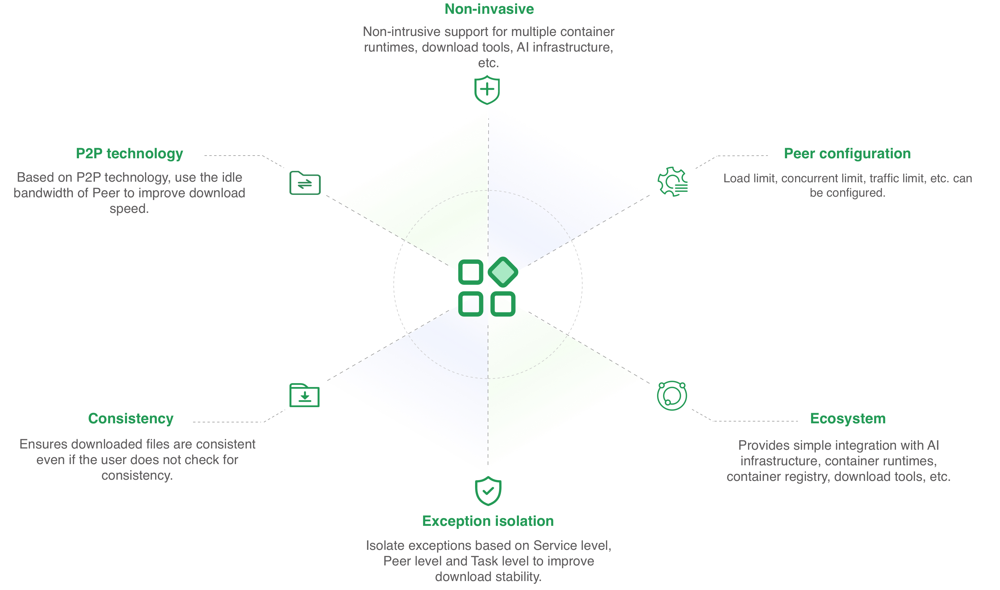

Dragonfly 是一款基于 P2P 技术的文件分发和镜像加速系统，它旨在提高大规模文件传输的效率，最大限度地利用网络带宽。在镜像分发、文件分发、日志分发、AI 模型分发以及 AI 数据集分发等领域被大规模使用。

## 特征

提供的基础能力包括：

- **P2P 技术**：通过利用 P2P 技术进行文件传输，它能最大限度地利用每个 Peer 的带宽资源。提高下载效率，并节省大量跨机房带宽，尤其是昂贵的跨境带宽。
- **非侵入式**：可非侵入式支持多种容器运行时、文件下载工具以及 AI 基础设施等。
- **节点级别配置**：可动态配置节点级别负载、并发以及限流等能力。
- **一致性**：可确保下载的文件是一致的，即使用户不进行最终一致性校验。
- **异常隔离**：通过 Service、Peer 以及 Task 三个级别自动隔离异常提高下载稳定性。
- **生态**：跟 AI 基础设施、容器镜像以及文件分发等生态项目都有简单的集成方案。

## 里程碑

[Dragonfly 1.x](https://github.com/dragonflyoss/Dragonfly) 自 17 年 11 月开源以来，被许多大规模互联网公司选用并投入生产使用。
并在 18 年 10 月正式进入 CNCF，成为中国第三个成为 CNCF Sandbox 的项目。
2020 年 4 月，CNCF 技术监督委员会（TOC）投票决定接受 Dragonfly 成为 CNCF Incubating 项目。
2021 年 4 月，经过系统架构、产品能力、使用场景等几大方向上进行升级后发布 Dragonfly 2。

## 架构

Dragonfly 架构主要分为四部分 Manager、Scheduler、Seed Peer 以及 Peer 各司其职组成 P2P 下载网络。
详细内容可以参考[架构文档](./concepts/terminology/architecture)， 下面是各模块功能：

- **Manager**：Manager 在多 P2P 集群部署的时候扮演管理者的角色。主要提供动态配置管理以及数据收集等功能。也包含了前端控制台，方便用户进行可视化操作集群。
- **Scheduler**：为当前下载节点寻找一组最优父节点。在适当时候触发 Seed Peer 进行回源下载或让 Peer 进行回源下载。
- **Seed Peer**：提供上传跟下载能力。并提供可以被 Scheduler 主动触发回源，可以作为 P2P 节点中的根节点。
- **Peer**：提供上传跟下载能力。

## 怎么运行的

当下载一个镜像或文件时，通过 Peer 的 HTTP Proxy 将下载请求代理到 Dragonfly。Peer 首先会向 Scheduler 注册 Task， Scheduler 会查看 Task 的信息，判断 Task 是否在 P2P 集群内第一次下载，
如果是第一次下载优先触发 Seed Peer 进行回源下载，并且下载过程中对 Task 基于 Piece 级别切分。注册成功后 Peer 会和 Scheduler 建立双向流，
然后将 Seed Peer 调度给 Peer 进行下载。Seed Peer 和 Peer 之间下载传输基于 Piece 级别进行流式传输。Peer 每下载成功一个 Piece，
会将信息上报给 Scheduler 供下次调度使用。如果 Task 在 P2P 集群内非第一次下载，那么 Scheduler 会调度其他 Peer 给当前 Peer 下载。
Peer 从不同的 Peer 下载 Piece，拼接并返回整个文件，那么 P2P 下载就完成了。

