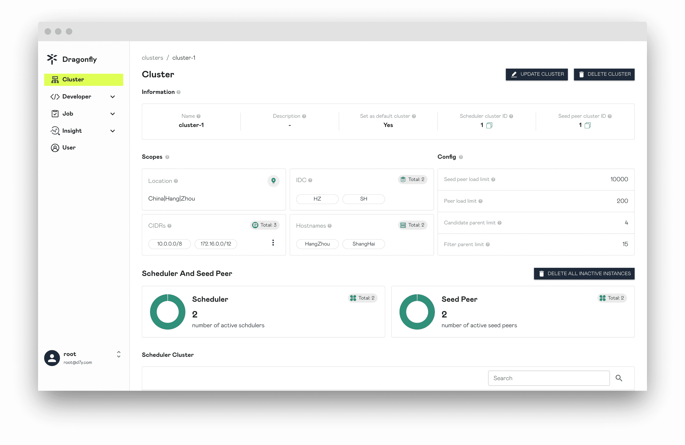

本文档概述了我们计划如何为 Dragonfly 设置容量规划和性能优化。

## 容量规划

规划容量时需要考虑的一个重要因素是：最高预期存储容量。并且你需要对目前所拥有的机器的内存大小、CPU 核心数、磁盘容量有清晰的了解。

如果您没有明确的容量规划，可以使用下面的估算值来预测您的容量。

### Manager

部署 Manager 会根据 Peer 数量来估算所使用的资源量。

> 推荐运行至少 3 个副本。

<!-- markdownlint-disable -->

| Total Number of Peers | CPU | Memory | Disk  |
| --------------------- | --- | ------ | ----- |
| 1K                    | 8C  | 16G    | 200Gi |
| 5K                    | 16C | 32G    | 200Gi |
| 10K                   | 16C | 64G    | 200Gi |

<!-- markdownlint-restore -->

### Scheduler

部署 Scheduler 会根据每秒下载请求数来估算所使用的资源量。

> 推荐运行至少 3 个副本。

<!-- markdownlint-disable -->

| Request Per Second | CPU | Memory | Disk  |
| ------------------ | --- | ------ | ----- |
| 1K                 | 8C  | 16G    | 200Gi |
| 3K                 | 16C | 32G    | 200Gi |
| 5K                 | 32C | 64G    | 200Gi |

<!-- markdownlint-restore -->

### Client

部署 Client 会根据每秒下载请求数来估算所使用的资源量。

> 如果是 Seed Peer 推荐运行至少 3 个副本。Disk 大小根据不同文件存储容量计算。

<!-- markdownlint-disable -->

| Request Per Second | CPU | Memory | Disk  |
| ------------------ | --- | ------ | ----- |
| 500                | 8C  | 16G    | 500Gi |
| 1K                 | 8C  | 16G    | 3Ti   |
| 3K                 | 16C | 32G    | 5Ti   |
| 5K                 | 32C | 64G    | 10Ti  |

<!-- markdownlint-restore -->

### Cluster

部署 P2P 集群会根据 Peer 数量来估算每个服务所使用的资源量。

<!-- markdownlint-disable -->

| Total Number of Peers | Manager            | Scheduler          | Seed Peer         | Peer        |
| --------------------- | ------------------ | ------------------ | ----------------- | ----------- |
| 500                   | 4C/8G/200Gi \* 3   | 8C/16G/200Gi \* 3  | 8C/16G/1Ti \* 3   | 4C/8G/500Gi |
| 1K                    | 8C/16G/200Gi \* 3  | 8C/16G/200Gi \* 3  | 8C/16G/3Ti \* 3   | 4C/8G/500Gi |
| 3K                    | 16C/32G/200Gi \* 3 | 16C/32G/200Gi \* 3 | 16C/32G/5Ti \* 3  | 4C/8G/500Gi |
| 5K                    | 16C/64G/200Gi \* 3 | 32C/64G/200Gi \* 3 | 32C/64G/10Ti \* 3 | 4C/8G/500Gi |

<!-- markdownlint-restore -->

## 性能调优

以下内容可以帮助你实现更好的性能，特别是对于大规模运行。

### 速率限制

#### 上行带宽

主要作用节点 P2P 分享 Piece 的带宽。当峰值带宽大于默认上行带宽，可以将 `rateLimit` 设置更高，提升上传速度。在不影响其他服务情况下，建议配置和机器下行带宽相同，详情参考 [dfdaemon.yaml](../../reference/configuration/client/dfdaemon.md)。

```yaml
upload:
  # 上传速度的默认速率限制，单位为 KiB/MiB/GiB 每秒，默认为 10GiB/s。
  rateLimit: 10GiB
```

#### 下行带宽

主要作用节点回源带宽和从 Remote Peer 下载带宽。当峰值带宽大于默认上行带宽，可以将 `rateLimit` 设置更高，提升下载速度。在不影响其他服务情况下，建议配置和机器上行带宽相同，详情参考 [dfdaemon.yaml](../../reference/configuration/client/dfdaemon.md)。

```yaml
download:
  # 下载速度的默认速率限制，单位为 KiB/MiB/GiB 每秒，默认为 10GiB/s。
  rateLimit: 10GiB
```

### 并发控制

主要作用节点单个任务下载时，回源下载 Piece 并发数和从 Remote Peer 下载 Piece 并发数。默认并发数为 10，可根据机器配置调整。
Piece 并发数越大，任务下载越快，但是消耗 CPU 以及 Memory 会更多。用户根据实际情况在调整 Piece 并发数的同时，
调整 Client 的 CPU 以及 Memory 配置，详情参考 [dfdaemon.yaml](../../reference/configuration/client/dfdaemon.md)。

```yaml
download:
  # 下载 piece 的并发数量。
  concurrentPieceCount: 10
```

### GC

主要作用节点磁盘中的 Task 缓存 GC，taskTTL 根据用户实际需要缓存时间评估。
为了避免 GC 出现问题或可能造成灾难性后果的情况，`distHighThresholdPercent` 和 `distLowThresholdPercent` 建议使用默认值，详情参考 [dfdaemon.yaml](../../reference/configuration/client/dfdaemon.md)。

```yaml
gc:
  # 进行 GC 的时间间隔。
  interval: 900s
  policy:
    # 不活跃的 task 的存活时间。
    taskTTL: 21600s
    # 磁盘使用率的高阈值百分比。
    # 如果磁盘使用率大于阈值，dfdaemon 将执行 GC。
    distHighThresholdPercent: 80
    # 磁盘使用率的下阈值百分比。
    # 如果磁盘使用率低于阈值，dfdaemon 将停止 GC。
    distLowThresholdPercent: 60
```

### Nydus

当 Nydus 下载镜像或文件的时候，Nydus 会将 Task 切分成 1MB 左右的 Chunk 请求按需加载。
在使用 Seed Peer 的 HTTP Proxy 作为 Nydus 的缓存服务时，利用 P2P 的传输方式减少回源请求以及回源带宽，进一步提升下载速度。
Dragonfly 作为 Nydus 的缓存服务，部署 Manager，Scheduler 以及 Seed Peer 即可，配置需要有一定优化。

**1.** `proxy.rules.regex` 正则匹配 Nydus 存储仓库 URL，截获下载流量转发到 P2P 网络中，详情参考 [dfdaemon.yaml](../../reference/configuration/client/dfdaemon.md)。

```yaml
proxy:
  # rules 是代理服务器的正则列表。
  # regex 是请求 URL 的正则表达式。
  # useTLS 指示代理后端是否使用 TLS。
  # redirect 是重定向 URL。
  # FilteredQueryParams 是过滤后的查询参数，用于生成任务 ID。
  # 当过滤器为["Signature", "Expires", "ns"]时，例如：
  # http://example.com/xyz?Expires=e1&Signature=s1&ns=docker.io 和 http://example.com/xyz?Expires=e2&Signature=s2&ns=docker.io
  # 将生成相同的任务 ID.
  # 默认值包括过滤后的s3、gcs、oss、obs、cos的查询参数。
  rules:
    - regex: 'blobs/sha256.*'
      # useTLS: false
      # redirect: ""
      # filteredQueryParams: []
```

**2.** 推荐 `Seed Peer Load Limit` 改成 10000 或者更高，提高 Seed Peer 之间的 P2P 缓存命中率。

点击 `UPDATE CLUSTER` 按钮更改 `Seed Peer Load Limit` 为 10000。详情参考 [update-cluster](https://d7y.io/docs/next/advanced-guides/web-console/cluster/#update-cluster)。


更改 `Seed Peer Load Limit` 成功。


**3.** Nydus 会发起 1MB 左右的 HTTP Range 请求实现按需加载，开启 Prefetch 的情况下 Seed Peer 可以在接受到 HTTP Range 请求后预取完整的资源，
提高缓存命中率，详情参考 [dfdaemon.yaml](../../reference/configuration/client/dfdaemon.md)。

```yaml
proxy:
  # 当请求使用 Range Header，请求部分数据的时候，可以预先获取非 Range 内的数据。
  prefetch: true
```

**4.** 下载速度较慢时，可以调整 Proxy 的 `readBufferSize` 值，适当调至为 64KB，目的是为了减少 Proxy 请求时间，参考文档 [dfdaemon.yaml](../../reference/configuration/client/dfdaemon.md)。

```yaml
proxy:
  # 从磁盘读取 piece 的缓冲区大小，默认为32KB。
  readBufferSize: 32768
```
