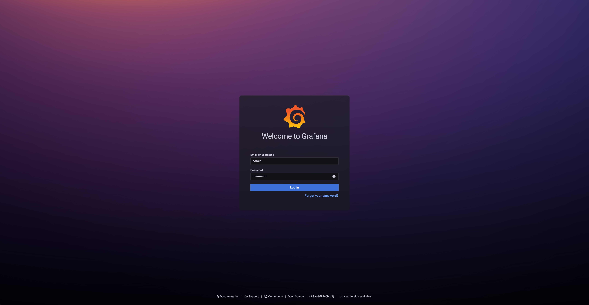
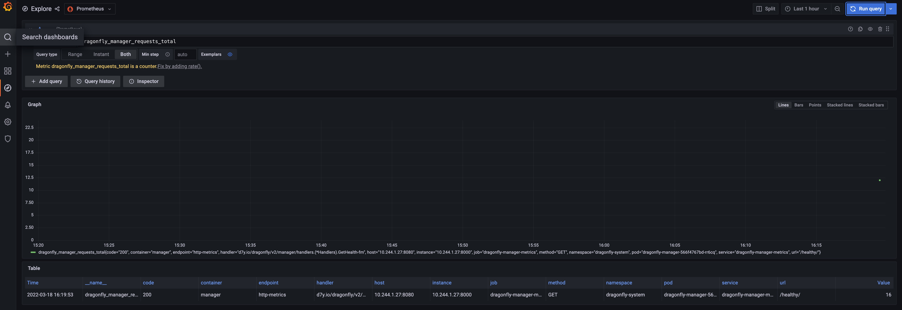
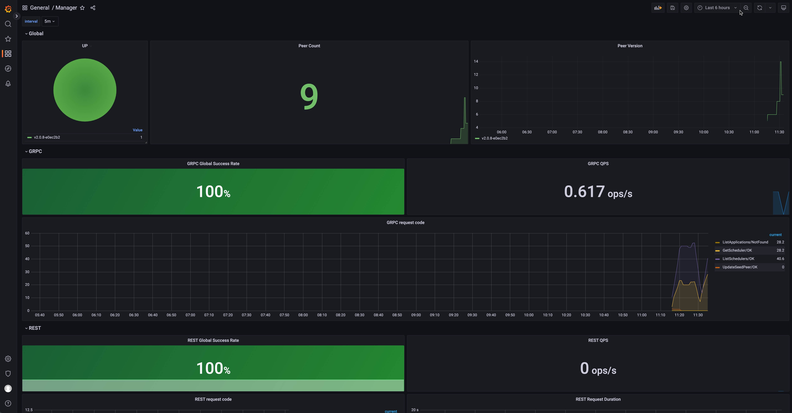
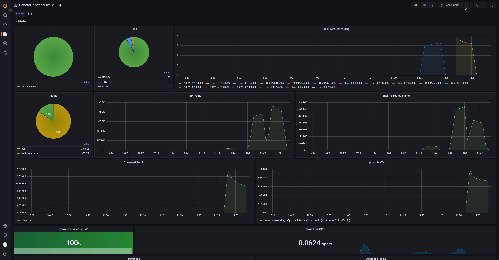

Dragonfly 推荐使用 [prometheus](https://prometheus.io/) 做监控。
Prometheus 和 Grafana 配置维护在仓库 [dragonflyoss/monitoring](https://github.com/dragonflyoss/monitoring/)。

Grafana 大盘发布在 [grafana.com](https://grafana.com/)，对应大盘地址分别为 [Manager](https://grafana.com/grafana/dashboards/15945/)，
[Scheduler](https://grafana.com/grafana/dashboards/15944/) 和
[Peer](https://grafana.com/grafana/dashboards/15946/)。

下面例子中对于 Dragonfly 监控例子基于 [kubernetes](https://kubernetes.io/) 环境，使用
[prometheus-community/kube-prometheus-stack](https://artifacthub.io/packages/helm/prometheus-community/kube-prometheus-stack/)
charts 部署 Prometheus 和 Grafana。

## 环境准备

| 所需软件           | 版本要求 | 文档                                    |
| ------------------ | -------- | --------------------------------------- |
| Kubernetes cluster | 1.19+    | [kubernetes.io](https://kubernetes.io/) |
| Helm               | v3.8.0+  | [helm.sh](https://helm.sh/)             |
| Prometheus         | v2.40.0+ | [prometheus.io](https://prometheus.io/) |

## 准备 Kubernetes 集群

如果没有可用的 Kubernetes 集群进行测试，推荐使用 [Kind](https://kind.sigs.k8s.io/)。

创建 Kind 多节点集群配置文件 `kind-config.yaml`，配置如下:

```yaml
kind: Cluster
apiVersion: kind.x-k8s.io/v1alpha4
nodes:
  - role: control-plane
  - role: worker
  - role: worker
```

使用配置文件创建 Kind 集群:

```shell
kind create cluster --config kind-config.yaml
```

切换 Kubectl 的 context 到 Kind 集群：

```shell
kubectl config use-context kind-kind
```

## Kind 加载 Dragonfly 镜像

下载 Dragonfly latest 镜像:

```shell
docker pull dragonflyoss/scheduler:latest
docker pull dragonflyoss/manager:latest
docker pull dragonflyoss/client:latest
docker pull dragonflyoss/dfinit:latest
```

Kind 集群加载 Dragonfly latest 镜像：

```shell
kind load docker-image dragonflyoss/scheduler:latest
kind load docker-image dragonflyoss/manager:latest
kind load docker-image dragonflyoss/client:latest
kind load docker-image dragonflyoss/dfinit:latest
```

## 基于 Helm Charts 创建 Dragonfly 集群

创建 Helm Charts 配置文件 `values.yaml`，开启 `ServiceMonitor`功能，详情参考
[serviceMonitor](https://github.com/dragonflyoss/helm-charts/blob/main/charts/dragonfly/values.yaml#L247)。

```yaml
scheduler:
 image:
    repository: dragonflyoss/scheduler
    tag: latest
  metrics:
    enable: true
    serviceMonitor:
      enable: true

seedPeer:
  image:
    repository: dragonflyoss/dfdaemon
    tag: latest
  metrics:
    enable: true
    serviceMonitor:
      enable: true

dfdaemon:
  image:
    repository: dragonflyoss/dfdaemon
    tag: latest
  metrics:
    enable: true
    serviceMonitor:
      enable: true

manager:
  image:
    repository: dragonflyoss/manager
    tag: latest
  metrics:
    enable: true
    serviceMonitor:
      enable: true
```

使用配置文件部署 Dragonfly Helm Charts:

<!-- markdownlint-disable -->

```shell
$ helm repo add dragonfly https://dragonflyoss.github.io/helm-charts/
$ helm install --create-namespace --namespace dragonfly-system dragonfly dragonfly/dragonfly -f values.yaml
NAME: dragonfly
LAST DEPLOYED: Tue Jun 11 16:12:19 2024
NAMESPACE: dragonfly-system
STATUS: deployed
REVISION: 1
TEST SUITE: None
NOTES:
1. Get the scheduler address by running these commands:
  export SCHEDULER_POD_NAME=$(kubectl get pods --namespace dragonfly-system -l "app=dragonfly,release=dragonfly,component=scheduler" -o jsonpath={.items[0].metadata.name})
  export SCHEDULER_CONTAINER_PORT=$(kubectl get pod --namespace dragonfly-system $SCHEDULER_POD_NAME -o jsonpath="{.spec.containers[0].ports[0].containerPort}")
  kubectl --namespace dragonfly-system port-forward $SCHEDULER_POD_NAME 8002:$SCHEDULER_CONTAINER_PORT
  echo "Visit http://127.0.0.1:8002 to use your scheduler"

1. Get the dfdaemon port by running these commands:
  export DFDAEMON_POD_NAME=$(kubectl get pods --namespace dragonfly-system -l "app=dragonfly,release=dragonfly,component=dfdaemon" -o jsonpath={.items[0].metadata.name})
  export DFDAEMON_CONTAINER_PORT=$(kubectl get pod --namespace dragonfly-system $DFDAEMON_POD_NAME -o jsonpath="{.spec.containers[0].ports[0].containerPort}")
  You can use $DFDAEMON_CONTAINER_PORT as a proxy port in Node.

1. Configure runtime to use dragonfly:
  https://d7y.io/docs/getting-started/quick-start/kubernetes/
```

<!-- markdownlint-restore -->

检查 Dragonfly 是否部署成功：

```shell
$ kubectl get po -n dragonfly-system
NAME                                 READY   STATUS    RESTARTS   AGE
dragonfly-client-b6vjg               1/1     Running   0          63m
dragonfly-client-mpc7w               1/1     Running   0          63m
dragonfly-manager-6598986b85-22n7k   1/1     Running   0          63m
dragonfly-manager-6598986b85-4lfvv   1/1     Running   0          63m
dragonfly-manager-6598986b85-cngzb   1/1     Running   0          63m
dragonfly-mysql-0                    1/1     Running   0          63m
dragonfly-redis-master-0             1/1     Running   0          63m
dragonfly-redis-replicas-0           1/1     Running   0          63m
dragonfly-redis-replicas-1           1/1     Running   0          61m
dragonfly-redis-replicas-2           1/1     Running   0          61m
dragonfly-scheduler-0                1/1     Running   0          63m
dragonfly-scheduler-1                1/1     Running   0          58m
dragonfly-scheduler-2                1/1     Running   0          45m
dragonfly-seed-client-0              1/1     Running   0          63m
dragonfly-seed-client-1              1/1     Running   0          50m
dragonfly-seed-client-2              1/1     Running   0          47m
```

## 基于 Helm Charts 创建 Prometheus 和 Grafana

基于 [kube-prometheus-stack](https://artifacthub.io/packages/helm/prometheus-community/kube-prometheus-stack)
安装 Prometheus 和 Grafana。

<!-- markdownlint-disable -->

```bash
$ helm repo add prometheus-community https://prometheus-community.github.io/helm-charts
$ helm install --create-namespace --namespace prometheus prometheus prometheus-community/kube-prometheus-stack -f https://raw.githubusercontent.com/dragonflyoss/monitoring/main/prometheus/values.yaml
NAME: prometheus
LAST DEPLOYED: Tue Jun 11 15:37:56 2024
NAMESPACE: default
STATUS: deployed
REVISION: 1
NOTES:
kube-prometheus-stack has been installed. Check its status by running:
  kubectl --namespace default get pods -l "release=prometheus"

Visit https://github.com/prometheus-operator/kube-prometheus for instructions on how to create & configure Alertmanager and Prometheus instances using the Operator.
```

检查 Prometheus 是否部署成功：

```shell
$ kubectl get po -n prometheus
NAME                                                     READY   STATUS    RESTARTS      AGE
alertmanager-prometheus-kube-prometheus-alertmanager-0   2/2     Running   2 (47m ago)   71m
prometheus-grafana-7576556869-jzpsf                      3/3     Running   3 (47m ago)   73m
prometheus-kube-prometheus-operator-fd56bbb4f-29sp6      1/1     Running   2 (47m ago)   73m
prometheus-kube-state-metrics-7d7654ff7-7vtrg            1/1     Running   2 (47m ago)   73m
prometheus-prometheus-kube-prometheus-prometheus-0       2/2     Running   2 (47m ago)   71m
prometheus-prometheus-node-exporter-8dl68                1/1     Running   1 (47m ago)   73m
prometheus-prometheus-node-exporter-jlgcp                1/1     Running   1 (47m ago)   73m
prometheus-prometheus-node-exporter-tlhld                1/1     Running   1 (47m ago)   73m
```

<!-- markdownlint-restore -->

暴露 Grafana 大盘 8080 端口，访问 Grafana 大盘地址为 `localhost:8080`，默认用户名为 `admin`，密码为 `prom-operator`。

```bash
kubectl --namespace prometheus port-forward svc/prometheus-grafana 8080:80
```



## 验证数据是否被采集

访问 Grafana explore 页面，地址为 `localhost:8080/explore`，
并且搜索 `dragonfly_manager_requests_total` 来验证数据是否被采集。



## 导入 Dragonfly grafana 数据大盘

Dragonfly grafana 数据大盘信息如下：

<!-- markdownlint-disable -->

| Name                  | ID    | Link                                         | Description                                                      |
| :-------------------- | :---- | :------------------------------------------- | :--------------------------------------------------------------- |
| Dragonfly Manager     | 15945 | https://grafana.com/grafana/dashboards/15945 | Dragonfly Manager 的 Grafana 仪表板。                            |
| Dragonfly Scheduler   | 15944 | https://grafana.com/grafana/dashboards/15944 | Dragonfly Scheduler 的 Grafana 仪表板。                          |
| Dragonfly Client      | 21053 | https://grafana.com/grafana/dashboards/21053 | 用于 Dragonfly Client 和 Dragonfly Seed Client 的 Grafana 仪表板 |
| Dragonfly Seed Client | 21054 | https://grafana.com/grafana/dashboards/21054 | Dragonfly Seed Client 的 Grafana 仪表板。                        |

<!-- markdownlint-restore -->

导入 Dragonfly grafana 数据大盘使用 ID `15945`，`15944`，`21053` 和 `21054`， 参考文档 [export-import](https://grafana.com/docs/grafana/latest/dashboards/export-import/)


导入成功可以访问 Dragonfly 数据大盘：






