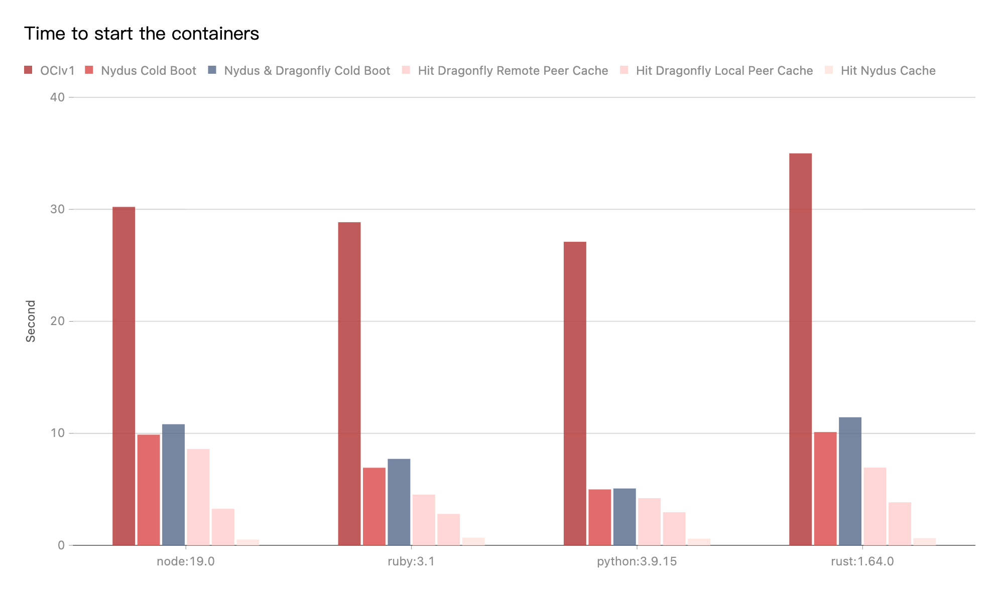

文档的目标是帮助您将 Dragonfly 的容器运行时设置为 Nydus。

## 依赖

<!-- markdownlint-disable -->

| 所需软件           | 版本要求 | 文档                                                        |
| ------------------ | -------- | ----------------------------------------------------------- |
| Kubernetes cluster | 1.20+    | [kubernetes.io](https://kubernetes.io/)                     |
| Helm               | 3.8.0+   | [helm.sh](https://helm.sh/)                                 |
| containerd         | v1.4.3+  | [containerd.io](https://containerd.io/)                     |
| Nerdctl            | 0.22+    | [containerd/nerdctl](https://github.com/containerd/nerdctl) |

<!-- markdownlint-restore -->

**注意:** 如果没有可用的 Kubernetes 集群进行测试，推荐使用 [Kind](https://kind.sigs.k8s.io/)。

## 使用 Helm 安装 Nydus

推荐使用 Helm 安装 Nydus，参考文档 [Install Dragonfly & Nydus with Helm](https://github.com/dragonflyoss/helm-charts/blob/main/INSTALL.md).

## 使用二进制文件安装 Nydus

### Dragonfly Kubernetes 集群搭建

基于 Kubernetes cluster 详细安装文档可以参考 [quick-start-kubernetes](../../../getting-started/quick-start/kubernetes.md)。

#### 准备 Kubernetes 集群

创建 Kind 多节点集群配置文件 `kind-config.yaml`, 配置如下:

```yaml
kind: Cluster
apiVersion: kind.x-k8s.io/v1alpha4
nodes:
  - role: control-plane
  - role: worker
    extraPortMappings:
      - containerPort: 30950
        hostPort: 4001
      - containerPort: 30951
        hostPort: 4003
  - role: worker
```

使用配置文件创建 Kind 集群:

```shell
kind create cluster --config kind-config.yaml
```

切换 Kubectl 的 context 到 Kind 集群:

```shell
kubectl config use-context kind-kind
```

#### Kind 加载 Dragonfly 镜像

下载 Dragonfly latest 镜像:

```shell
docker pull dragonflyoss/scheduler:latest
docker pull dragonflyoss/manager:latest
docker pull dragonflyoss/client:latest
```

Kind 集群加载 Dragonfly latest 镜像:

```shell
kind load docker-image dragonflyoss/scheduler:latest
kind load docker-image dragonflyoss/manager:latest
kind load docker-image dragonflyoss/client:latest
```

#### 基于 Helm Charts 创建 Dragonfly P2P 集群

创建 Helm Charts 配置文件 `charts-config.yaml` 并且开启 Peer 的预取功能, 配置如下:

```yaml
manager:
  image:
    repository: dragonflyoss/manager
    tag: latest
  metrics:
    enable: true
  config:
    verbose: true
    pprofPort: 18066

scheduler:
  image:
    repository: dragonflyoss/clinet
    tag: latest
  metrics:
    enable: true
  config:
    verbose: true
    pprofPort: 18066

seedClient:
  image:
    repository: dragonflyoss/client
    tag: latest
  metrics:
    enable: true
  config:
    verbose: true
    proxy:
      prefetch: true

client:
  image:
    repository: dragonflyoss/client
    tag: latest
  hostNetwork: true
  metrics:
    enable: true
  config:
    verbose: true
    security:
      enable: true
    proxy:
      prefetch: true
      server:
        port: 4001
      registryMirror:
        addr: https://index.docker.io
      rules:
        - regex: 'blobs/sha256.*'
```

使用配置文件部署 Dragonfly Helm Charts:

<!-- markdownlint-disable -->

```shell
$ helm repo add dragonfly https://dragonflyoss.github.io/helm-charts/
$ helm install --wait --create-namespace --namespace dragonfly-system dragonfly dragonfly/dragonfly -f charts-config.yaml
NAME: dragonfly
LAST DEPLOYED: Mon May 27 19:56:34 2024
NAMESPACE: dragonfly-system
STATUS: deployed
REVISION: 1
TEST SUITE: None
NOTES:
1. Get the scheduler address by running these commands:
  export SCHEDULER_POD_NAME=$(kubectl get pods --namespace dragonfly-system -l "app=dragonfly,release=dragonfly,component=scheduler" -o jsonpath={.items[0].metadata.name})
  export SCHEDULER_CONTAINER_PORT=$(kubectl get pod --namespace dragonfly-system $SCHEDULER_POD_NAME -o jsonpath="{.spec.containers[0].ports[0].containerPort}")
  kubectl --namespace dragonfly-system port-forward $SCHEDULER_POD_NAME 8002:$SCHEDULER_CONTAINER_PORT
  echo "Visit http://127.0.0.1:8002 to use your scheduler"

2. Get the dfdaemon port by running these commands:
  export DFDAEMON_POD_NAME=$(kubectl get pods --namespace dragonfly-system -l "app=dragonfly,release=dragonfly,component=dfdaemon" -o jsonpath={.items[0].metadata.name})
  export DFDAEMON_CONTAINER_PORT=$(kubectl get pod --namespace dragonfly-system $DFDAEMON_POD_NAME -o jsonpath="{.spec.containers[0].ports[0].containerPort}")
  You can use $DFDAEMON_CONTAINER_PORT as a proxy port in Node.

3. Configure runtime to use dragonfly:
  https://d7y.io/docs/getting-started/quick-start/kubernetes/
```

<!-- markdownlint-restore -->

检查 Dragonfly 是否部署成功:

```shell
$ kubectl get po -n dragonfly-system
NAME                                 READY   STATUS    RESTARTS        AGE
dragonfly-client-9rkgp               1/1     Running   1 (6h29m ago)   9h
dragonfly-client-l2czc               1/1     Running   2 (6h29m ago)   9h
dragonfly-manager-789f57fc65-t44tf   1/1     Running   2 (6h28m ago)   9h
dragonfly-mysql-0                    1/1     Running   3 (6h28m ago)   9h
dragonfly-redis-master-0             1/1     Running   3 (6h28m ago)   9h
dragonfly-redis-replicas-0           1/1     Running   7 (6h28m ago)   9h
dragonfly-redis-replicas-1           1/1     Running   2 (6h28m ago)   8h
dragonfly-redis-replicas-2           1/1     Running   2 (6h28m ago)   8h
dragonfly-scheduler-0                1/1     Running   2 (6h28m ago)   9h
dragonfly-scheduler-1                1/1     Running   2 (6h28m ago)   8h
dragonfly-scheduler-2                1/1     Running   2 (6h28m ago)   8h
dragonfly-seed-client-0              1/1     Running   8 (6h27m ago)   9h
dragonfly-seed-client-1              1/1     Running   4 (6h27m ago)   8h
dragonfly-seed-client-2              1/1     Running   4 (6h27m ago)   8h
```

创建 Peer Service 配置文件 `peer-service-config.yaml` 配置如下:

```yaml
apiVersion: v1
kind: Service
metadata:
  name: peer
  namespace: dragonfly-system
spec:
  type: NodePort
  ports:
    - name: http-4001
      nodePort: 30950
      port: 4001
    - name: http-4003
      nodePort: 30951
      port: 4003
  selector:
    app: dragonfly
    component: client
    release: dragonfly
```

使用配置文件部署 Peer Service:

```shell
kubectl apply -f peer-service-config.yaml
```

### containerd 集成 Nydus

生产环境 containerd 集成 Nydus 详细文档可以参考
[nydus-setup-for-containerd-environment](https://github.com/dragonflyoss/image-service/blob/master/docs/containerd-env-setup.md#nydus-setup-for-containerd-environment)。
下面例子使用 Systemd 管理 `nydus-snapshotter` 服务。

#### 下载安装 Nydus 工具

下载 `Nydus Snapshotter` 二进制文件, 下载地址为 [nydus-snapshotter/releases](https://github.com/containerd/nydus-snapshotter/releases/latest):

> 注意: your_nydus_snapshotter_version 建议使用最新版本

```shell
NYDUS_SNAPSHOTTER_VERSION=<your_nydus_snapshotter_version>
wget  -O nydus-snapshotter_linux_arm64.tar.gz https://github.com/containerd/nydus-snapshotter/releases/download/v$NYDUS_SNAPSHOTTER_VERSION/nydus-snapshotter-v$NYDUS_SNAPSHOTTER_VERSION-linux-arm64.tar.gz
tar zxvf nydus-snapshotter_linux_arm64.tar.gz
```

安装 `containerd-nydus-grpc` 工具:

```shell
sudo cp bin/containerd-nydus-grpc /usr/local/bin/
```

下载 `Nydus Image Service` 二进制文件, 下载地址为 [dragonflyoss/image-service](https://github.com/dragonflyoss/image-service/releases/latest):

> 注意: your_nydus_version 建议使用最新版本

```shell
NYDUS_VERSION=<your_nydus_version>
wget -O nydus-image-service-linux-arm64.tgz https://github.com/dragonflyoss/image-service/releases/download/v$NYDUS_VERSION/nydus-static-v$NYDUS_VERSION-linux-arm64.tgz
tar zxvf nydus-image-service-linux-arm64.tgz
```

安装 `nydus-image`、`nydusd` 以及 `nydusify` 工具:

```shell
sudo cp nydus-static/nydus-image nydus-static/nydusd nydus-static/nydusify /usr/local/bin/
```

#### containerd 集成 Nydus Snapshotter 插件

配置 containerd 使用 `nydus-snapshotter` 插件, 详细文档参考
[configure-and-start-containerd](https://github.com/dragonflyoss/image-service/blob/master/docs/containerd-env-setup.md#configure-and-start-containerd)。

更改 containerd 配置文件 `/etc/containerd/config.toml`。

```toml
[proxy_plugins]
  [proxy_plugins.nydus]
    type = "snapshot"
    address = "/run/containerd-nydus/containerd-nydus-grpc.sock"

[plugins.cri]
  [plugins.cri.containerd]
    snapshotter = "nydus"
    disable_snapshot_annotations = false
```

重新启动 containerd：

```shell
sudo systemctl restart containerd
```

验证 containerd 是否使用 `nydus-snapshotter` 插件:

```shell
$ ctr -a /run/containerd/containerd.sock plugin ls | grep nydus
io.containerd.snapshotter.v1          nydus                    -              ok
```

#### Systemd 启动 Nydus Snapshotter 服务

Nydusd 的 Mirror 模式配置详细文档可以参考
[enable-mirrors-for-storage-backend](https://github.com/dragonflyoss/image-service/blob/master/docs/nydusd.md#enable-mirrors-for-storage-backend)。

创建 Nydusd 配置文件 `nydusd-config.json`, 配置如下:

在配置文件下设置 `backend.config.mirrors.host` 和 `backend.config.mirrors.ping_url` 地址为你的实际地址，配置内容如下：

```json
{
  "device": {
    "backend": {
      "type": "registry",
      "config": {
        "mirrors": [
          {
            "host": "http://dragonfly:4001",
            "auth_through": false,
            "headers": {
              "X-Dragonfly-Registry": "https://index.docker.io"
            },
            "ping_url": "http:dragonfly:4003/healthy"
          }
        ],
        "scheme": "https",
        "skip_verify": true,
        "timeout": 10,
        "connect_timeout": 10,
        "retry_limit": 2
      }
    },
    "cache": {
      "type": "blobcache",
      "config": {
        "work_dir": "/var/lib/nydus/cache/"
      }
    }
  },
  "mode": "direct",
  "digest_validate": false,
  "iostats_files": false,
  "enable_xattr": true,
  "fs_prefetch": {
    "enable": true,
    "threads_count": 10,
    "merging_size": 131072,
    "bandwidth_rate": 1048576
  }
}
```

复制配置文件至 `/etc/nydus/config.json` 文件:

```shell
sudo mkdir /etc/nydus && cp nydusd-config.json /etc/nydus/config.json
```

创建 Nydus Snapshotter Systemd 配置文件 `nydus-snapshotter.service`, 配置如下:

```text
[Unit]
Description=nydus snapshotter
After=network.target
Before=containerd.service

[Service]
Type=simple
Environment=HOME=/root
ExecStart=/usr/local/bin/containerd-nydus-grpc --nydusd-config /etc/nydus/config.json
Restart=always
RestartSec=1
KillMode=process
OOMScoreAdjust=-999
StandardOutput=journal
StandardError=journal

[Install]
WantedBy=multi-user.target
```

复制配置文件至 `/etc/systemd/system/` 目录:

```shell
sudo cp nydus-snapshotter.service /etc/systemd/system/
```

Systemd 启动 Nydus Snapshotter 服务:

<!-- markdownlint-disable -->

```shell
$ sudo systemctl enable nydus-snapshotter
$ sudo systemctl start nydus-snapshotter
$ sudo systemctl status nydus-snapshotter
● nydus-snapshotter.service - nydus snapshotter
     Loaded: loaded (/etc/systemd/system/nydus-snapshotter.service; enabled; vendor preset: enabled)
     Active: active (running) since Tue 2024-05-28 12:35:54 UTC; 18h ago
   Main PID: 61491 (containerd-nydu)
      Tasks: 35 (limit: 11017)
     Memory: 32.8M
        CPU: 463ms
     CGroup: /system.slice/nydus-snapshotter.service
             ├─61491 /usr/local/bin/containerd-nydus-grpc --nydusd-config /etc/nydus/config.json
             └─61625 /usr/local/bin/nydusd fuse --config /var/lib/containerd-nydus/config/cpasvi0qpkh556h5e7gg/config.json --bootstrap /var/lib/containerd-nydus/snapshots/2/fs/image/image.boot --mountpoint /var/lib/containerd-nydus/snapshots/2/mnt --apisock /var/lib/containerd-nydus/socket/cpasvi0qpkh556h5e7gg/api.sock --log-level info --log-rotation-size 100 --log-file /var/lib/containerd-nydus/logs/cpasvi0qpkh556h5e7gg/nydusd.log
```

<!-- markdownlint-restore -->

#### 转换 Nydus 格式镜像

转换 `alpine:3.19` 镜像为 Nydus 格式镜像, 可以直接使用已经转换好的 `alpine:3.19-nydus` 镜像, 跳过该步骤。
转换工具可以使用 [nydusify](https://github.com/dragonflyoss/image-service/blob/master/docs/nydusify.md) 也可以使用 [acceld](https://github.com/goharbor/acceleration-service)。

登陆 Dockerhub:

```shell
docker login
```

转换 Nydus 镜像, `DOCKERHUB_REPO_NAME` 环境变量设置为用户个人的镜像仓库:

```shell
DOCKERHUB_REPO_NAME=<your_dockerhub_repo_name>
sudo nydusify convert --nydus-image /usr/local/bin/nydus-image --source alpine:3.19 --target $DOCKERHUB_REPO_NAME/alpine:3.19-nydus
```

#### Nerdctl 运行 Nydus 镜像

使用 Nerdctl 运行 `alpine:3.19-nydus`, 过程中即通过 Nydus 和 Dragonfly 下载镜像:

```shell
sudo nerdctl --snapshotter nydus run --network host --rm -it $DOCKERHUB_REPO_NAME/alpine:3.19-nydus
```

<!-- markdownlint-disable -->

#### 验证镜像下载成功

搜索日志验证 Nydus 基于 Mirror 模式通过 Dragonfly 分发流量:

```shell
# 查看 Nydus 日志
grep mirrors /var/lib/containerd-nydus/logs/**/*log
```

```shell
[2024-05-28 12:36:24.834434 +00:00] INFO backend config: ConnectionConfig { proxy: ProxyConfig { url: "", ping_url: "", fallback: false, check_interval: 5, use_http: false }, mirrors: [MirrorConfig { host: "http://Dragonfly:4001", ping_url: "http://Dragonfly:4003/healthy", headers: {"X-Dragonfly-Registry": "https://index.docker.io"}, health_check_interval: 5, failure_limit: 5 }], skip_verify: true, timeout: 10, connect_timeout: 10, retry_limit: 2 }
```

可以查看 Dragonfly 日志，判断 alpine:3.19 镜像正常拉取。

```shell
# 获取 Pod Name
export POD_NAME=$(kubectl get pods --namespace dragonfly-system -l "app=dragonfly,release=dragonfly,component=client" -o=jsonpath='{.items[?(@.spec.nodeName=="kind-worker")].metadata.name}' | head -n 1 )

# 获取 Peer ID
export TASK_ID=$(kubectl -n dragonfly-system exec ${POD_NAME} -- sh -c "grep -hoP 'alpine.*task_id=\"\K[^\"]+' /var/log/dragonfly/dfdaemon/* | head -n 1")

# 查看下载日志
kubectl -n dragonfly-system exec -it ${POD_NAME} -- sh -c "grep ${TASK_ID} /var/log/dragonfly/dfdaemon/* | grep 'download task succeeded'"
```

日志输出例子:

```shell
2024-05-28T12:36:24.861903Z  INFO download_task: dragonfly-client/src/grpc/dfdaemon_download.rs:276: download task succeeded host_id="127.0.0.1-kind-worker" task_id="4535f073321f0d1908b8c3ad63a1d59324573c0083961c5bcb7f38ac72ad598d" peer_id="127.0.0.1-kind-worker-13095fb5-786a-4908-b8c1-744be144b383"
```

<!-- markdownlint-restore -->

## 性能测试

测试 Nydus Mirror 模式与 Dragonfly P2P 集成后的单机镜像下载的性能。
主要测试不同语言镜像运行版本命令的启动时间，例如 `python` 镜像运行启动命令为 `python -V`。
测试是在同一台机器上面做不同场景的测试。
由于机器本身网络环境、配置等影响，实际下载时间不具有参考价值，
但是不同场景下载时间所提升的比率是有重要意义的。



- OCIv1: 使用 containerd 直接拉取镜像并且启动成功的数据。
- Nydus Cold Boot: 使用 containerd 通过 Nydus 拉取镜像，没有命中任何缓存并且启动成功的数据。
- Nydus & Dragonfly Cold Boot: 使用 containerd 通过 Nydus 拉取镜像，并且基于 Nydus Mirror 模式流量转发至 Dragonfly P2P，在没有命中任何缓存并且启动成功的数据。
- Hit Dragonfly Remote Peer Cache: 使用 containerd 通过 Nydus 拉取镜像，
  并且基于 Nydus Mirror 模式流量转发至 Dragonfly P2P，在命中 Dragonfly 的远端 Peer 缓存的情况下并且成功启动的数据。
- Hit Dragonfly Local Peer Cache: 使用 containerd 通过 Nydus 拉取镜像，
  并且基于 Nydus Mirror 模式流量转发至 Dragonfly P2P，在命中 Dragonfly 的本地 Peer 缓存的情况下并且成功启动的数据。
- Hit Nydus Cache: 使用 containerd 通过 Nydus 拉取镜像，
  并且基于 Nydus Mirror 模式流量转发至 Dragonfly P2P，在命中 Nydus 的本地缓存的情况下并且成功启动的数据。

测试结果表明 Nydus Mirror 模式和 Dragonfly P2P 集成。使用 Nydus 下载镜像对比 `OCIv1` 的模式，
能够有效减少镜像下载时间。Nydus 冷启动和 Nydus & Dragonfly 冷启动数据基本接近。
其他命中 Dragonfly Cache 的结果均好于只使用 Nydus 的情况。最重要的是如果很大规模集群使用 Nydus 拉取镜像，
会将每个镜像层的下载分解按需产生很多 Range 请求。增加镜像仓库源站 `QPS`。
而 Dragonfly 可以基于 P2P 技术有效减少回源镜像仓库的请求数量和下载流量。
最优的情况，Dragonfly 可以保证大规模集群中每个下载任务只回源一次。
