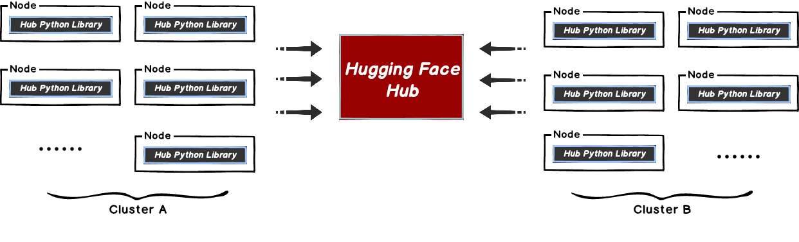
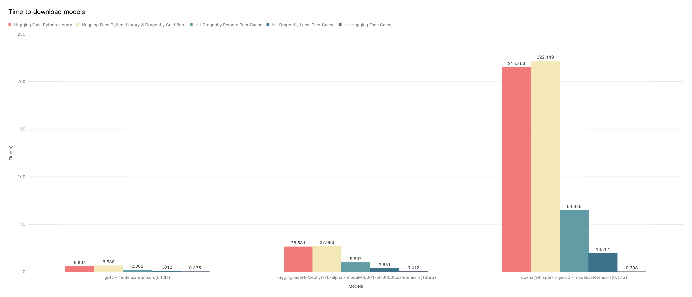

本文档将帮助您将 Dragonfly 与 Hugging Face 一起使用。
当在 Hugging Face 下载数据集以及模型的时候，文件相对较大且会有并发下载文件的场景。
这样很容易导致 Hugging Face 的 Git LFS 存储带宽被打满，从而引起下载过慢的情况，影响训练以及推理服务的使用。



这种方式比较好的解决方案是使用 Dragonfly 的 P2P 技术利用每个节点的闲置带宽缓解 Git LFS 存储的带宽压力，
从而达到加速效果。在最理想的情况下 Dragonfly 可以让整个 P2P 集群中只有一个节点回源 Hugging Face 下载数据集或模型，
其他节点流量均使用集群内 P2P 内网带宽。


## 环境准备

<!-- markdownlint-disable -->

| 所需软件           | 版本要求 | 文档                                    |
| ------------------ | -------- | --------------------------------------- |
| Kubernetes cluster | 1.20+    | [kubernetes.io](https://kubernetes.io/) |
| Helm               | 3.8.0+   | [helm.sh](https://helm.sh/)             |
| Python             | 3.6.0+   | [python.org](https://www.python.org/)   |

<!-- markdownlint-restore -->

## Dragonfly Kubernetes 集群搭建

基于 Kubernetes cluster 详细安装文档可以参考 [quick-start-kubernetes](../../../getting-started/quick-start/kubernetes.md)。

### 准备 Kubernetes 集群

如果没有可用的 Kubernetes 集群进行测试，推荐使用 [Kind](https://kind.sigs.k8s.io/)。

创建 Kind 多节点集群配置文件 `kind-config.yaml`, 配置如下:

```yaml
kind: Cluster
apiVersion: kind.x-k8s.io/v1alpha4
nodes:
  - role: control-plane
  - role: worker
    extraPortMappings:
      - containerPort: 30950
        hostPort: 4001
  - role: worker
```

使用配置文件创建 Kind 集群:

```shell
kind create cluster --config kind-config.yaml
```

切换 Kubectl 的 context 到 Kind 集群:

```shell
kubectl config use-context kind-kind
```

### Kind 加载 Dragonfly 镜像

下载 Dragonfly latest 镜像:

```shell
docker pull dragonflyoss/scheduler:latest
docker pull dragonflyoss/manager:latest
docker pull dragonflyoss/client:latest
```

Kind 集群加载 Dragonfly latest 镜像:

```shell
kind load docker-image dragonflyoss/scheduler:latest
kind load docker-image dragonflyoss/manager:latest
kind load docker-image dragonflyoss/client:latest
```

### 基于 Helm Charts 创建 Dragonfly P2P 集群

创建 Helm Charts 配置文件 `charts-config.yaml` 并且设置 `client.config.proxy.registryMirror.addr` 为
Hugging Face 的 LFS 服务的地址, 配置如下:

```yaml
manager:
  image:
    repository: dragonflyoss/manager
    tag: latest
  metrics:
    enable: true
  config:
    verbose: true
    pprofPort: 18066

scheduler:
  image:
    repository: dragonflyoss/scheduler
    tag: latest
  metrics:
    enable: true
  config:
    verbose: true
    pprofPort: 18066

seedClient:
  image:
    repository: dragonflyoss/client
    tag: latest
  metrics:
    enable: true
  config:
    verbose: true

client:
  image:
    repository: dragonflyoss/client
    tag: latest
  hostNetwork: true
  metrics:
    enable: true
  config:
    verbose: true
    security:
      enable: true
    proxy:
      server:
        port: 4001
      registryMirror:
        addr: https://cdn-lfs.huggingface.co
      rules:
        - regex: repos.*
            useTLS: true
```

使用配置文件部署 Dragonfly Helm Charts:

<!-- markdownlint-disable -->

```shell
$ helm repo add dragonfly https://dragonflyoss.github.io/helm-charts/
$ helm install --wait --create-namespace --namespace dragonfly-system dragonfly dragonfly/dragonfly -f charts-config.yaml
NAME: dragonfly
LAST DEPLOYED: Mon Jun  3 16:32:28 2024
NAMESPACE: dragonfly-system
STATUS: deployed
REVISION: 1
TEST SUITE: None
NOTES:
1. Get the scheduler address by running these commands:
  export SCHEDULER_POD_NAME=$(kubectl get pods --namespace dragonfly-system -l "app=dragonfly,release=dragonfly,component=scheduler" -o jsonpath={.items[0].metadata.name})
  export SCHEDULER_CONTAINER_PORT=$(kubectl get pod --namespace dragonfly-system $SCHEDULER_POD_NAME -o jsonpath="{.spec.containers[0].ports[0].containerPort}")
  kubectl --namespace dragonfly-system port-forward $SCHEDULER_POD_NAME 8002:$SCHEDULER_CONTAINER_PORT
  echo "Visit http://127.0.0.1:8002 to use your scheduler"

2. Get the dfdaemon port by running these commands:
  export DFDAEMON_POD_NAME=$(kubectl get pods --namespace dragonfly-system -l "app=dragonfly,release=dragonfly,component=dfdaemon" -o jsonpath={.items[0].metadata.name})
  export DFDAEMON_CONTAINER_PORT=$(kubectl get pod --namespace dragonfly-system $DFDAEMON_POD_NAME -o jsonpath="{.spec.containers[0].ports[0].containerPort}")
  You can use $DFDAEMON_CONTAINER_PORT as a proxy port in Node.

3. Configure runtime to use dragonfly:
  https://d7y.io/docs/getting-started/quick-start/kubernetes/
```

<!-- markdownlint-restore -->

检查 Dragonfly 是否部署成功:

```shell
$ kubectl get po -n dragonfly-system
NAME                                 READY   STATUS    RESTARTS       AGE
dragonfly-client-6jgzn               1/1     Running   0             21m
dragonfly-client-qzcz9               1/1     Running   0             21m
dragonfly-manager-6bc4454d94-ldsk7   1/1     Running   0             21m
dragonfly-mysql-0                    1/1     Running   0             21m
dragonfly-redis-master-0             1/1     Running   0             21m
dragonfly-redis-replicas-0           1/1     Running   0             21m
dragonfly-redis-replicas-1           1/1     Running   0             21m
dragonfly-redis-replicas-2           1/1     Running   0             21m
dragonfly-scheduler-0                1/1     Running   0             21m
dragonfly-scheduler-1                1/1     Running   0             21m
dragonfly-scheduler-2                1/1     Running   0             21m
dragonfly-seed-client-0              1/1     Running   2 (21m ago)   21m
dragonfly-seed-client-1              1/1     Running   0             21m
dragonfly-seed-client-2              1/1     Running   0             21m
```

创建 Peer Service 配置文件 `peer-service-config.yaml` 配置如下:

```yaml
apiVersion: v1
kind: Service
metadata:
  name: peer
  namespace: dragonfly-system
spec:
  type: NodePort
  ports:
    - name: http-4001
      nodePort: 30950
      port: 4001
  selector:
    app: dragonfly
    component: client
    release: dragonfly
```

使用配置文件部署 Peer Service:

```shell
kubectl apply -f peer-service-config.yaml
```

## 通过 Dragonfly 分发 Hub Python Library 的下载文件流量

任何 [Hub Python Library](https://huggingface.co/docs/huggingface_hub/index) 的 API 使用
`Requests` 库下载文件，都可以通过设置 `DragonflyAdapter` 将流量使用 Dragonfly 分发。

### 使用 Dragonfly 下载单个文件

下载单个文件可以使用 [`hf_hub_download`](https://huggingface.co/docs/huggingface_hub/v0.17.1/en/package_reference/file_download#huggingface_hub.hf_hub_download)，
并且通过 Dragonfly 分发流量。

创建 `hf_hub_download_dragonfly.py` 文件，使用 `DragonflyAdapter` 将下载流量转发至 Dragonfly HTTP Proxy。
这样可以通过 P2P 网络分发流量，内容如下：

> 注意：更换 `session.proxies` 地址为你的实际地址。

```python
import requests
from requests.adapters import HTTPAdapter
from urllib.parse import urlparse
from huggingface_hub import hf_hub_download
from huggingface_hub import configure_http_backend

class DragonflyAdapter(HTTPAdapter):
    def get_connection(self, url, proxies=None):
        # Change the schema of the LFS request to download large files from https:// to http://,
        # so that Dragonfly HTTP proxy can be used.
        if url.startswith('https://cdn-lfs.huggingface.co'):
            url = url.replace('https://', 'http://')
        return super().get_connection(url, proxies)

    def add_headers(self, request, **kwargs):
        super().add_headers(request, **kwargs)

        # If there are multiple different LFS repositories, you can override the
        # default repository address by adding X-Dragonfly-Registry header.
        if request.url.find('example.com') != -1:
            request.headers["X-Dragonfly-Registry"] = 'https://example.com'

# Create a factory function that returns a new Session.
def backend_factory() -> requests.Session:
    session = requests.Session()
    session.mount('http://', DragonflyAdapter())
    session.mount('https://', DragonflyAdapter())
    session.proxies = {'http': 'http://127.0.0.1:4001'}
    return session

# Set it as the default session factory
configure_http_backend(backend_factory=backend_factory)

hf_hub_download(repo_id="tiiuae/falcon-rw-1b", filename="pytorch_model.bin")
```

通过 Dragonfly 基于 LFS 协议下载单个文件：

<!-- markdownlint-disable -->

```shell
$ python3 hf_hub_download_dragonfly.py
(…)YkNX13a46FCg__&Key-Pair-Id=KVTP0A1DKRTAX: 100%|████████████████████████████████████████████████████████████████████████████████████████████████████████████████████████████████████████████████████████████████████████| 2.62G/2.62G [00:52<00:00, 49.8MB/s]
```

<!-- markdownlint-restore -->

#### 验证基于 Dragonfly 下载单个文件

执行命令：

```shell
# 获取 Pod Name
export POD_NAME=$(kubectl get pods --namespace dragonfly-system -l "app=dragonfly,release=dragonfly,
component=client" -o=jsonpath='{.items[?(@.spec.nodeName=="kind-worker")].metadata.name}' | head -n 1 )

# 查看下载日志
kubectl -n dragonfly-system exec -it ${POD_NAME} -- grep "download task succeeded" /var/log/dragonfly/dfdaemon/*
```

日志输出例子：

<!-- markdownlint-disable -->

```text
2024-06-03-13:2024-06-04T13:30:50.644228Z  INFO download_task: dragonfly-client/src/grpc/dfdaemon_download.rs:276: download task succeeded host_id="172.18.0.4-kind-worker" task_id="2fe93348699e07ab67823170925f6be579a3fbc803ff3d33bf9278a60b08d901" peer_id="172.18.0.4-kind-worker-39ee6e2b-a339-440b-b214-3e8a1a3f1e36"
```

<!-- markdownlint-restore -->

### 使用 Dragonfly 下载仓库快照

下载仓库快照可以使用 [`snapshot_download`](https://huggingface.co/docs/huggingface_hub/v0.17.1/en/package_reference/file_download#huggingface_hub.snapshot_download)，
并且通过 Dragonfly 分发流量。

创建 `snapshot_download_dragonfly.py` 文件，使用 `DragonflyAdapter` 将下载流量转发至 Dragonfly HTTP Proxy。
只有 Git LFS 协议的大文件流量会通过 P2P 网络分发，内容如下：

> 注意：更换 session.proxies 地址为你的实际地址。

```python
import requests
from requests.adapters import HTTPAdapter
from urllib.parse import urlparse
from huggingface_hub import snapshot_download
from huggingface_hub import configure_http_backend

class DragonflyAdapter(HTTPAdapter):
    def get_connection(self, url, proxies=None):
        # Change the schema of the LFS request to download large files from https:// to http://,
        # so that Dragonfly HTTP proxy can be used.
        if url.startswith('https://cdn-lfs.huggingface.co'):
            url = url.replace('https://', 'http://')
        return super().get_connection(url, proxies)

    def add_headers(self, request, **kwargs):
        super().add_headers(request, **kwargs)

        # If there are multiple different LFS repositories, you can override the
        # default repository address by adding X-Dragonfly-Registry header.
        if request.url.find('example.com') != -1:
            request.headers["X-Dragonfly-Registry"] = 'https://example.com'

# Create a factory function that returns a new Session.
def backend_factory() -> requests.Session:
    session = requests.Session()
    session.mount('http://', DragonflyAdapter())
    session.mount('https://', DragonflyAdapter())
    session.proxies = {'http': 'http://127.0.0.1:4001'}
    return session

# Set it as the default session factory
configure_http_backend(backend_factory=backend_factory)

snapshot_download(repo_id="tiiuae/falcon-rw-1b")
```

通过 Dragonfly 基于 LFS 协议下载仓库快照：

<!-- markdownlint-disable -->

```shell
$ python3 snapshot_download_dragonfly.py
(…)03165eb22f0a867d4e6a64d34fce19/README.md: 100%|█████████████████████████████████████████████████████████████████████████████████████████████████████████████████████████████████████████████████████████████████████████| 7.60k/7.60k [00:00<00:00, 374kB/s]
(…)7d4e6a64d34fce19/configuration_falcon.py: 100%|█████████████████████████████████████████████████████████████████████████████████████████████████████████████████████████████████████████████████████████████████████████| 6.70k/6.70k [00:00<00:00, 762kB/s]
(…)f0a867d4e6a64d34fce19/modeling_falcon.py: 100%|████████████████████████████████████████████████████████████████████████████████████████████████████████████████████████████████████████████████████████████████████████| 56.9k/56.9k [00:00<00:00, 5.35MB/s]
(…)3165eb22f0a867d4e6a64d34fce19/merges.txt: 100%|██████████████████████████████████████████████████████████████████████████████████████████████████████████████████████████████████████████████████████████████████████████| 456k/456k [00:00<00:00, 9.07MB/s]
(…)867d4e6a64d34fce19/tokenizer_config.json: 100%|█████████████████████████████████████████████████████████████████████████████████████████████████████████████████████████████████████████████████████████████████████████████| 234/234 [00:00<00:00, 106kB/s]
(…)eb22f0a867d4e6a64d34fce19/tokenizer.json: 100%|████████████████████████████████████████████████████████████████████████████████████████████████████████████████████████████████████████████████████████████████████████| 2.11M/2.11M [00:00<00:00, 27.7MB/s]
(…)3165eb22f0a867d4e6a64d34fce19/vocab.json: 100%|██████████████████████████████████████████████████████████████████████████████████████████████████████████████████████████████████████████████████████████████████████████| 798k/798k [00:00<00:00, 19.7MB/s]
(…)7d4e6a64d34fce19/special_tokens_map.json: 100%|██████████████████████████████████████████████████████████████████████████████████████████████████████████████████████████████████████████████████████████████████████████| 99.0/99.0 [00:00<00:00, 45.3kB/s]
(…)67d4e6a64d34fce19/generation_config.json: 100%|████████████████████████████████████████████████████████████████████████████████████████████████████████████████████████████████████████████████████████████████████████████| 115/115 [00:00<00:00, 5.02kB/s]
(…)165eb22f0a867d4e6a64d34fce19/config.json: 100%|████████████████████████████████████████████████████████████████████████████████████████████████████████████████████████████████████████████████████████████████████████| 1.05k/1.05k [00:00<00:00, 75.9kB/s]
(…)eb22f0a867d4e6a64d34fce19/.gitattributes: 100%|█████████████████████████████████████████████████████████████████████████████████████████████████████████████████████████████████████████████████████████████████████████| 1.48k/1.48k [00:00<00:00, 171kB/s]
(…)t-oSSW23tawg__&Key-Pair-Id=KVTP0A1DKRTAX: 100%|████████████████████████████████████████████████████████████████████████████████████████████████████████████████████████████████████████████████████████████████████████| 2.62G/2.62G [00:50<00:00, 52.1MB/s]
Fetching 12 files: 100%|███████████████████████████████████████████████████████████████████████████████████████████████████████████████████████████████████████████████████████████████████████████████████████████████████████| 12/12 [00:50<00:00,  4.23s/it]
```

<!-- markdownlint-restore -->

#### 验证基于 Dragonfly 下载仓库快照

执行命令：

```shell
# 获取 Pod Name
export POD_NAME=$(kubectl get pods --namespace dragonfly-system -l "app=dragonfly,release=dragonfly,
component=client" -o=jsonpath='{.items[?(@.spec.nodeName=="kind-worker")].metadata.name}' | head -n 1 )

# 查看下载日志
kubectl -n dragonfly-system exec -it ${POD_NAME} -- grep "download task succeeded" /var/log/dragonfly/dfdaemon/*
```

日志输出例子：

<!-- markdownlint-disable -->

```text
2024-06-03-13:2024-06-04T13:30:50.644228Z  INFO download_task: dragonfly-client/src/grpc/dfdaemon_download.rs:276: download task succeeded host_id="172.18.0.4-kind-worker" task_id="2fe93348699e07ab67823170925f6be579a3fbc803ff3d33bf9278a60b08d901" peer_id="172.18.0.4-kind-worker-39ee6e2b-a339-440b-b214-3e8a1a3f1e36"
```

<!-- markdownlint-restore -->

## 性能测试

测试 Hugging Face Python Library 的 `hf_hub_download` API 与 Dragonfly 集成后的
单机模型文件下载的性能。
由于机器本身网络环境、配置等影响，实际下载时间不具有参考价值，
但是不同场景下载时间所提升的比率是有重要意义的。



<!-- markdownlint-disable -->

- Hugging Face Python Library: 使用 `hf_hub_download` API 直接下载模型文件。
- Hugging Face Python Library & Dragonfly Cold Boot: 使用 `hf_hub_download` API 直接下载模型文件，没有命中任何缓存。
- Hit Dragonfly Remote Peer Cache: 使用 `hf_hub_download` API 直接下载模型文件，在命中 Dragonfly 的远端 Peer 缓存。
- Hit Dragonfly Remote Local Cache: 使用 `hf_hub_download` API 直接下载模型文件，在命中 Dragonfly 的本地 Peer 缓存。
- Hit Hugging Face Cache: 使用 `hf_hub_download` API 直接下载模型文件，在命中 Hugging Face 的缓存。

<!-- markdownlint-restore -->

测试结果表明 Hugging Face Python Library 和 Dragonfly 集成。
能够有效减少模型文件下载时间。测试是在单机情况下基本在缓存命中情况下，
性能瓶颈在于磁盘。如果在多节点并发下载数据集或者模型的情况下，
Dragonfly 效果会更加明显。
