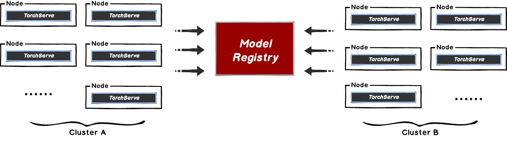
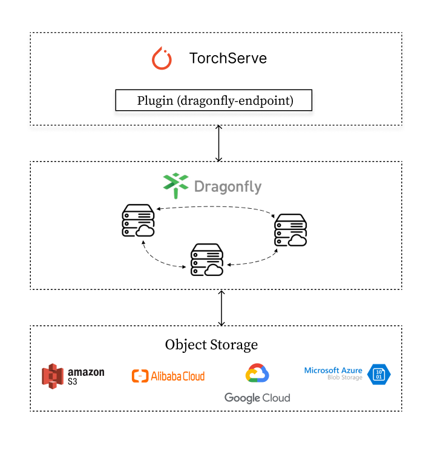
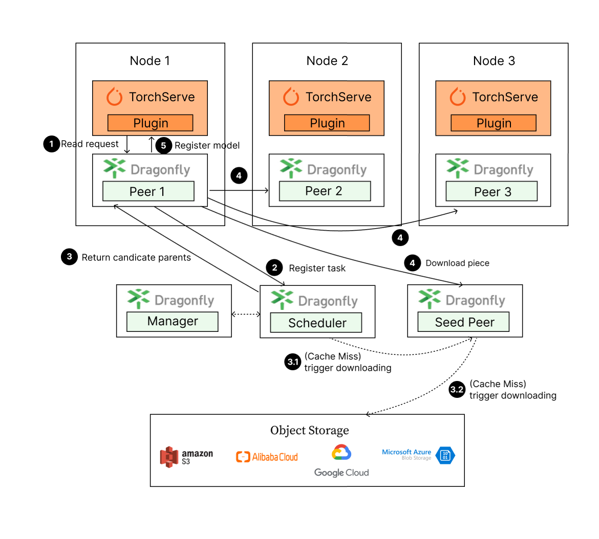

本文主要解决在 [TorchServe](https://github.com/pytorch/serve) 模型拉取时，存在的中心化的模型仓库带宽瓶颈问题。
当在 TorchServe 下载模型的时候，文件相对较大且会有并发下载模型的场景。 这样很容易导致存储带宽被打满，从而引起下载过慢的情况，影响推理服务的使用。



这种方式比较好的解决方案是使用 Dragonfly 的 P2P 技术利用每个节点的闲置带宽缓解模型仓库的带宽压力，从而达到加速效果。
在最理想的情况下 Dragonfly 可以让整个 P2P 集群中只有一个节点回源下载模型，其他节点流量均使用集群内 P2P 内网带宽。


## 架构



TorchServe 通过集成 [Dragonfly Endpoint](https://github.com/dragonflyoss/dragonfly-endpoint) 插件，
发送模型下载请求到 Dragonfly，Dragonfly 作为代理去对应的 Object Storage下载模型并返回。



模型下载步骤：

1. TorchServe 发起模型下载请求到 Dragonfly Peer。
2. Dragonfly Peer 会到 Dragonfly Scheduler 注册任务。
3. 返回合适的一组父节点给 Dragonfly Peer 进行下载。
4. Dragonfly Peer 从合适的一组父节点分片下载文件。
5. 模型下载完成之后，TorchServe 会进行模型注册。

## 部署

通过集成 Dragonfly Endpoint 到 TorchServe 中，使下载流量通过 Dragonfly 去拉取 S3，OSS，GCS，ABS 中存储的模型文件,
并在 TorchServe 中进行注册。TorchServe 插件维护在 [dragonfly-endpoint](https://github.com/dragonflyoss/dragonfly-endpoint) 仓库中。

### 环境准备

| 所需软件           | 版本   | 链接                                             |
| ------------------ | ------ | ------------------------------------------------ |
| Kubernetes cluster | 1.20+  | [kubernetes.io](https://kubernetes.io/)          |
| Helm               | 3.8.0+ | [helm.sh](https://helm.sh/)                      |
| TorchServe         | 0.4.0+ | [pytorch.org/serve/](https://pytorch.org/serve/) |

### Dragonfly Kubernetes 集群搭建

基于 Kubernetes cluster 详细安装文档可以参考 [quick-start-kubernetes](https://d7y.io/zh/docs/getting-started/quick-start/kubernetes/)。

#### 准备 Kubernetes 集群

如果没有可用的 Kubernetes 集群进行测试，推荐使用 [Kind](https://kind.sigs.k8s.io/)。

创建 Kind 多节点集群配置文件 kind-config.yaml, 配置如下:

```yaml
kind: Cluster
apiVersion: kind.x-k8s.io/v1alpha4
nodes:
  - role: control-plane
  - role: worker
  - role: worker
```

使用配置文件创建 Kind 集群:

```shell
kind create cluster --config kind-config.yaml
```

切换 Kubectl 的 context 到 Kind 集群:

```shell
kubectl config use-context kind-kind
```

#### Kind 加载 Dragonfly 镜像

下载 Dragonfly Latest 镜像:

```shell
docker pull dragonflyoss/scheduler:latest
docker pull dragonflyoss/manager:latest
docker pull dragonflyoss/client:latest
```

Kind 集群加载 Dragonfly Latest 镜像:

```shell
kind load docker-image dragonflyoss/scheduler:latest
kind load docker-image dragonflyoss/manager:latest
kind load docker-image dragonflyoss/client:latest
```

#### 基于 Helm Charts 创建 Dragonfly 集群

创建 Helm Charts 配置文件 charts-config.yaml。可以根据对象存储的下载路径修改`client.config.proxy.rules.regex`来调整路由匹配规则，示例中默认匹配了 AWS S3 的请求，配置如下:

```yaml
manager:
  image:
    repository: dragonflyoss/manager
    tag: latest
  metrics:
    enable: true
  config:
    verbose: true
    pprofPort: 18066

scheduler:
  image:
    repository: dragonflyoss/scheduler
    tag: latest
  metrics:
    enable: true
  config:
    verbose: true
    pprofPort: 18066

seedClient:
  image:
    repository: dragonflyoss/client
    tag: latest
  metrics:
    enable: true
  config:
    verbose: true

client:
  image:
    repository: dragonflyoss/client
    tag: latest
  metrics:
    enable: true
  config:
    verbose: true
    security:
      enable: true
    proxy:
      server:
        port: 4001
      registryMirror:
        addr: https://index.docker.io
      rules:
        - regex: 'blobs/sha256.*'
        - regex: '.*amazonaws.*'
```

使用配置文件部署 Dragonfly Helm Charts:

<!-- markdownlint-disable -->

```shell
$ helm repo add dragonfly https://dragonflyoss.github.io/helm-charts/
$ helm install --wait --create-namespace --namespace dragonfly-system dragonfly dragonfly/dragonfly -f charts-config.yaml
LAST DEPLOYED: Mon June 5 16:53:14 2024
NAMESPACE: dragonfly-system
STATUS: deployed
REVISION: 1
TEST SUITE: None
NOTES:
1. Get the scheduler address by running these commands:
  export SCHEDULER_POD_NAME=$(kubectl get pods --namespace dragonfly-system -l "app=dragonfly,release=dragonfly,component=scheduler" -o jsonpath={.items[0].metadata.name})
  export SCHEDULER_CONTAINER_PORT=$(kubectl get pod --namespace dragonfly-system $SCHEDULER_POD_NAME -o jsonpath="{.spec.containers[0].ports[0].containerPort}")
  kubectl --namespace dragonfly-system port-forward $SCHEDULER_POD_NAME 8002:$SCHEDULER_CONTAINER_PORT
  echo "Visit http://127.0.0.1:8002 to use your scheduler"

2. Get the dfdaemon port by running these commands:
  export DFDAEMON_POD_NAME=$(kubectl get pods --namespace dragonfly-system -l "app=dragonfly,release=dragonfly,component=dfdaemon" -o jsonpath={.items[0].metadata.name})
  export DFDAEMON_CONTAINER_PORT=$(kubectl get pod --namespace dragonfly-system $DFDAEMON_POD_NAME -o jsonpath="{.spec.containers[0].ports[0].containerPort}")
  You can use $DFDAEMON_CONTAINER_PORT as a proxy port in Node.

3. Configure runtime to use dragonfly:
  https://d7y.io/docs/getting-started/quick-start/kubernetes/


4. Get Jaeger query URL by running these commands:
  export JAEGER_QUERY_PORT=$(kubectl --namespace dragonfly-system get services dragonfly-jaeger-query -o jsonpath="{.spec.ports[0].port}")
  kubectl --namespace dragonfly-system port-forward service/dragonfly-jaeger-query 16686:$JAEGER_QUERY_PORT
  echo "Visit http://127.0.0.1:16686/search?limit=20&lookback=1h&maxDuration&minDuration&service=dragonfly to query download events"
```

<!-- markdownlint-restore -->

检查 Dragonfly 是否部署成功:

```shell
$ kubectl get po -n dragonfly-system
NAME                                 READY   STATUS    RESTARTS      AGE
dragonfly-client-6jgzn               1/1     Running   0             17m
dragonfly-client-qzcz9               1/1     Running   0             17m
dragonfly-manager-6bc4454d94-ldsk7   1/1     Running   0             17m
dragonfly-mysql-0                    1/1     Running   0             17m
dragonfly-redis-master-0             1/1     Running   0             17m
dragonfly-redis-replicas-0           1/1     Running   0             17m
dragonfly-redis-replicas-1           1/1     Running   0             17m
dragonfly-redis-replicas-2           1/1     Running   0             17m
dragonfly-scheduler-0                1/1     Running   0             17m
dragonfly-scheduler-1                1/1     Running   0             17m
dragonfly-scheduler-2                1/1     Running   0             17m
dragonfly-seed-client-0              1/1     Running   0             17m
dragonfly-seed-client-1              1/1     Running   0             17m
dragonfly-seed-client-2              1/1     Running   0             17m
```

#### 暴露 Proxy 服务端口

创建 dfstore.yaml 配置文件，暴露 Dragonfly Peer 的 HTTP Proxy 服务监听的端口，用于和 TorchServe 交互。
`targetPort` 如果未在 charts-config.yaml 中修改默认为`4001`， port 可根据实际情况设定值，建议也使用 `4001`。

```yaml
kind: Service
apiVersion: v1
metadata:
  name: dfstore
spec:
  selector:
    app: dragonfly
    component: client
    release: dragonfly

  ports:
    - protocol: TCP
      port: 4001
      targetPort: 4001

  type: NodePort
```

创建 Service:

```shell
kubectl --namespace dragonfly-system apply -f dfstore.yaml
```

将本地的 `4001` 端口流量转发至 Dragonfly 的 Proxy 服务:

```shell
kubectl --namespace dragonfly-system port-forward service/dfstore 4001:4001
```

### 安装 Dragonfly Endpoint 插件

#### 设置 Dragonfly Endpoint 配置的环境变量

创建 `config.json` 配置文件，并将 `DRAGONFLY_ENDPOINT_CONFIG` 环境变量配置为 `config.json` 文件路径。

```shell
export DRAGONFLY_ENDPOINT_CONFIG=/etc/dragonfly-endpoint/config.json
```

默认读取路径为：

- linux:`/etc/dragonfly-endpoint/config.json`
- darwin: `~/.dragonfly-endpoint/config.json`

#### Dragonfly Endpoint 插件配置

创建 `config.json` 配置文件，对 Torchserve 插件进行配置。下面是 S3 的配置:

> 注意：config.json 配置文件下设置 `addr` 地址为你的实际地址。

```json
{
  "addr": "http://127.0.0.1:4001",
  "header": {},
  "filter": [
    "X-Amz-Algorithm",
    "X-Amz-Credential",
    "X-Amz-Date",
    "X-Amz-Expires",
    "X-Amz-SignedHeaders",
    "X-Amz-Signature"
  ],
  "object_storage": {
    "type": "s3",
    "bucket_name": "your_s3_bucket_name",
    "region": "your_s3_access_key",
    "access_key": "your_s3_access_key",
    "secret_key": "your_s3_access_key"
  }
}
```

- addr: Drangonfly 的 Peer 的 HTTP Proxy 的地址。
- header: 为请求增加请求头。
- filter: 用于生成唯一的任务，并过滤 URL 中不必要的查询参数。
- object_storage: 模型文件所在对象存储的配置，其中 type 可为 s3，oss，abs 和 gcs。

配置文件中的 `filter` 部分， 根据对象存储类型设置不同值:

<!-- markdownlint-disable -->

| 类型 | 值                                                                                                                             |
| ---- | ------------------------------------------------------------------------------------------------------------------------------ |
| OSS  | ["Expires","Signature","ns"]                                                                                                   |
| S3   | ["X-Amz-Algorithm", "X-Amz-Credential", "X-Amz-Date", "X-Amz-Expires", "X-Amz-SignedHeaders", "X-Amz-Signature"]               |
| OBS  | ["X-Amz-Algorithm", "X-Amz-Credential", "X-Amz-Date", "X-Obs-Date", "X-Amz-Expires", "X-Amz-SignedHeaders", "X-Amz-Signature"] |

<!-- markdownlint-restore -->

##### 对象存储配置

除 S3 外，Dragonfly 的 TorchServe 插件还支持 OSS，GCS，ABS。不同的对象存储配置如下：

> 注意：OSS，GCS，ABS 配置文件下设置 `addr` 地址为你的实际地址。

OSS(Object Storage Service)

```json
{
  "addr": "http://127.0.0.1:4001",
  "header": {},
  "filter": ["Expires", "Signature"],
  "object_storage": {
    "type": "oss",
    "bucket_name": "your_oss_bucket_name",
    "endpoint": "your_oss_endpoint",
    "access_key_id": "your_oss_access_key_id",
    "access_key_secret": "your_oss_access_key_secret"
  }
}
```

GCS(Google Cloud Storage)

```json
  "addr": "http://127.0.0.1:4001",
  "header": {},
  "object_storage": {
    "type": "gcs",
    "bucket_name": "your_gcs_bucket_name",
    "project_id": "your_gcs_project_id",
    "service_account_path": "your_gcs_service_account_path"
  }
}
```

ABS(Azure Blob Storage)

```json
{
  "addr": "http://127.0.0.1:4001",
  "header": {},
  "object_storage": {
    "type": "abs",
    "account_name": "your_abs_account_name",
    "account_key": "your_abs_account_key",
    "container_name": "your_abs_container_name"
  }
}
```

### TorchServe 集成 Dragonfly Endpoint 插件

TorchServe 在不同生产环境下使用的具体文档可参考 [TorchServe 文档](https://pytorch.org/serve/)。以下提供二种部署方式, 推荐使用 Docker 容器化部署：

#### 二进制安装

##### 插件依赖

| 所需软件   | Header2 | Header3                                                                      |
| ---------- | ------- | ---------------------------------------------------------------------------- |
| Python     | 3.8.0+  | [https://www.python.org/](https://www.python.org/)                           |
| TorchServe | 0.4.0+  | [pytorch.org/serve/](https://pytorch.org/serve/)                             |
| Java       | 11      | [https://openjdk.org/projects/jdk/11/](https://openjdk.org/projects/jdk/11/) |

安装 TorchServe 依赖和 torch-model-archiver：

```shell
python ./ts_scripts/install_dependencies.py
conda install torchserve torch-model-archiver torch-workflow-archiver -c pytorch
```

克隆 TorchServe 存储库：

```shell
git clone https://github.com/pytorch/serve.git
cd serve
```

创建 [model-store](https://pytorch.org/serve/getting_started.html?highlight=model+store) 目录用来存储模型文件：

```shell
mkdir model-store
chmod 777 model-store
```

创建 [plugins-path](https://github.com/pytorch/serve/tree/master/plugins/docs) 目录用来存储插件的二进制文件：

```shell
mkdir plugins-path
```

##### 打包 Dragonfly Endpoint 插件

下载 dragonfly-endpoint 项目：

```shell
git clone https://github.com/dragonflyoss/dragonfly-endpoint.git
```

打包 dragonfly-endpoint 项目，在 `build/libs` 目录下生成文件:

```shell
cd ./dragonfly-endpoint
gradle shadowJar
```

**注意**：因为 TorchServe 自身 JVM 的限制，Gradle 的 Java 版本号最好为 11，版本号过高会导致插件无法解析。

将 Jar 文件放入之前创建好的 plugins-path 目录下：

```shell
mv build/libs/dragonfly_endpoint-1.0-all.jar  <your plugins-path>
```

准备插件的配置文件 config.json，对象存储仍以 S3 为例：

> 注意：config.json 配置文件下设置 `addr` 地址为你的实际地址。

```shell
{
	"addr": "http://127.0.0.1:4001",
	"header": {
	},
	"filter": [
		"X-Amz-Algorithm",
		"X-Amz-Credential",
    "X-Amz-Date",
  	"X-Amz-Expires",
  	"X-Amz-SignedHeaders",
  	"X-Amz-Signature"
	],
	"object_storage": {
		"type": "s3",
		"bucket_name": "your_s3_bucket_name",
		"region": "your_s3_access_key",
		"access_key": "your_s3_access_key",
		"secret_key": "your_s3_access_key"
	}
}
```

设置配置文件的环境变量:

```shell
export DRAGONFLY_ENDPOINT_CONFIG=/etc/dragonfly-endpoint/config.json
```

`--model-store` 使用之前创建的存储模型目录，`--plugins-path` 使用之前创建的存储插件的目录。启动 TorchServe 使用 Dragonfly Endpoint 插件 :

```shell
torchserve --start --model-store <path-to-model-store-file> --plugins-path=<path-to-plugin-jars>
```

##### 功能验证(二进制插件)

准备模型文件。请直接到 [Model ZOO](https://pytorch.org/serve/model_zoo.html#) 中下载现成的模型文件 `.mar`
或者参考 [Torch Model archiver for TorchServe](https://github.com/pytorch/serve/tree/master/model-archiver/README)
打包自己模型文件。以 `squeezenet1_1_scripted.mar` 模型为例：

```shell
wget https://torchserve.pytorch.org/mar_files/squeezenet1_1_scripted.mar
```

上传模型到对象存储，以下以 S3 为例，具体参考 [S3](https://aws.amazon.com/s3/?nc1=h_ls):

```shell
# 下载命令行工具
pip install awscli
# 根据提示配置密钥等
aws configure
# 上传文件
aws s3 cp <本地文件路径> s3://<存储桶名称>/<目标路径>
```

TorchServe 插件名称为 dragonfly，插件 API 的详细参数请参考 [TorchServe Register API](https://pytorch.org/serve/management_api.html#register-a-model)，
不支持 url 参数，并增加参数 `file_name` 参数 ，即需要下载的模型文件名称。
发送下载请求进行测试：

```shell
curl -X POST  "http://localhost:8081/dragonfly/models?file_name=squeezenet1_1.mar"
```

正确响应：

<!-- markdownlint-disable -->

```shell
{
	"Status": "Model "squeezenet1_1" Version: 1.0 registered with 0 initial workers. Use scale workers API to add workers for the model."
}
```

<!-- markdownlint-restore -->

增加模型的 Worker 用于推理:

```shell
curl -v -X PUT "http://localhost:8081/models/squeezenet1_1?min_worker=1"
```

模型的 Worker 数量增加成功，响应如下：

```shell
* About to connect() to localhost port 8081 (#0)
*   Trying ::1...
* Connected to localhost (::1) port 8081 (#0)
> PUT /models/squeezenet1_1?min_worker=1 HTTP/1.1
> User-Agent: curl/7.29.0
> Host: localhost:8081
> Accept: */*
>
< HTTP/1.1 202 Accepted
< content-type: application/json
< x-request-id: 66761b5a-54a7-4626-9aa4-12041e0e4e63
< Pragma: no-cache
< Cache-Control: no-cache; no-store, must-revalidate, private
< Expires: Thu, 01 Jan 1970 00:00:00 UTC
< content-length: 47
< connection: keep-alive
<
{
  "status": "Processing worker updates..."
}
* Connection #0 to host localhost left intact
```

调用推理 API:

```shell
# 准备需要推理的图片
curl -O  https://raw.githubusercontent.com/pytorch/serve/master/docs/images/kitten_small.jpg
curl -O  https://raw.githubusercontent.com/pytorch/serve/master/docs/images/dogs-before.jpg

# 调用推理 API
curl http://localhost:8080/predictions/squeezenet1_1 -T kitten_small.jpg -T dogs-before.jpg
```

推理 API 成功调用后的响应:

```shell
{
  "lynx": 0.5455784201622009,
  "tabby": 0.2794168293476105,
  "Egyptian_cat": 0.10391931980848312,
  "tiger_cat": 0.062633216381073,
  "leopard": 0.005019133910536766
}
```

#### Docker 部署 TorchServe

##### Docker 配置

拉取自带插件的 `dragonflyoss/dragonfly-endpoint` 镜像。
以下为 CPU 版的 TorchServe 为例子。构建细节参考 [Dockerfile](https://github.com/dragonflyoss/dragonfly-endpoint/blob/main/images/Dockerfile)。

```shell
docker pull dragonflyoss/dragonfly-endpoint
```

创建 [model-store](https://pytorch.org/serve/getting_started.html?highlight=model+store) 目录用来存储模型文件：

```shell
mkdir model-store
chmod 777 model-store
```

准备插件的配置文件 config.json，对象存储仍以 S3 为例:

> 注意：config.json 配置文件下设置 `addr` 地址为你的实际地址。

```shell
{
	"addr": "http://127.0.0.1:4001",
	"header": {
	},
	"filter": [
		"X-Amz-Algorithm",
		"X-Amz-Credential&X-Amz-Date",
  	"X-Amz-Expires",
  	"X-Amz-SignedHeaders",
  	"X-Amz-Signature"
	],
	"object_storage": {
		"type": "s3",
		"bucket_name": "your_s3_bucket_name",
		"region": "your_s3_access_key",
		"access_key": "your_s3_access_key",
		"secret_key": "your_s3_access_key"
	}
}
```

设置配置文件的环境变量：

```shell
export DRAGONFLY_ENDPOINT_CONFIG=/etc/dragonfly-endpoint/config.json
```

运行容器并 mount model-store 和 dragonfly-endpoint 配置目录：

<!-- markdownlint-disable -->

```shell
# 使用环境变量的配置路径
sudo docker run --rm -it --network host -v $(pwd)/model-store:/home/model-server/model-store  -v ${DRAGONFLY_ENDPOINT_CONFIG}:${DRAGONFLY_ENDPOINT_CONFIG} dragonflyoss/dragonfly-endpoint:latest
```

<!-- markdownlint-restore -->

##### 功能验证(容器镜像)

准备模型文件。请直接到 [Model ZOO](https://pytorch.org/serve/model_zoo.html#) 中下载现成的模型文件 `.mar` 或者
参考 [Torch Model archiver for TorchServe](https://github.com/pytorch/serve/tree/master/model-archiver/README) 打包自己模型文件。
以 `squeezenet1_1_scripted.mar` 模型为例：

```shell
wget https://torchserve.pytorch.org/mar_files/squeezenet1_1_scripted.mar
```

上传模型到对象存储，以下以 S3 为例，具体参考 [S3](https://aws.amazon.com/s3/?nc1=h_ls):

```shell
# 下载命令行工具
pip install awscli
# 根据提示配置密钥等
aws configure
# 上传文件
aws s3 cp <本地文件路径> s3://<存储桶名称>/<目标路径>
```

TorchServe 插件名称为 dragonfly，在 TorchServe 的管理接口下监听。
插件 API 的详细参数请参考 [TorchServe Register API](https://pytorch.org/serve/management_api.html#register-a-model) (仅不支持 url 参数)，
并增加参数 `file_name` ，即需要下载的模型文件。
发送下载请求进行测试：

```shell
curl -X POST  "http://localhost:8081/dragonfly/models?file_name=squeezenet1_1.mar"
```

正确响应：

<!-- markdownlint-disable -->

```shell
{
	"Status": "Model "squeezenet1_1" Version: 1.0 registered with 0 initial workers. Use scale workers API to add workers for the model."
}
```

<!-- markdownlint-restore -->

增加模型的 Worker 用于推理：

```shell
curl -v -X PUT "http://localhost:8081/models/squeezenet1_1?min_worker=1"
```

模型的 Worker 数量增加成功，响应如下：

```shell
* About to connect() to localhost port 8081 (#0)
*   Trying ::1...
* Connected to localhost (::1) port 8081 (#0)
> PUT /models/squeezenet1_1?min_worker=1 HTTP/1.1
> User-Agent: curl/7.29.0
> Host: localhost:8081
> Accept: */*
>
< HTTP/1.1 202 Accepted
< content-type: application/json
< x-request-id: 66761b5a-54a7-4626-9aa4-12041e0e4e63
< Pragma: no-cache
< Cache-Control: no-cache; no-store, must-revalidate, private
< Expires: Thu, 01 Jan 1970 00:00:00 UTC
< content-length: 47
< connection: keep-alive
<
{
  "status": "Processing worker updates..."
}
* Connection #0 to host localhost left intact
```

调用推理 API：

```shell
# 准备需要推理的图片
curl -O  https://raw.githubusercontent.com/pytorch/serve/master/docs/images/kitten_small.jpg
curl -O  https://raw.githubusercontent.com/pytorch/serve/master/docs/images/dogs-before.jpg

# 调用推理 API
curl http://localhost:8080/predictions/squeezenet1_1 -T kitten_small.jpg -T dogs-before.jpg
```

推理 API 成功调用后的响应：

```shell
{
  "lynx": 0.5455784201622009,
  "tabby": 0.2794168293476105,
  "Egyptian_cat": 0.10391931980848312,
  "tiger_cat": 0.062633216381073,
  "leopard": 0.005019133910536766
}
```

## 性能测试

测试在单机情况下，集成 Dragonfly 后下载模型的性能对比。使用的对象存储是 OSS，由于机器本身网络环境、配置等影响，
实际下载时间不具有参考价值。不同场景下下载速度对应的比例较有意义。


- TorchServe API: 直接通过 URL 下载对象存储里的模型文件。
- TorchServe API & Dragonfly Cold Boot：通过 Dragonfly 代理模式进行回源下载，没有命中任何缓存所花费的时间。
- Hit Remote Peer: 通过 Dragonfly 代理模式，在命中 Dragonfly 的远端 Peer 缓存的情况下的下载时间。
- Hit Local Peer: 通过 Dragonfly 代理模式，在命中 Dragonfly 的本地 Peer 缓存的情况下的下载时间。

测试结果表明 TorchServe 集成 Dragonfly，能有效减少下载时间。在命中缓存 ，尤其是本地缓存的情况下有较大的提升。
即使是回源下载的性能也和直接下载的相差无几。注意的是本次测试为单机测试，意味着在命中缓存的情况下，性能瓶颈主要在磁盘。
如果是多台机器部署的 Dragonfly 进行 P2P 下载的情况，模型下载速度会更快。
