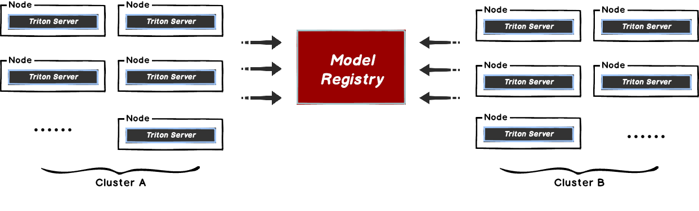
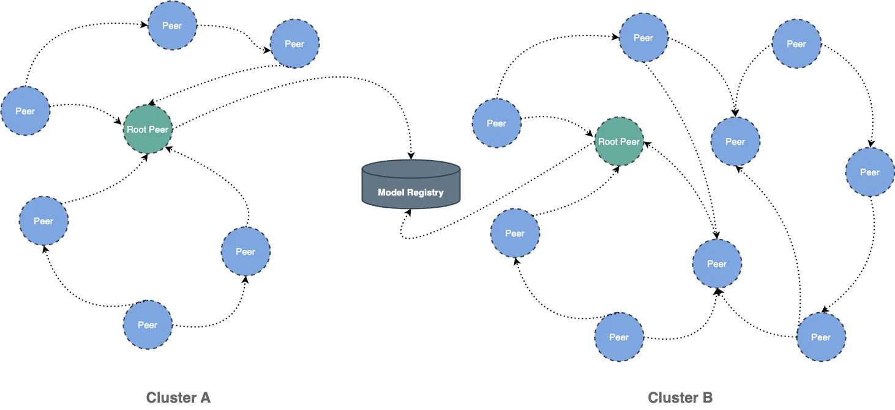

本文主要解决在 [Triton Server](https://github.com/triton-inference-server/server) 模型拉取时，存在的中心化的模型仓库带宽瓶颈问题。
当在 Triton Server 下载模型的时候，文件相对较大且会有并发下载模型的场景。
这样很容易导致存储带宽被打满，从而引起下载过慢的情况，影响推理服务的使用。



这种方式比较好的解决方案是使用 Dragonfly 的 P2P 技术利用每个节点的闲置带宽缓解模型仓库的带宽压力，
从而达到加速效果。在最理想的情况下 Dragonfly 可以让整个 P2P 集群中只有一个节点回源下载模型，其他节点流量均使用集群内 P2P 内网带宽。



## 部署

通过集成 Dragonfly Repository Agent 到 Triton Server 中，使下载流量通过 Dragonfly 去拉取 S3，GCS，ABS 中存储的模型文件,
并在 Triton Serve 中进行注册。Triton Server 插件维护在
[dragonfly-repository-agent](https://github.com/dragonflyoss/dragonfly-repository-agent) 仓库中。

### 依赖

| 所需软件           | 版本      | 链接                                                               |
| ------------------ | --------- | ------------------------------------------------------------------ |
| Kubernetes cluster | 1.20+     | [kubernetes.io](https://kubernetes.io/)                            |
| Helm               | 3.8.0+    | [helm.sh](https://helm.sh/)                                        |
| Triton Server      | 23.08-py3 | [Triton Server](https://github.com/triton-inference-server/server) |

### Dragonfly Kubernetes 集群搭建

基于 Kubernetes cluster 详细安装文档可以参考 [quick-start-kubernetes](https://d7y.io/zh/docs/getting-started/quick-start/kubernetes/)。

#### 准备 Kubernetes 集群

如果没有可用的 Kubernetes 集群进行测试，推荐使用 [Kind](https://kind.sigs.k8s.io/)。

创建 Kind 多节点集群配置文件 kind-config.yaml, 配置如下:

```yaml
kind: Cluster
apiVersion: kind.x-k8s.io/v1alpha4
nodes:
  - role: control-plane
  - role: worker
  - role: worker
```

使用配置文件创建 Kind 集群:

```shell
kind create cluster --config kind-config.yaml
```

切换 Kubectl 的 context 到 Kind 集群:

```shell
kubectl config use-context kind-kind
```

#### Kind 加载 Dragonfly 镜像

下载 Dragonfly latest 镜像:

```shell
docker pull dragonflyoss/scheduler:latest
docker pull dragonflyoss/manager:latest
docker pull dragonflyoss/client:latest
```

Kind 集群加载 Dragonfly latest 镜像:

```shell
kind load docker-image dragonflyoss/scheduler:latest
kind load docker-image dragonflyoss/manager:latest
kind load docker-image dragonflyoss/client:latest
```

#### 基于 Helm Charts 创建 Dragonfly 集群

创建 Helm Charts 配置文件 charts-config.yaml。可以根据对象存储的下载路径修改 `client.config.proxy.rules.regex` 来调整路由匹配规则。
示例中默认匹配了 AWS S3 的请求，并且添加 `regex:.*models.*` 以匹配存储桶 `models` 的请求，配置如下:

```yaml
manager:
  image:
    repository: dragonflyoss/manager
    tag: latest
  metrics:
    enable: true
  config:
    verbose: true
    pprofPort: 18066

scheduler:
  image:
    repository: dragonflyoss/scheduler
    tag: latest
  metrics:
    enable: true
  config:
    verbose: true
    pprofPort: 18066

seedClient:
  image:
    repository: dragonflyoss/client
    tag: latest
  metrics:
    enable: true
  config:
    verbose: true

client:
  image:
    repository: dragonflyoss/client
    tag: latest
  metrics:
    enable: true
  config:
    verbose: true
    security:
      enable: true
    proxy:
      server:
        port: 4001
      registryMirror:
        addr: https://index.docker.io
      rules:
        - regex: 'blobs/sha256.*'
        # 代理匹配 Model Bucket 的所有 HTTP Downlowd 请求
        - regex: '.*models.*'
```

使用配置文件部署 Dragonfly Helm Charts:

<!-- markdownlint-disable -->

```shell
$ helm repo add dragonfly https://dragonflyoss.github.io/helm-charts/
$ helm install --wait --create-namespace --namespace dragonfly-system dragonfly dragonfly/dragonfly -f charts-config.yaml
LAST DEPLOYED: Mon June 27 19:56:34 2024
NAMESPACE: dragonfly-system
STATUS: deployed
REVISION: 1
TEST SUITE: None
NOTES:
1. Get the scheduler address by running these commands:
  export SCHEDULER_POD_NAME=$(kubectl get pods --namespace dragonfly-system -l "app=dragonfly,release=dragonfly,component=scheduler" -o jsonpath={.items[0].metadata.name})
  export SCHEDULER_CONTAINER_PORT=$(kubectl get pod --namespace dragonfly-system $SCHEDULER_POD_NAME -o jsonpath="{.spec.containers[0].ports[0].containerPort}")
  kubectl --namespace dragonfly-system port-forward $SCHEDULER_POD_NAME 8002:$SCHEDULER_CONTAINER_PORT
  echo "Visit http://127.0.0.1:8002 to use your scheduler"

2. Get the dfdaemon port by running these commands:
  export DFDAEMON_POD_NAME=$(kubectl get pods --namespace dragonfly-system -l "app=dragonfly,release=dragonfly,component=dfdaemon" -o jsonpath={.items[0].metadata.name})
  export DFDAEMON_CONTAINER_PORT=$(kubectl get pod --namespace dragonfly-system $DFDAEMON_POD_NAME -o jsonpath="{.spec.containers[0].ports[0].containerPort}")
  You can use $DFDAEMON_CONTAINER_PORT as a proxy port in Node.

3. Configure runtime to use dragonfly:
  https://d7y.io/docs/getting-started/quick-start/kubernetes/


4. Get Jaeger query URL by running these commands:
  export JAEGER_QUERY_PORT=$(kubectl --namespace dragonfly-system get services dragonfly-jaeger-query -o jsonpath="{.spec.ports[0].port}")
  kubectl --namespace dragonfly-system port-forward service/dragonfly-jaeger-query 16686:$JAEGER_QUERY_PORT
  echo "Visit http://127.0.0.1:16686/search?limit=20&lookback=1h&maxDuration&minDuration&service=dragonfly to query download events"
```

<!-- markdownlint-restore -->

检查 Dragonfly 是否部署成功:

```shell
$ kubectl get pod -n dragonfly-system
NAME                                 READY   STATUS    RESTARTS       AGE
dragonfly-client-qhkn8               1/1     Running   0              21m3s
dragonfly-client-qzcz9               1/1     Running   0              21m3s
dragonfly-manager-6bc4454d94-ldsk7   1/1     Running   0              21m3s
dragonfly-mysql-0                    1/1     Running   0              21m3s
dragonfly-redis-master-0             1/1     Running   0              21m3s
dragonfly-redis-replicas-0           1/1     Running   0              21m3s
dragonfly-redis-replicas-1           1/1     Running   0              21m3s
dragonfly-redis-replicas-2           1/1     Running   0              21m3s
dragonfly-scheduler-0                1/1     Running   0              21m3s
dragonfly-scheduler-1                1/1     Running   0              21m3s
dragonfly-scheduler-2                1/1     Running   0              21m3s
dragonfly-seed-client-0              1/1     Running   0              21m3s
dragonfly-seed-client-1              1/1     Running   0              21m3s
dragonfly-seed-client-2              1/1     Running   0              21m3s
```

#### 暴露 Proxy 服务端口

创建 dfstore.yaml 配置文件，暴露 Dragonfly Peer 的 HTTP Proxy 服务监听的端口，用于和 Triton Server 交互。
`targetPort` 如果未在 charts-config.yaml 中修改默认为`4001`， port 可根据实际情况设定值，建议也使用 `4001`。

```yaml
kind: Service
apiVersion: v1
metadata:
  name: dfstore
spec:
  selector:
    app: dragonfly
    component: client
    release: dragonfly

  ports:
    - protocol: TCP
      port: 4001
      targetPort: 4001

  type: NodePort
```

创建 Service:

```shell
kubectl --namespace dragonfly-system apply -f dfstore.yaml
```

将本地的`4001`端口流量转发至 Dragonfly 的 Proxy 服务:

```shell
kubectl --namespace dragonfly-system port-forward service/dfstore 4001:4001
```

### 安装 Dragonfly Repository Agent 插件

#### 设置 Dragonfly Repository Agent 配置

创建 `dragonfly_config.json` 配置文件，示例如下：

> 注意：config.json 配置文件下设置 `addr` 地址为你的实际地址。

```shell
{
  "proxy": "http://127.0.0.1:4001",
	"header": {
	},
	"filter": [
  	"X-Amz-Algorithm",
  	"X-Amz-Credential&X-Amz-Date",
  	"X-Amz-Expires",
  	"X-Amz-SignedHeaders",
  	"X-Amz-Signature"
	]
}
```

- proxy: Dragonfly Peer 的 HTTP Proxy 的地址。
- header: 为请求增加请求头。
- filter: 用于生成唯一的任务，并过滤 URL 中不必要的查询参数。

配置文件中的 `filter` 部分， 根据对象存储类型设置不同值:

<!-- markdownlint-disable -->

| 类型 | 值                                                                                                                             |
| ---- | ------------------------------------------------------------------------------------------------------------------------------ |
| OSS  | ["Expires","Signature","ns"]                                                                                                   |
| S3   | ["X-Amz-Algorithm", "X-Amz-Credential", "X-Amz-Date", "X-Amz-Expires", "X-Amz-SignedHeaders", "X-Amz-Signature"]               |
| OBS  | ["X-Amz-Algorithm", "X-Amz-Credential", "X-Amz-Date", "X-Obs-Date", "X-Amz-Expires", "X-Amz-SignedHeaders", "X-Amz-Signature"] |

<!-- markdownlint-restore -->

#### 设置模型仓库配置

创建 `cloud_credential.json` 云存储凭证文件，示例如下：

```shell
{
  "gs": {
    "": "PATH_TO_GOOGLE_APPLICATION_CREDENTIALS",
    "gs://gcs-bucket-002": "PATH_TO_GOOGLE_APPLICATION_CREDENTIALS_2"
  },
  "s3": {
    "": {
      "secret_key": "AWS_SECRET_ACCESS_KEY",
      "key_id": "AWS_ACCESS_KEY_ID",
      "region": "AWS_DEFAULT_REGION",
      "session_token": "",
      "profile": ""
    },
    "s3://s3-bucket-002": {
      "secret_key": "AWS_SECRET_ACCESS_KEY_2",
      "key_id": "AWS_ACCESS_KEY_ID_2",
      "region": "AWS_DEFAULT_REGION_2",
      "session_token": "AWS_SESSION_TOKEN_2",
      "profile": "AWS_PROFILE_2"
    }
  },
  "as": {
    "": {
      "account_str": "AZURE_STORAGE_ACCOUNT",
      "account_key": "AZURE_STORAGE_KEY"
    },
    "as://Account-002/Container": {
      "account_str": "",
      "account_key": ""
    }
  }
}
```

同时，通过 Dragonfly 拉取模型，需要修改模型中配置文件`config.pbtxt`，添加如下代码：

```shell
model_repository_agents
{
  agents [
    {
      name: "dragonfly",
    }
  ]
}
```

[densenet_onnx 示例](https://github.com/dragonflyoss/dragonfly-repository-agent/tree/main/examples/model_repository/densenet_onnx)提供已修改的配置及模型文件。其中`densenet_onnx/config.pbtxt`文件修改如下:

```shell
name: "densenet_onnx"
platform: "onnxruntime_onnx"
max_batch_size : 0
input [
  {
    name: "data_0"
    data_type: TYPE_FP32
    format: FORMAT_NCHW
    dims: [ 3, 224, 224 ]
    reshape { shape: [ 1, 3, 224, 224 ] }
  }
]
output [
  {
    name: "fc6_1"
    data_type: TYPE_FP32
    dims: [ 1000 ]
    reshape { shape: [ 1, 1000, 1, 1 ] }
    label_filename: "densenet_labels.txt"
  }
]
model_repository_agents
{
  agents [
    {
      name: "dragonfly",
    }
  ]
}
```

### Triton Server 集成 Dragonfly Repository Agent 插件

#### Docker 部署 Triton Server

拉取自带插件的 `dragonflyoss/dragonfly-repository-agent` 镜像。构建细节参考 [Dockerfile](https://github.com/dragonflyoss/dragonfly-repository-agent/blob/main/Dockerfile)。

```shell
docker pull dragonflyoss/dragonfly-repository-agent:latest
```

运行容器并 mount model-repository 和 dragonfly-repository-agent 配置目录：

```shell
docker run --network host --rm \
  -v ${path-to-config-dir}:/home/triton/ \
  dragonflyoss/dragonfly-repository-agent:latest tritonserver \
  --model-repository=${model-repository-path}
```

- `path-to-config-dir`: `dragonfly_config.json` 以及 `cloud_credential.json` 文件所在目录。
- `model-repository-path`: 远程模型仓库地址。

正确输出结果有以下内容：

<!-- markdownlint-disable -->

```shell
=============================
== Triton Inference Server ==
=============================
successfully loaded 'densenet_onnx'
I1130 09:43:22.595672 1 server.cc:604]
+------------------+------------------------------------------------------------------------+
| Repository Agent | Path                                                                   |
+------------------+------------------------------------------------------------------------+
| dragonfly        | /opt/tritonserver/repoagents/dragonfly/libtritonrepoagent_dragonfly.so |
+------------------+------------------------------------------------------------------------+

I1130 09:43:22.596011 1 server.cc:631]
+-------------+-----------------------------------------------------------------+---------------------------------------------------------------------------------------------------------------------------------------------------------------+
| Backend     | Path                                                            | Config                                                                                                                                                        |
+-------------+-----------------------------------------------------------------+---------------------------------------------------------------------------------------------------------------------------------------------------------------+
| pytorch     | /opt/tritonserver/backends/pytorch/libtriton_pytorch.so         | {}                                                                                                                                                            |
| onnxruntime | /opt/tritonserver/backends/onnxruntime/libtriton_onnxruntime.so | {"cmdline":{"auto-complete-config":"true","backend-directory":"/opt/tritonserver/backends","min-compute-capability":"6.000000","default-max-batch-size":"4"}} |
+-------------+-----------------------------------------------------------------+---------------------------------------------------------------------------------------------------------------------------------------------------------------+

I1130 09:43:22.596112 1 server.cc:674]
+---------------+---------+--------+
| Model         | Version | Status |
+---------------+---------+--------+
| densenet_onnx | 1       | READY  |
+---------------+---------+--------+

I1130 09:43:22.598318 1 metrics.cc:703] Collecting CPU metrics
I1130 09:43:22.599373 1 tritonserver.cc:2435]
+----------------------------------+-----------------------------------------------------------------------------------------------------------------------------------------------------------------------------------------------------------------+
| Option                           | Value                                                                                                                                                                                                           |
+----------------------------------+-----------------------------------------------------------------------------------------------------------------------------------------------------------------------------------------------------------------+
| server_id                        | triton                                                                                                                                                                                                          |
| server_version                   | 2.37.0                                                                                                                                                                                                          |
| server_extensions                | classification sequence model_repository model_repository(unload_dependents) schedule_policy model_configuration system_shared_memory cuda_shared_memory binary_tensor_data parameters statistics trace logging |
| model_repository_path[0]         | s3://192.168.36.128:9000/models                                                                                                                                                                                 |
| model_control_mode               | MODE_NONE                                                                                                                                                                                                       |
| strict_model_config              | 0                                                                                                                                                                                                               |
| rate_limit                       | OFF                                                                                                                                                                                                             |
| pinned_memory_pool_byte_size     | 268435456                                                                                                                                                                                                       |
| min_supported_compute_capability | 6.0                                                                                                                                                                                                             |
| strict_readiness                 | 1                                                                                                                                                                                                               |
| exit_timeout                     | 30                                                                                                                                                                                                              |
| cache_enabled                    | 0                                                                                                                                                                                                               |
+----------------------------------+-----------------------------------------------------------------------------------------------------------------------------------------------------------------------------------------------------------------+

I1130 09:43:22.610334 1 grpc_server.cc:2451] Started GRPCInferenceService at 0.0.0.0:8001
I1130 09:43:22.612623 1 http_server.cc:3558] Started HTTPService at 0.0.0.0:8000
I1130 09:43:22.695843 1 http_server.cc:187] Started Metrics Service at 0.0.0.0:8002
```

<!-- markdownlint-restore -->

执行指令，查看 Dragonfly 日志:

```shell
# 获取 Pod Name
export POD_NAME=$(kubectl get pods --namespace dragonfly-system -l "app=dragonfly,release=dragonfly,
component=client" -o=jsonpath='{.items[?(@.spec.nodeName=="kind-worker")].metadata.name}' | head -n 1 )

# 查看下载日志
kubectl -n dragonfly-system exec -it ${POD_NAME} -- grep "download task succeeded" /var/log/dragonfly/dfdaemon/*
```

日志输出例子：

```shell
{
  2024-04-19T02:44:09.259458Z  INFO
  "download_task":"dragonfly-client/src/grpc/dfdaemon_download.rs:276":: "download task succeeded"
  "host_id": "172.18.0.3-minikube",
  "task_id": "a46de92fcb9430049cf9e61e267e1c3c9db1f1aa4a8680a048949b06adb625a5",
  "peer_id": "172.18.0.3-minikube-86e48d67-1653-4571-bf01-7e0c9a0a119d"
}
```

#### 功能验证

对于上述上传的 `densenet_onnx` 模型，运行以下命令进行验证：

<!-- markdownlint-disable -->

```shell
docker run -it --rm --net=host nvcr.io/nvidia/tritonserver:23.08-py3-sdk /workspace/install/bin/image_client -m densenet_onnx -c 3 -s INCEPTION /workspace/images/mug.jpg
```

<!-- markdownlint-restore -->

推理成功的响应：

```shell
Request 0, batch size 1
Image '/workspace/images/mug.jpg':
    15.349563 (504) = COFFEE MUG
    13.227461 (968) = CUP
    10.424893 (505) = COFFEEPOT
```

## 性能测试

测试在单机情况下，集成 Dragonfly 后下载模型的性能对比，使用的对象存储为 minio。由于机器本身网络环境、配置等影响，实际下载时间不具有参考价值。不同场景下下载速度对应的比例较有意义:


- Triton API: 直接通过 URL 下载对象存储里的模型文件。
- Triton API & Dragonfly Cold Boot：通过 Dragonfly 代理模式进行回源下载，没有命中任何缓存所花费的时间。
- Hit Remote Peer: 通过 Dragonfly 代理模式，在命中 Dragonfly 的远端 Peer 缓存的情况下的下载时间。
- Hit Local Peer: 通过 Dragonfly 代理模式，在命中 Dragonfly 的本地 Peer 缓存的情况下的下载时间。

测试结果表明 Triton Server 集成 Dragonfly，能有效减少下载时间。在命中缓存，尤其是本地缓存的情况下有较大的提升。
即使是回源下载的性能也和直接下载的相差无几。注意的是本次测试为单机测试，意味着在命中缓存的情况下，性能瓶颈主要在磁盘。
如果是多台机器部署的 Dragonfly 进行 P2P 下载的情况，模型下载速度会更快。
