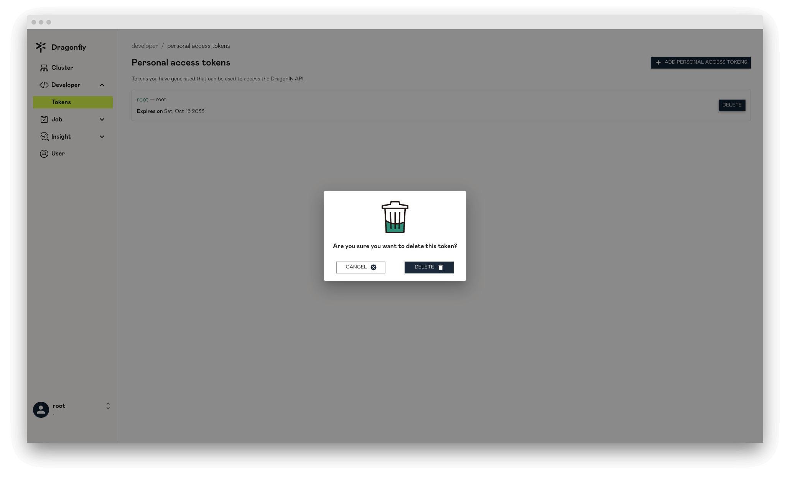

## Sign in

默认账号为 `root`, 密码为 `dragonfly`.

## Sign up

可以在该页面注册新的账号。

## Clusters

当用户登陆成功会直接重定向到 Clusters 页面，该页面展示所有 Clusters 的列表信息。

## Cluster

展示 Cluster 的详细信息，如果对属性表述不清楚，可以点击 `?` 按钮展示具体提示信息。

## Create Cluster

创建 Cluster 资源，同时会创建一组 `1:1` 关系的 Scheduler Cluster 和 Seed Peer Cluster。
一个 Cluster 即可以表示一个 P2P 集群，包含 1 个 Scheduler Cluster 和 1 个 Seed Peer Cluster。

### Information

Cluster 基本信息。

**Set cluster as your default cluster**: 当 Peer 根据 Scopes 信息没有找到匹配的 Cluster 服务时，会使用默认的 Cluster 服务。

### Scopes

Cluster 管辖的 Scopes 信息。Peer 会根据 Dfdaemon 启动的配置文件 IDC、Location 以及 IP 的内容上报给 Manager。然后 Manager 选择
跟 Cluster Scopes 中 IDC、Location 以及 CIDRs 匹配的 Cluster。被选中的 Cluster 会提供自身的 Scheduler Cluster 和 Seed Peer Cluster 对
当前 Peer 进行服务。这样可以通过 Scopes 来区分不同 Cluster 服务的 Peer 群，在多集群场景中非常重要。

**Location**: Cluster 需要为该 Location 的所有 Peer 提供服务。当对 Peer 配置中的 Location 与 Cluster 中的 Location 配时，
Peer 将优先使用 Cluster 的 Scheduler 和 Seed Peer。用“|”分隔，例如“地区|国家|省|城市”。

**IDC**: Cluster 需要服务 IDC 内的所有 Peer。当 Peer 配置中的 IDC 与 Cluster 中的 IDC 匹配时，Peer 将优先使用 Cluster 的 Scheduler 和 Seed Peer。
IDC 在 Scopes 内的优先级高于 Location。

**CIDRs**: Cluster 需要为 CIDR 中的所有 Peer 提供服务。当 Peer 启动时，将在 Peer 配置中使用 Advertise IP，如果 Peer 配置中的 Advertise IP 为空，
则 Peer 将自动获取 Expose IP 作为 Advertise IP。当 Peer 上报的 IP 与 Cluster 中的 CIDR 匹配时，Peer 将优先使用 Cluster 的 Scheduler 和 Seed Peer。
CIDR 在 Scopes 内的优先级高于 IDC。

### Config

P2P 中的下载配置。

**Seed Peer load limit**: 如果其他 Peer 从 Seed Peer 下载，Seed Peer 的负载将会增加。当达到 Seed Peer 的负载限制时，
Scheduler 将不再调度其他 Peer 从 Seed Peer 下载，直到它有可用的负载。

**Peer load limit**: 如果其他 Peer 从该 Peer 下载，该 Peer 的负载将会增加。当达到 Peer 的负载限制时，
Scheduler 将不再调度其他 Peer 从该 Peer 下载，直到它有可用的负载。

**Number of concurrent download pieces**: 可以同时并发下载 Piece 的数量。

**Candidate parent limit**: Scheduler 最多可以为 Peer 调度的父节点个数。

**Filter parent limit**: Scheduler 将根据限制从所有 Peer 中随机选择对应数量的 Parents，并且对 Parents 进行评估，并且根据 Candidate parent limit 值
选择分数最高的一组 Parents 供当前 Peer 使用。

## Update Cluster

更新 Cluster 信息。

## Delete Cluster

删除 Cluster 信息，同时会删除 Scheduler Cluster 和 Seed Peer Cluster 信息。

## Scheduler

展示 Scheduler 实例信息。

## Delete Scheduler

删除 Scheduler 实例信息，如果被删除掉那么该 Scheduler 就无法提供服务。

## Seed Peer

展示 Seed Peer 实例信息。

## Delete Seed Peer

删除 Seed Peer 实例信息，如果被删除掉那么该 Seed Peer 就无法提供服务。

## Personal Access Tokens

展示所有 Personal Access Token 的列表信息。

## Create Personal Access Token

创建 Personal Access Token。

**Expiration**: 为令牌提供过期时间。

**Scopes**:选择令牌的访问权限。

## Update Personal Access Token

更新 Personal Access Token 信息。

## Delete Personal Access Token

删除 Personal Access Token ，如果被删除那么该 Personal Access Token 将无法提供服务。

## Preheats

展示所有预热任务列表信息。

## Preheat

显示预热任务详细信息，`status` 属性显示预热任务是否成功。

## Preheat Failure

如果返回预热任务状态为 `FAILURE`，表示预热失败，并且可以查看失败日志。

## Create Preheat

创建预热任务，该任务用于文件预热。

**Clusters**至少选择一个或多个 Cluster 进行预热。

**URL**: 需要进行预热资源的 URL 地址。

**Tag**: 当预热任务的 URL 相同但 Tag 不同时，会根据 Tag 进行区分，生成的预热任务也会不同。

**Filter**:通过设置 Filter 参数，可以指定需要预热的资源的文件类型,过滤器用于生成唯一的任务 ID,过滤 URL 中不必要的查询参数，由 & 字符分隔。

## Peers

根据不同的属性展示 Peer 数量，如果对图表表述不清楚，可以点击 `?` 按钮展示具体提示信息。

## Export Peer Date

导出你需要的 Peer 数据。

## Users

只有 `root` 角色的用户可以浏览所有用户的信息列表。

## User

展示用户的详细信息。

## Update User Role

只有 `root` 角色的用户可以更改其他用户的角色。

## Profile

展示用户自己的信息。

## Change Password

更改密码。

## Update Profile

更新用户自己的信息。

