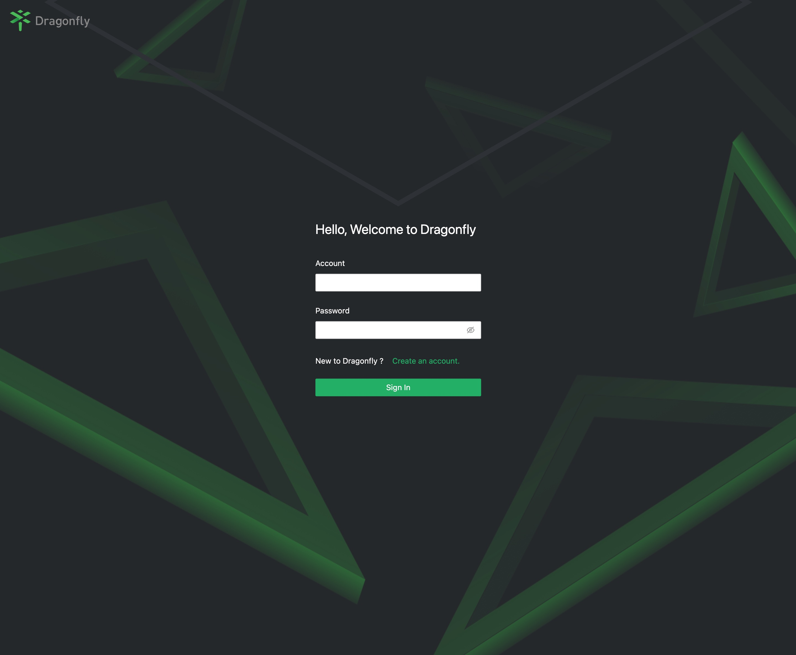
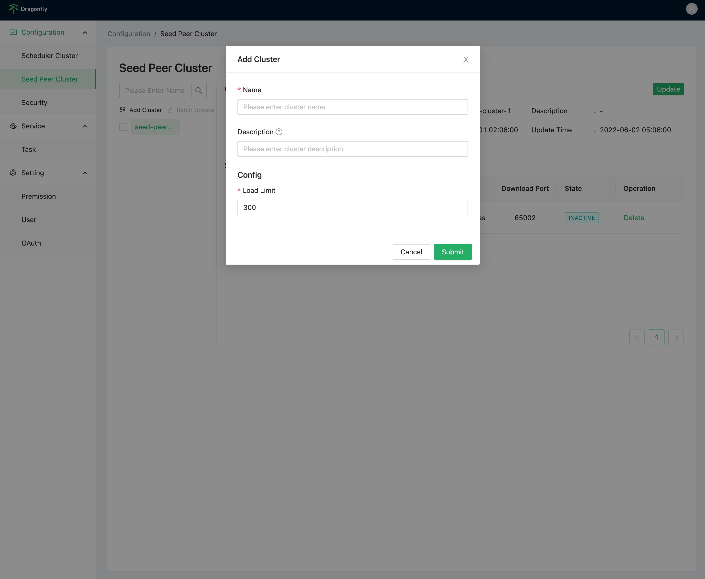

## 用户账号

服务启动后会默认生成 Root 用户, 账号为 `root`, 密码为 `dragonfly`。

## 功能页面

### 用户

#### 登陆

#### 注册

### 配置管理

#### Scheduler 集群

##### Scheduler 集群列表

##### 添加 Scheduler 集群

#### Seed Peer 集群

##### Seed Peer 集群列表

##### 添加 Seed Peer 集群

