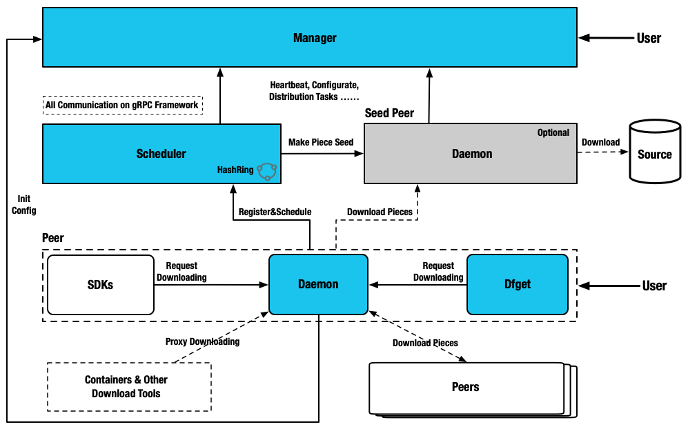

## 定位

提供企业级（高效、稳定、安全、低成本、产品化）的文件分发与管理服务，并成为在该领域的云原生标准解决方案与最佳实践。

## 核心能力

- 基于机器学习的多场景自适应智能 P2P 节点调度，不仅提高下载效率且能够保证系统稳定性。
- 通过统一的回源适配层及实现支持各种不同类型存储（HDFS、各云厂商的存储服务、Maven、YUM 等等）的 P2P 文件分发能力。
- 支持更多的分发模式, 如主动拉取、主动推送、实时同步、自动预热等等。
- 系统之间分离解耦，且支持按需部署，可轻可重，可内可外，灵活满足不同场景的实际需要。
- 基于 grpc 全新设计的 P2P 协议框架，效率及稳定性更佳。
- 支持用户权限管理以及多租户隔离机制。
- 支持分发过程中对文件动态压缩以提升分发效率。
- 客户端通过 C/S 模式支持第三方软件原生集成蜻蜓的 P2P 能力。
- 支持任务管理、数据视图以及全局管控等功能。
- 与云原生生态融合，比如 Harbor、Nydus 等。

## 架构设计

## 子系统功能

### Manager

- 存储动态配置供 Seed Peer 集群、Scheduler 集群以及 Dfdaemon 消费。
- 维护 Seed Peer 集群和 Scheduler 集群之间关联关系。
- 提供统一异步任务管理，用作预热等功能。
- 监听各模块是否健康运行。
- 为 Dfdaemon 筛选最优 Scheduler 集群调度使用。
- 提供可视化控制台，方便用户操作管理 P2P 集群。

### Scheduler

- 基于机器学习的多场景自适应智能 P2P 节点调度, 为当前下载节点选择最优父节点。
- 构建 P2P 下载网络的有向无环图。
- 根据不同特征值评估节点下载能力, 剔除异常节点。
- 当下载失败情况，主动通知 Dfdaemon 进行回源下载。

### Dfdaemon

- 基于 GRPC 提供下载功能, 并提供多源适配能力。
- 开启 Seed Peer 模式可以作为 P2P 集群中回源下载节点, 也就是整个集群中下载的根节点。
- 为镜像仓库或者其他 HTTP 下载任务提供代理服务。
- 下载任务基于 `HTTP` 或 `HTTPS` 或其他自定义协议。
