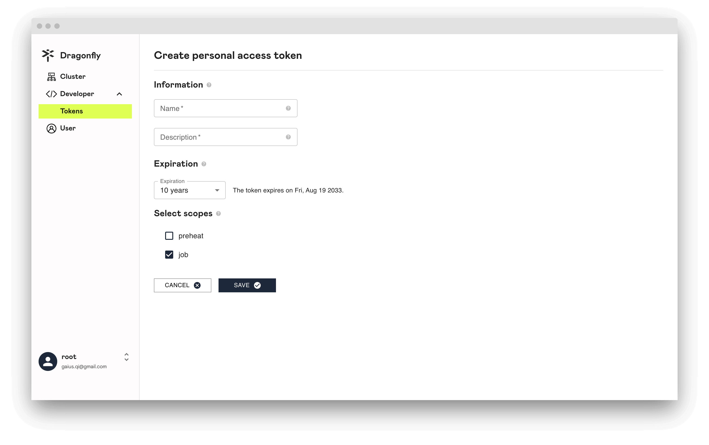
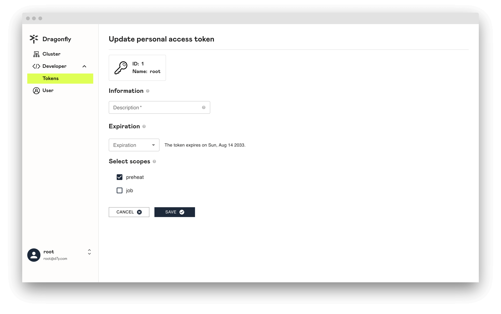
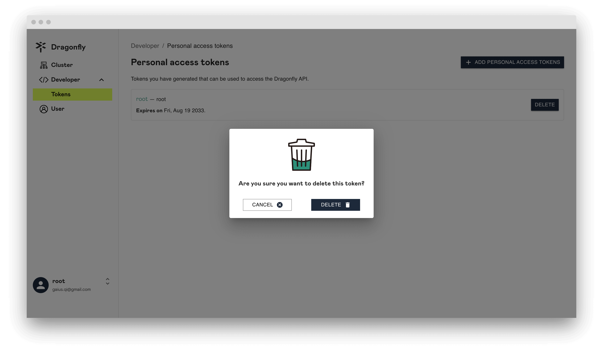
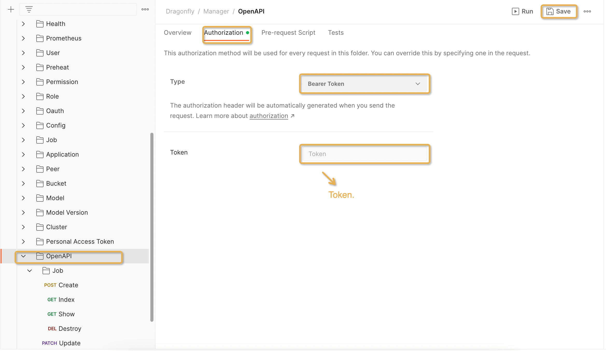

可以使用 Personal Access Token 来调用 Open API。

在本文中，我们将向您展示如何为 Personal Access Token 创建、使用、修改和删除。

## 关于 Personal Access Token

只有具有 `root` 角色的用户才能浏览所有 Personal Access Token 列表。

## 创建 Personal Access Token

点击 `ADD PERSONAL ACCESS TOKENS` 按钮创建 Personal Access Token。

**Name**: 为您的令牌指定一个描述性名称。

**Description**: 添加说明来描述令牌的用途。

**Expiration**: 为令牌提供过期时间。

**Select scopes**: 选择令牌的访问权限。

点击 `SAVE` 创建完成后，复制令牌并将其存储在安全位置。为了您的安全，它不会再次显示

## 更新 Personal Access Token

在要更新的 Personal Access Token 的左侧，点击 `Personal Access Token Name`。

## 删除 Personal Access Token

在要删除的 Personal Access Token 的右侧，点击 `DELETE`。

## 使用 Personal Access Token

**步骤 1:** 打开 Postman，并导入 [postman-collection.json](https://github.com/gaius-qi/dragonfly-docs/blob/main/manager/postman/Dragonfly.postman_collection.json)。

**步骤 2:** 在左侧边栏中点击 **Open API**。

**步骤 3:** 点击 **Authorization** 并选择 **Bearer Token**，在 `Token` 处粘贴 `Personal Access Token`。

**步骤 4:** 点击 **Headers**，检查 Headers 是否添加 `Authorization`。

**步骤 5:** 点击 **Send** 按钮发起请求。

**步骤 6:** 如果成功，则说明通过 Personal Access Token 完成了对 **Open API** 的调用。

