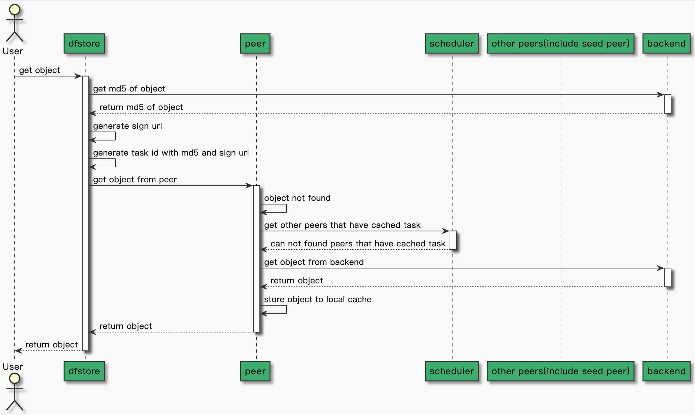

`dfstore` is a storage client for dragonfly. It can rely on different types of object storage,
such as S3 or OSS, to provide stable object storage capabilities.

Dfstore uses the entire P2P network as a cache when storing objects.
Rely on S3 or OSS as the backend to ensure storage reliability.
In the process of object storage, P2P Cache is effectively used for fast read and write storage.

## Features {#features}

- Provides object storage service.
- Provides two modes for writing backend including `AsyncWriteBack` and `WriteBack`.
- Backend is third-party object service and supports `S3` and `OSS`.
- Multiple copies can be replicated within a P2P cluster, and the number of copies is controllable.

## Architecture {#architecture}

### Put Object {#put-object}

Upload object to dragonfly object storage service.


#### Put Object With AsyncWriteBack Mode {#put-object-async}

Dfstore puts object to peer synchronously, to backend asynchronously, and to other peer asynchronously.


#### Put Object With WriteBack Mode {#put-object-sync}

Dfstore puts object to peer synchronously, to backend synchronously, and to other peer asynchronously.


### Get Object {#get-object}

Download object from dragonfly object storage service.


#### Hit Peer Cache {#get-object-hit-peer}

Dfstore download object hits the cache of peer and returns immediately.


#### Hit Other Peers(include seed peer) Cache {#get-object-hit-other-peers}

Dfstore download object hits the cache of other peers and download object from other peers.
Other peers includes seed peers and peers that have cached object.


#### Hit Backend {#get-object-hit-backend}

Dfstore download object from backend.



## Protocol

Dragonfly object storage protocol name is `dfs`, and the URL is defined as `dfs://${bucketName}/${objectKey}`.

- bucketName: The bucket name of the backend third-party object storage service.
- objectKey: The key of the object storage, that is, the storage path.

**For example:**

If the Backend is S3 and the upload object is `dfs://dragonfly/bar/foo/baz.jpg`.
Then upload the image `/bar/foo/baz.jpg` in the S3 `dragonfly` bucket.

## Usage

### Step 1: Create the backend object storage service

Create the backend third-party object storage service, bucket and `AccessKey` and `AccessSecretKey`.
Now backend supports AWS S3 and Aliyun OSS.

How to create an object storage service refer to
[AWS S3](https://docs.aws.amazon.com/s3/index.html) or [Aliyun OSS](https://www.alibabacloud.com/help/en/object-storage-service).

### Step 2: Configure the third-party object storage service to the manager

Enable the object storage service in the manager's configuration file.

```yaml
objectStorage:
  # Enable object storage
  enable: true
  # Object storage name of type, it can be s3 or oss
  name: s3
  # Storage region
  region: 'us-east-2'
  # Datacenter endpoint
  endpoint: 's3.us-east-2.amazonaws.com'
  # Access key ID
  accessKey: ''
  # Access key secret
  secretKey: ''
```

### Step 3: Enable object storage in the peer

Enable the object storage service and enable the manager service in the dfdaemon's configuration file.

```yaml
manager:
  # Get scheduler list dynamically from manager
  enable: true
  # Manager service address
  netAddrs:
    - type: tcp
      addr: manager-service:65003
  # Scheduler list refresh interval
  refreshInterval: 10s
objectStorage:
  # Enable object storage service
  enable: true
  # Filter is used to generate a unique Task ID by
  # filtering unnecessary query params in the URL,
  # it is separated by & character.
  # When filter: "Expires&Signature&ns", for example:
  #  http://localhost/xyz?Expires=111&Signature=222&ns=docker.io and http://localhost/xyz?Expires=333&Signature=999&ns=docker.io
  # is same task
  filter: 'Expires&Signature&ns'
  # MaxReplicas is the maximum number of replicas of an object cache in seed peers.
  maxReplicas: 3
  # Object storage service security option
  security:
    insecure: true
    tlsVerify: true
  tcpListen:
    # Listen address
    listen: 0.0.0.0
    # Listen port
    port: 65004
```

### Step 4: Install dragofly system

Install dragonfly system with object storage, refer to [install dragonfly](../../setup/install/helm-charts.md).

### Step 5: Install the dfstore command-line tool

Install the last version of dfstore. You can install one of the version for Dragonfly on the [github releases page](https://github.com/dragonflyoss/Dragonfly2/releases).

```shell
go install d7y.io/dragonfly/v2/cmd/dfstore@latest
```

`dfstore` and peer need to be in the same instance,
because the `127.0.0.1:65004` endpoint of the peer will be called by default when uploading and downloading.
If dfstore and peer are not the same instance,
you can specify the endpoint of the peer's object storage through
the `--endpoint` parameter of `dfstore` command-line tool.
Detailed parameters refer to [dfstore-cli](../../reference/cli/dfstore.md).

### Step 6: Upload object to dragonfly object storage

Upload `baz.jpg` image to `/bar/foo/baz.jpg` in S3 `dragonfly` bucket.

```shell
dfstore cp ./baz.jpg dfs://dragonfly/bar/foo/baz.jpg
```

### Step 7: Download object from dragonfly object storage

Download `baz.jpg` image from `/bar/foo/baz.jpg` in S3 `dragonfly` bucket.

```shell
dfstore cp dfs://dragonfly/bar/foo/baz.jpg ./baz.jpg
```

### Step 8: Delete object from dragonfly object storage

Delete `/bar/foo/baz.jpg` image in S3 `dragonfly` bucket.

```shell
dfstore rm dfs://dragonfly/bar/foo/baz.jpg
```
