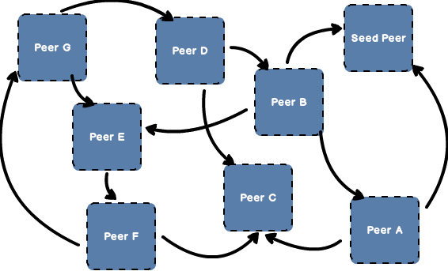
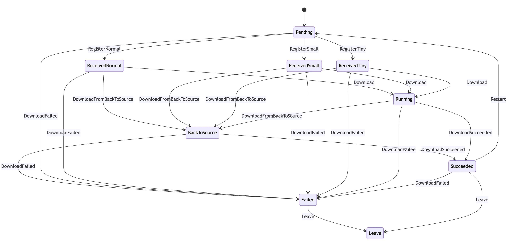

Scheduler selects the optimal parent peer for current peer to be downloaded
and triggers the seed peer back-to-source download or dfdaemon back-to-source download at the appropriate time.

## Features {#features}

- Based on the multi-feature intelligent scheduling system selects the optimal parent peer.
- Build a scheduling directed acyclic graph for the P2P cluster.
- Remove abnormal peer based on peer multi-feature evaluation results.
- In the case of scheduling failure, notice peer back-to-source download.

## Scheduling {#scheduling}

Scheduler maintains task, peer and host resources.

- Peer: a download task for dfdaemon
- Host: host information for dfdaemon, host and peer have a `1:N` relationship
- Task: a download task, task and peer have a `1:N` relationship

The scheduling process is actually to build a directed acyclic graph according to the peer's load.

## Peer State Machine {#peer-state-machine}

The scheduler divides tasks into three types `Tiny`, `Small` and `Normal`.

- Tiny: file size is less than 128 bytes
- Small: only one piece task
- Normal: tasks with more than one piece

Different scheduling strategies are used for different types of download tasks,
following state transition diagram during the peer scheduling process.

