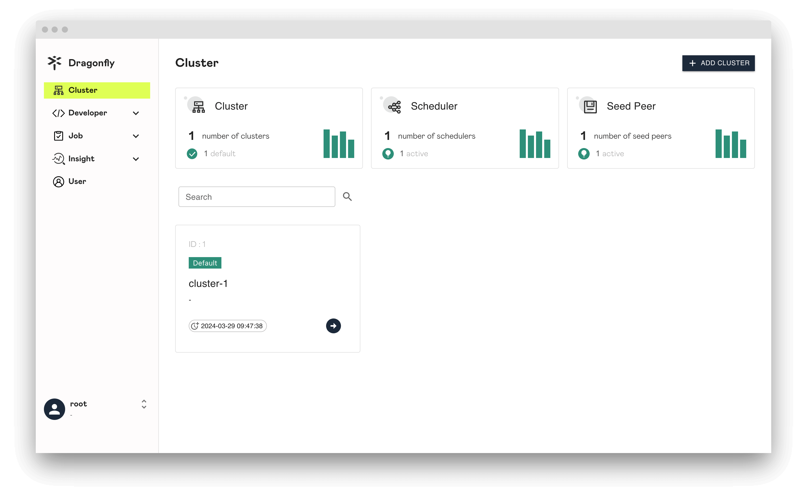

This guide shows how to install the Dragonfly. Dragonfly can be installed either from source, or from pre-built binary releases.

## Prerequisites {#prerequisites}

<!-- markdownlint-disable -->

| Name              | Version                      | Document                                                                     |
| ----------------- | ---------------------------- | ---------------------------------------------------------------------------- |
| Git               | 1.9.1+                       | [git-scm](https://git-scm.com/)                                              |
| Golang            | 1.16.x                       | [go.dev](https://go.dev/)                                                    |
| Database          | Mysql 5.6+ OR PostgreSQL 12+ | [mysql](https://www.mysql.com/) OR [postgresql](https://www.postgresql.org/) |
| Redis             | 3.0+                         | [redis.io](https://redis.io/)                                                |

<!-- markdownlint-restore -->

## Install Dragonfly {#install-dragonfly}

### From the Binary Releases {#from-the-binary-releases}

Every [release](https://github.com/dragonflyoss/dragonfly/releases) of
Dragonfly provides binary releases for a variety of OSes.
These binary versions can be manually downloaded and installed.

Download the Dragonfly binaries:

> Notice: your_version is recommended to use the latest version.

<!-- markdownlint-disable -->

```bash
VERSION=<your_version>
wget -O dragonfly_linux_amd64.tar.gz https://github.com/dragonflyoss/dragonfly/releases/download/v${VERSION}/dragonfly-${VERSION}-linux-amd64.tar.gz
```

<!-- markdownlint-restore -->

Untar the package:

```bash
# Replace `/path/to/dragonfly` with the installation directory.
tar -zxf dragonfly_linux_amd64.tar.gz -C /path/to/dragonfly
```

Configuration environment:

```bash
export PATH="/path/to/dragonfly:$PATH"
```

### From Source {#from-source}

Clone the source code of Dragonfly:

```bash
git clone --recurse-submodules https://github.com/dragonflyoss/dragonfly.git
cd dragonfly
```

Compile the source code:

```bash
# At the same time to build scheduler, dfget and manager.
make build

# make build is equivalent to
make build-scheduler && make build-dfget && make build-manager

# Install executable file to  /opt/dragonfly/bin/{manager,scheduler,dfget}.
make install-manager
make install-scheduler
make install-dfget
```

Configuration environment:

```bash
export PATH="/opt/dragonfly/bin/:$PATH"
```

## Operation {#operation}

### Manager {#manager}

#### Startup Manager {#startup-manager}

Configure `manager.yaml`, the default path in Linux is `/etc/dragonfly/manager.yaml`,
the default path in Darwin is `$HOME/.dragonfly/config/manager.yaml`,
refer to [Manager](../../reference/configuration/manager.md).

Set the `database.mysql.addrs` and `database.redis.addrs` addresses under the configuration
file to your actual addresses. Configuration content is as follows:

```yaml
# Manager configuration.
database:
  type: mysql
  mysql:
    user: dragonfly-mysql
    password: your_mysql_password
    host: your_mysql_host
    port: your_mysql_port
    dbname: manager
    migrate: true
  redis:
    addrs:
      - dragonfly-redis
    masterName: your_redis_master_name
    username: your_redis_username
    password: your_redis_passwprd
    db: 0
    brokerDB: 1
    backendDB: 2
```

Run Manager:

```bash
# View Manager cli help docs.
manager --help

# Startup Manager.
manager
```

#### Verify {#verify-manager}

After the Manager deployment is complete, run the following commands to verify if **Manager** is started,
and if Port `8080` and `65003` is available.

```bash
telnet 127.0.0.1 8080
telnet 127.0.0.1 65003
```

#### Manager Console {#manager-console}

Now you can open brower and visit console by localhost:8080, Console features preview reference document [console preview](../../reference/manage-console.md).



### Scheduler {#scheduler}

#### Startup Scheduler {#startup-scheduler}

Configure `scheduler.yaml`, the default path in Linux is `/etc/dragonfly/scheduler.yaml`,
the default path in Darwin is `$HOME/.dragonfly/config/scheduler.yaml`,
refer to [Scheduler](../../reference/configuration/scheduler.md).

Set the `database.redis.addrs` and `manager.addr` addresses manager.
under the configuration file to your actual addresses. Configuration content is as follows:

```yaml
# Scheduler configuration.
database:
  redis:
    addrs:
      - dragonfly-redis
    masterName: your_redis_master_name
    username: your_redis_username
    password: your_redis_password
    brokerDB: 1
    backendDB: 2
    networkTopologyDB: 3
 manager:
  addr: dragonfly-manager:65003
  schedulerClusterID: 1
  keepAlive:
    interval: 5s
```

Run Scheduler:

```bash
# View Scheduler cli help docs.
scheduler --help

# Startup Scheduler.
scheduler
```

#### Verify {#verify-scheduler}

After the Scheduler deployment is complete, run the following commands to verify if **Scheduler** is started,
and if Port `8002` is available.

```bash
telnet 127.0.0.1 8002
```

### Dfdaemon {#dfdaemon}

#### Startup Dfdaemon as Seed Peer {#startup-dfdaemon-as-seed-peer}

Configure `dfdaemon.yaml`, the default path in Linux is `/etc/dragonfly/dfdaemon.yaml`,
the default path in Darwin is `$HOME/.dragonfly/config/dfget.yaml`,
refer to [Dfdaemon](../../reference/configuration/dfdaemon.md).

Set the `scheduler.manager.netAddrs.addr` address in the configuration file to your actual address.
Configuration content is as follows:

```yaml
# Seed Peer configuration.
scheduler:
  manager:
    enable: true
    netAddrs:
      - type: tcp
        addr: dragonfly-manager:65003
    refreshInterval: 10m
    seedPeer:
      enable: true
      type: super
      clusterID: 1
```

Run Dfdaemon as Seed Peer:

```bash
# View Dfget cli help docs.
dfget --help

# View Dfget daemon cli help docs.
dfget daemon --help

# Startup Dfget daemon mode.
dfget daemon
```

#### Verify {#verify-seed-peer}

After the Seed Peer deployment is complete, run the following commands to verify if **Seed Peer** is started,
and if Port `65000`, `65001` and `65002` is available.

```bash
telnet 127.0.0.1 65000
telnet 127.0.0.1 65001
telnet 127.0.0.1 65002
```

#### Startup Dfdaemon as Peer {#startup-dfdaemon-as-Peer}

Configure `dfdaemon.yaml`, the default path in Linux is `/etc/dragonfly/dfdaemon.yaml`,
the default path in Darwin is `$HOME/.dragonfly/config/dfget.yaml`,
refer to [Dfdaemon](../../reference/configuration/dfdaemon.md).

Set the `scheduler.manager.netAddrs.addr` address in the configuration file to your actual address.
Configuration content is as follows:

```yaml
# Peer configuration.
scheduler:
  manager:
    enable: true
    netAddrs:
      - type: tcp
        addr: dragonfly-manager:65003
    refreshInterval: 10m
```

Run Dfdaemon as Peer:

```bash
# View Dfget cli help docs.
dfget --help

# View Dfget daemon cli help docs.
dfget daemon --help

# Startup Dfget daemon mode.
dfget daemon
```

#### Verify {#verify-peer}

After the Peer deployment is complete, run the following commands to verify if **Peer** is started,
and if Port `65000`, `65001` and `65002` is available.

```bash
telnet 127.0.0.1 65000
telnet 127.0.0.1 65001
telnet 127.0.0.1 65002
```
