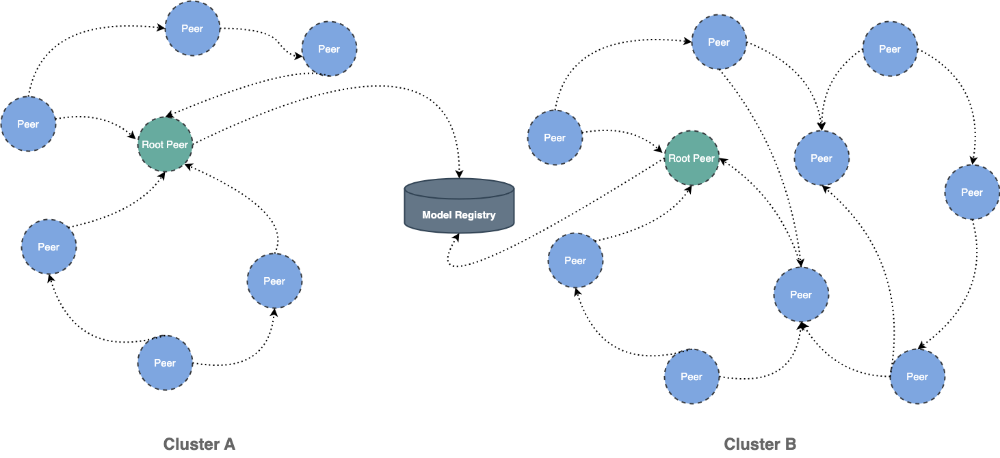
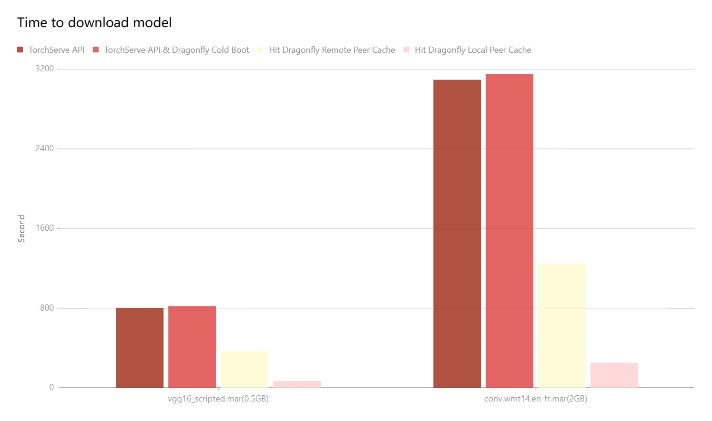

This document will help you experience how to use dragonfly with [TorchServe](https://github.com/pytorch/serve).
During the downloading of models, the file size is large and there are many services downloading the files at the same time.
The bandwidth of the storage will reach the limit and the download will be slow.


Dragonfly can be used to eliminate the bandwidth limit of the storage through P2P technology, thereby accelerating file downloading.



## Architecture


[Dragonfly Endpoint](https://github.com/dragonflyoss/dragonfly-endpoint) plugin forwards TorchServe download
model requests to the Dragonfly P2P network.


The models download steps:

1. TorchServe sends a model download request and the request is forwarded to the Dragonfly Peer.
2. The Dragonfly Peer registers tasks with the Dragonfly Scheduler.
3. Return the candidate parents to Dragonfly Peer.
4. Dragonfly Peer downloads model from candidate parents.
5. After downloading the model, TorchServe will register the model.

## Installation

By integrating Dragonfly Endpoint into TorchServe, download traffic through Dragonfly to pull models stored in
S3, OSS, GCS, and ABS, and register models in TorchServe.
The Dragonfly Endpoint plugin is in the [dragonfly-endpoint](https://github.com/dragonflyoss/dragonfly-endpoint) repository.

### Prerequisites

| Name               | Version | document                                         |
| ------------------ | ------- | ------------------------------------------------ |
| Kubernetes cluster | 1.20+   | [kubernetes.io](https://kubernetes.io/)          |
| Helm               | 3.8.0+  | [helm.sh](https://helm.sh/)                      |
| TorchServe         | 0.4.0+  | [pytorch.org/serve/](https://pytorch.org/serve/) |

**Notice:** [Kind](https://kind.sigs.k8s.io/) is recommended if no kubernetes cluster is available for testing.

### Dragonfly Kubernetes Cluster Setup

For detailed installation documentation, please refer to [quick-start-kubernetes](https://d7y.io/zh/docs/getting-started/quick-start/kubernetes/).

#### Prepare Kubernetes Cluster

Create kind multi-node cluster configuration file `kind-config.yaml`, configuration content is as follows:

```yaml
kind: Cluster
apiVersion: kind.x-k8s.io/v1alpha4
nodes:
  - role: control-plane
  - role: worker
  - role: worker
```

Create a kind multi-node cluster using the configuration file:

```shell
kind create cluster --config kind-config.yaml
```

Switch the context of kubectl to kind cluster:

```shell
kubectl config use-context kind-kind
```

#### Kind loads dragonfly image

Pull dragonfly latest images:

```shell
docker pull dragonflyoss/scheduler:latest
docker pull dragonflyoss/manager:latest
docker pull dragonflyoss/dfdaemon:latest
```

Kind cluster loads dragonfly latest images:

```shell
kind load docker-image dragonflyoss/scheduler:latest
kind load docker-image dragonflyoss/manager:latest
kind load docker-image dragonflyoss/dfdaemon:latest
```

#### Create dragonfly cluster based on helm charts

Create helm charts configuration file `charts-config.yaml` and set `dfdaemon.config.proxy.proxies.regx` to
match the download path of the object storage, configuration content is as follows:

```yaml
scheduler:
  image:
    repository: dragonflyoss/scheduler
    tag: latest
  replicas: 1
  metrics:
    enable: true
  config:
    verbose: true
    pprofPort: 18066

seedPeer:
  image:
    repository: dragonflyoss/dfdaemon
    tag: latest
  replicas: 1
  metrics:
    enable: true
  config:
    verbose: true
    pprofPort: 18066

dfdaemon:
  image:
    repository: dragonflyoss/dfdaemon
    tag: latest
  metrics:
    enable: true
  config:
    verbose: true
    pprofPort: 18066
    proxy:
      defaultFilter: 'Expires&Signature&ns'
      security:
        insecure: true
        cacert: ''
        cert: ''
        key: ''
      tcpListen:
        namespace: ''
        port: 65001
      registryMirror:
        url: https://index.docker.io
        insecure: true
        certs: []
        direct: false
      proxies:
        - regx: blobs/sha256.*
        - regx: .*amazonaws.*

manager:
  image:
    repository: dragonflyoss/manager
    tag: latest
  replicas: 1
  metrics:
    enable: true
  config:
    verbose: true
    pprofPort: 18066

jaeger:
  enable: true
```

Create a dragonfly cluster using the configuration file:

<!-- markdownlint-disable -->

```shell
$ helm repo add dragonfly https://dragonflyoss.github.io/helm-charts/
$ helm install --wait --create-namespace --namespace dragonfly-system dragonfly dragonfly/dragonfly -f charts-config.yaml
LAST DEPLOYED: Mon Sep  4 10:24:55 2023
NAMESPACE: dragonfly-system
STATUS: deployed
REVISION: 1
TEST SUITE: None
NOTES:
1. Get the scheduler address by running these commands:
  export SCHEDULER_POD_NAME=$(kubectl get pods --namespace dragonfly-system -l "app=dragonfly,release=dragonfly,component=scheduler" -o jsonpath={.items[0].metadata.name})
  export SCHEDULER_CONTAINER_PORT=$(kubectl get pod --namespace dragonfly-system $SCHEDULER_POD_NAME -o jsonpath="{.spec.containers[0].ports[0].containerPort}")
  kubectl --namespace dragonfly-system port-forward $SCHEDULER_POD_NAME 8002:$SCHEDULER_CONTAINER_PORT
  echo "Visit http://127.0.0.1:8002 to use your scheduler"

2. Get the dfdaemon port by running these commands:
  export DFDAEMON_POD_NAME=$(kubectl get pods --namespace dragonfly-system -l "app=dragonfly,release=dragonfly,component=dfdaemon" -o jsonpath={.items[0].metadata.name})
  export DFDAEMON_CONTAINER_PORT=$(kubectl get pod --namespace dragonfly-system $DFDAEMON_POD_NAME -o jsonpath="{.spec.containers[0].ports[0].containerPort}")
  You can use $DFDAEMON_CONTAINER_PORT as a proxy port in Node.

3. Configure runtime to use dragonfly:
  https://d7y.io/docs/getting-started/quick-start/kubernetes/


4. Get Jaeger query URL by running these commands:
  export JAEGER_QUERY_PORT=$(kubectl --namespace dragonfly-system get services dragonfly-jaeger-query -o jsonpath="{.spec.ports[0].port}")
  kubectl --namespace dragonfly-system port-forward service/dragonfly-jaeger-query 16686:$JAEGER_QUERY_PORT
  echo "Visit http://127.0.0.1:16686/search?limit=20&lookback=1h&maxDuration&minDuration&service=dragonfly to query download events"
```

<!-- markdownlint-restore -->

Check that dragonfly is deployed successfully:

```shell
$ kubectl get po -n dragonfly-system
NAME                                 READY   STATUS    RESTARTS      AGE
dragonfly-dfdaemon-7r2cn             1/1     Running   0          3m31s
dragonfly-dfdaemon-fktl4             1/1     Running   0          3m31s
dragonfly-jaeger-c7947b579-2xk44     1/1     Running   0          3m31s
dragonfly-manager-5d4f444c6c-wq8d8   1/1     Running   0          3m31s
dragonfly-mysql-0                    1/1     Running   0          3m31s
dragonfly-redis-master-0             1/1     Running   0          3m31s
dragonfly-redis-replicas-0           1/1     Running   0          3m31s
dragonfly-redis-replicas-1           1/1     Running   0          3m5s
dragonfly-redis-replicas-2           1/1     Running   0          2m44s
dragonfly-scheduler-0                1/1     Running   0          3m31s
dragonfly-seed-peer-0                1/1     Running   0          3m31s
```

#### Expose the Proxy service port

Create the `dfstore.yaml` configuration to expose the port on which the Dragonfly Peer's HTTP proxy listens.
The default port is `65001` and set`targetPort` to `65001`.

```yaml
kind: Service
apiVersion: v1
metadata:
  name: dfstore
spec:
  selector:
    app: dragonfly
    component: dfdaemon
    release: dragonfly

  ports:
    - protocol: TCP
      port: 65001
      targetPort: 65001

  type: NodePort
```

Create service:

```shell
kubectl --namespace dragonfly-system apply -f dfstore.yaml
```

Forward request to Dragonfly Peer's HTTP proxy:

```shell
kubectl --namespace dragonfly-system port-forward service/dfstore 65001:65001
```

### Install Dragonfly Endpoint plugin

#### Set environment variables for Dragonfly Endpoint configuration

Create `config.json` configuration，and set `DRAGONFLY_ENDPOINT_CONFIG` environment variable for `config.json` file path.

```shell
export DRAGONFLY_ENDPOINT_CONFIG=/etc/dragonfly-endpoint/config.json
```

The default configuration path is:

- linux: `/etc/dragonfly-endpoint/config.json`
- darwin: `~/.dragonfly-endpoint/config.json`

#### Dragonfly Endpoint configuration

Create the `config.json` configuration to configure the Dragonfly Endpoint for S3, the configuration is as follows:

```json
{
  "addr": "http://127.0.0.1:65001",
  "header": {},
  "filter": [
    "X-Amz-Algorithm",
    "X-Amz-Credential",
    "X-Amz-Date",
    "X-Amz-Expires",
    "X-Amz-SignedHeaders",
    "X-Amz-Signature"
  ],
  "object_storage": {
    "type": "s3",
    "bucket_name": "your_s3_bucket_name",
    "region": "your_s3_access_key",
    "access_key": "your_s3_access_key",
    "secret_key": "your_s3_access_key"
  }
}
```

- addr: The address of Drangonfly's Peer HTTP proxy.
- header: Adds a request header to the request.
- filter: Used to generate unique tasks and filter unnecessary query parameters in the URL.
- object_storage: The object storage configuration, where type can be s3, oss, abs and gcs.

In the filter of the configuration, set different values when using different object storage:

| Type | Value                                                                                                      |
| ---- | ---------------------------------------------------------------------------------------------------------- |
| OSS  | "Expires&Signature"                                                                                        |
| S3   | "X-Amz-Algorithm&X-Amz-Credential&X-Amz-Date&X-Amz-Expires&X-Amz-SignedHeaders&X-Amz-Signature"            |
| OBS  | "X-Amz-Algorithm&X-Amz-Credential&X-Amz-Date&X-Obs-Date&X-Amz-Expires&X-Amz-SignedHeaders&X-Amz-Signature" |

##### Object storage configuration

In addition to S3, Dragonfly Endpoint plugin also supports OSS, GCS and ABS.
Different object storage configurations are as follows:

OSS(Object Storage Service)

```json
{
  "addr": "http://127.0.0.1:65001",
  "header": {},
  "filter": ["Expires", "Signature"],
  "object_storage": {
    "type": "oss",
    "bucket_name": "your_oss_bucket_name",
    "endpoint": "your_oss_endpoint",
    "access_key_id": "your_oss_access_key_id",
    "access_key_secret": "your_oss_access_key_secret"
  }
}
```

GCS(Google Cloud Storage)

```json
{
  "addr": "http://127.0.0.1:65001",
  "header": {},
  "object_storage": {
    "type": "gcs",
    "bucket_name": "your_gcs_bucket_name",
    "project_id": "your_gcs_project_id",
    "service_account_path": "your_gcs_service_account_path"
  }
}
```

ABS(Azure Blob Storage)

```json
{
  "addr": "http://127.0.0.1:65001",
  "header": {},
  "object_storage": {
    "type": "abs",
    "account_name": "your_abs_account_name",
    "account_key": "your_abs_account_key",
    "container_name": "your_abs_container_name"
  }
}
```

### TorchServe integrates Dragonfly Endpoint plugin

For detailed installation documentation, please refer to [TorchServe document](https://pytorch.org/serve/).

#### Binary installation

##### Plugin Prerequisites

| Name       | Version | Document                                                                     |
| ---------- | ------- | ---------------------------------------------------------------------------- |
| Python     | 3.8.0+  | [https://www.python.org/](https://www.python.org/)                           |
| TorchServe | 0.4.0+  | [pytorch.org/serve/](https://pytorch.org/serve/)                             |
| Java       | 11      | [https://openjdk.org/projects/jdk/11/](https://openjdk.org/projects/jdk/11/) |

Install TorchServe dependencies and torch-model-archiver：

```shell
python ./ts_scripts/install_dependencies.py
conda install torchserve torch-model-archiver torch-workflow-archiver -c pytorch
```

Clone TorchServe repository：

```shell
git clone https://github.com/pytorch/serve.git
cd serve
```

Create [model-store](https://pytorch.org/serve/getting_started.html?highlight=model+store) directory to store the models：

```shell
mkdir model-store
chmod 777 model-store
```

Create [plugins-path](https://github.com/pytorch/serve/tree/master/plugins/docs) directory to store the binaries of the plugin：

```shell
mkdir plugins-path
```

#### Package Dragonfly Endpoint plugin

Clone dragonfly-endpoint repository：

```shell
git clone https://github.com/dragonflyoss/dragonfly-endpoint.git
```

Build the dragonfly-endpoint project to generate file in the `build/libs` directory:

```shell
cd ./dragonfly-endpoint
gradle shadowJar
```

**Note:** Due to the limitations of TorchServe's JVM, the best Java version for Gradle is 11,
as a higher version will cause the plugin to fail to parse.

Move the Jar file into the plugins-path directory:

```shell
mv build/libs/dragonfly_endpoint-1.0-all.jar  <your plugins-path>
```

Prepare the plugin configuration `config.json`, and use S3 as the object storage:

```shell
{
	"addr": "http://127.0.0.1:65001",
	"header": {
	},
	"filter": [
		"X-Amz-Algorithm",
		"X-Amz-Credential",
    "X-Amz-Date",
  	"X-Amz-Expires",
  	"X-Amz-SignedHeaders",
  	"X-Amz-Signature"
	],
	"object_storage": {
		"type": "s3",
		"bucket_name": "your_s3_bucket_name",
		"region": "your_s3_access_key",
		"access_key": "your_s3_access_key",
		"secret_key": "your_s3_access_key"
	}
}
```

Set the environment variables for the configuration:

```shell
export DRAGONFLY_ENDPOINT_CONFIG=/etc/dragonfly-endpoint/config.json
```

`--model-store`sets the previously created directory to store the models and `--plugins-path` sets
the previously created directory to store the plugins.Start the TorchServe with Dragonfly Endpoint plugin:

```shell
torchserve --start --model-store <path-to-model-store-file> --plugins-path=<path-to-plugin-jars>
```

#### Verify TorchServe binary

Prepare the model. Download a model from [Model ZOO](https://pytorch.org/serve/model_zoo.html#) or
package the model refer to [Torch Model archiver for TorchServe](https://github.com/pytorch/serve/tree/master/model-archiver).
Use `squeezenet1_1_scripted.mar` model to verify：

```shell
wget https://torchserve.pytorch.org/mar_files/squeezenet1_1_scripted.mar
```

Upload the model to object storage. For detailed uploading the model to S3, please refer to [S3](https://aws.amazon.com/s3/?nc1=h_ls)。

```shell
# Download the command line tool
pip install awscli
# Configure the key as prompted
aws configure
# Upload file
aws s3 cp < local file path > s3://< bucket name >/< Target path >
```

TorchServe plugin is named dragonfly, please refer to [TorchServe Register API](https://pytorch.org/serve/management_api.html#register-a-model)
for details of plugin API. The `url` parameter are not supported and add the `file_name`
parameter which is the model file name to download.
Download the model:

```shell
curl -X POST  "http://localhost:8081/dragonfly/models?file_name=squeezenet1_1.mar"
```

Verify the model download successful:

<!-- markdownlint-disable -->

```shell
{
	"Status": "Model "squeezenet1_1" Version: 1.0 registered with 0 initial workers. Use scale workers API to add workers for the model."
}
```

<!-- markdownlint-restore -->

Added model worker for inference:

```shell
curl -v -X PUT "http://localhost:8081/models/squeezenet1_1?min_worker=1"
```

Check the number of worker is increased:

```shell
* About to connect() to localhost port 8081 (#0)
*   Trying ::1...
* Connected to localhost (::1) port 8081 (#0)
> PUT /models/squeezenet1_1?min_worker=1 HTTP/1.1
> User-Agent: curl/7.29.0
> Host: localhost:8081
> Accept: */*
>
< HTTP/1.1 202 Accepted
< content-type: application/json
< x-request-id: 66761b5a-54a7-4626-9aa4-12041e0e4e63
< Pragma: no-cache
< Cache-Control: no-cache; no-store, must-revalidate, private
< Expires: Thu, 01 Jan 1970 00:00:00 UTC
< content-length: 47
< connection: keep-alive
<
{
  "status": "Processing worker updates..."
}
* Connection #0 to host localhost left intact
```

Call inference API:

```shell
# Prepare pictures that require reasoning.
curl -O  https://raw.githubusercontent.com/pytorch/serve/master/docs/images/kitten_small.jpg
curl -O  https://raw.githubusercontent.com/pytorch/serve/master/docs/images/dogs-before.jpg

# Call inference API.
curl http://localhost:8080/predictions/squeezenet1_1 -T kitten_small.jpg -T dogs-before.jpg
```

Check the response successful:

```shell
{
  "lynx": 0.5455784201622009,
  "tabby": 0.2794168293476105,
  "Egyptian_cat": 0.10391931980848312,
  "tiger_cat": 0.062633216381073,
  "leopard": 0.005019133910536766
}
```

#### Install TorchServe with Docker

##### Docker configuration

Pull `dragonflyoss/dragonfly-endpoint` image with the plugin. The following is an
example of the CPU version of TorchServe, refer to [Dockerfile](https://github.com/dragonflyoss/dragonfly-endpoint/blob/main/images/Dockerfile).

```shell
docker pull dragonflyoss/dragonfly-endpoint
```

Create [model-store](https://pytorch.org/serve/getting_started.html?highlight=model+store) directory to store the model files：

```shell
mkdir model-store
chmod 777 model-store
```

Prepare the plugin configuration `config.json`, and use S3 as the object storage:

```shell
{
	"addr": "http://127.0.0.1:65001",
	"header": {
	},
	"filter": [
		"X-Amz-Algorithm",
		"X-Amz-Credential",
    "X-Amz-Date",
  	"X-Amz-Expires",
  	"X-Amz-SignedHeaders",
  	"X-Amz-Signature"
	],
	"object_storage": {
		"type": "s3",
		"bucket_name": "your_s3_bucket_name",
		"region": "your_s3_access_key",
		"access_key": "your_s3_access_key",
		"secret_key": "your_s3_access_key"
	}
}
```

Set the environment variables for the configuration:

```shell
export DRAGONFLY_ENDPOINT_CONFIG=/etc/dragonfly-endpoint/config.json
```

Mount the `model-store` and dragonfly-endpoint configuration directory. Run the container:

<!-- markdownlint-disable -->

```shell
# 使用环境变量的配置路径
sudo docker run --rm -it --network host -v $(pwd)/model-store:/home/model-server/model-store  -v ${DRAGONFLY_ENDPOINT_CONFIG}:${DRAGONFLY_ENDPOINT_CONFIG} dragonflyoss/dragonfly-endpoint:latest
```

<!-- markdownlint-restore -->

#### Verify TorchServe container

Prepare the model. Download a model from [Model ZOO](https://pytorch.org/serve/model_zoo.html#) or
package the model refer to [Torch Model archiver for TorchServe](https://github.com/pytorch/serve/tree/master/model-archiver).
Use `squeezenet1_1_scripted.mar` model to verify：

```shell
wget https://torchserve.pytorch.org/mar_files/squeezenet1_1_scripted.mar
```

Upload the model to object storage. For detailed uploading the model to S3, please refer to [S3](https://aws.amazon.com/s3/?nc1=h_ls)。

```shell
# Download the command line tool
pip install awscli
# Configure the key as prompted
aws configure
# Upload file
aws s3 cp < local file path > s3://< bucket name >/< Target path >
```

TorchServe plugin is named dragonfly, please refer to [TorchServe Register API](https://pytorch.org/serve/management_api.html#register-a-model)
for details of plugin API. The `url` parameter are not supported and add the `file_name`
parameter which is the model file name to download.
Download a model：

```shell
curl -X POST  "http://localhost:8081/dragonfly/models?file_name=squeezenet1_1.mar"
```

Verify the model download successful:

<!-- markdownlint-disable -->

```shell
{
	"Status": "Model "squeezenet1_1" Version: 1.0 registered with 0 initial workers. Use scale workers API to add workers for the model."
}
```

<!-- markdownlint-restore -->

Added model worker for inference:

```shell
curl -v -X PUT "http://localhost:8081/models/squeezenet1_1?min_worker=1"
```

Check the number of worker is increased:

```shell
* About to connect() to localhost port 8081 (#0)
*   Trying ::1...
* Connected to localhost (::1) port 8081 (#0)
> PUT /models/squeezenet1_1?min_worker=1 HTTP/1.1
> User-Agent: curl/7.29.0
> Host: localhost:8081
> Accept: */*
>
< HTTP/1.1 202 Accepted
< content-type: application/json
< x-request-id: 66761b5a-54a7-4626-9aa4-12041e0e4e63
< Pragma: no-cache
< Cache-Control: no-cache; no-store, must-revalidate, private
< Expires: Thu, 01 Jan 1970 00:00:00 UTC
< content-length: 47
< connection: keep-alive
<
{
  "status": "Processing worker updates..."
}
* Connection #0 to host localhost left intact
```

Call inference API:

```shell
# Prepare pictures that require reasoning.
curl -O  https://raw.githubusercontent.com/pytorch/serve/master/docs/images/kitten_small.jpg
curl -O  https://raw.githubusercontent.com/pytorch/serve/master/docs/images/dogs-before.jpg

# Call inference API.
curl http://localhost:8080/predictions/squeezenet1_1 -T kitten_small.jpg -T dogs-before.jpg
```

Check the response successful:

```shell
{
  "lynx": 0.5455784201622009,
  "tabby": 0.2794168293476105,
  "Egyptian_cat": 0.10391931980848312,
  "tiger_cat": 0.062633216381073,
  "leopard": 0.005019133910536766
}
```

## Performance testing

Test the performance of single-machine model download by TorchServe API after the integration of Dragonfly P2P.
Due to the influence of the network environment of the machine itself, the actual download time is not important,
but the ratio of the increase in the download time in different scenarios is very important.



- TorchServe API: Use signed URL provided by Object Storage to download the model directly.
- TorchServe API & Dragonfly Cold Boot: Use `TorchServe API` to download model via Dragonfly P2P network and no cache hits.
- Hit Remote Peer: Use `TorchServe API` to download model via Dragonfly P2P network and hit the remote peer cache.
- Hit Local Peer: Use `TorchServe API` to download model via Dragonfly P2P network and hit the local peer cache.

Test results show TorchServe and Dragonfly integration. It can effectively reduce the file download time.
Note that this test was a single-machine test, which means that in the case of cache hits,
the performance limitation is on the disk. If Dragonfly is deployed on multiple machines for
P2P download, the models download speed will be faster.
