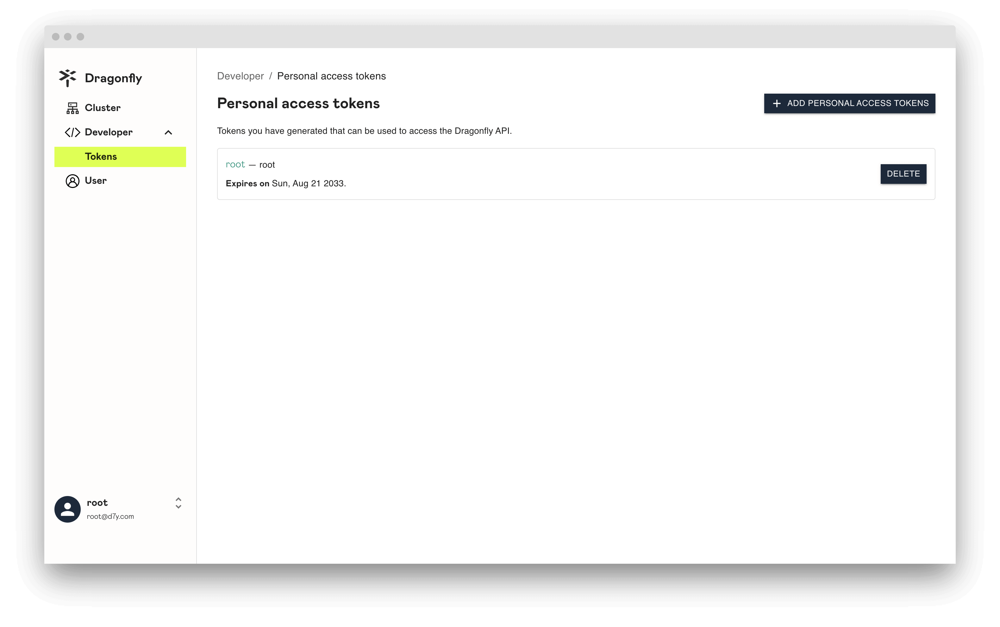
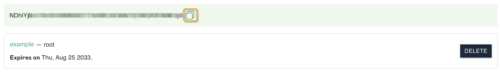
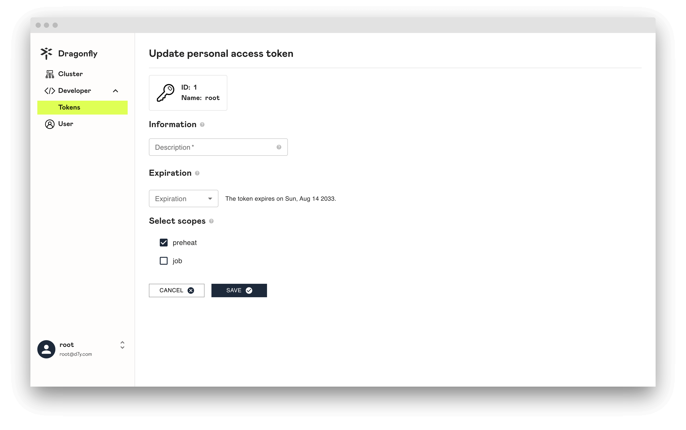
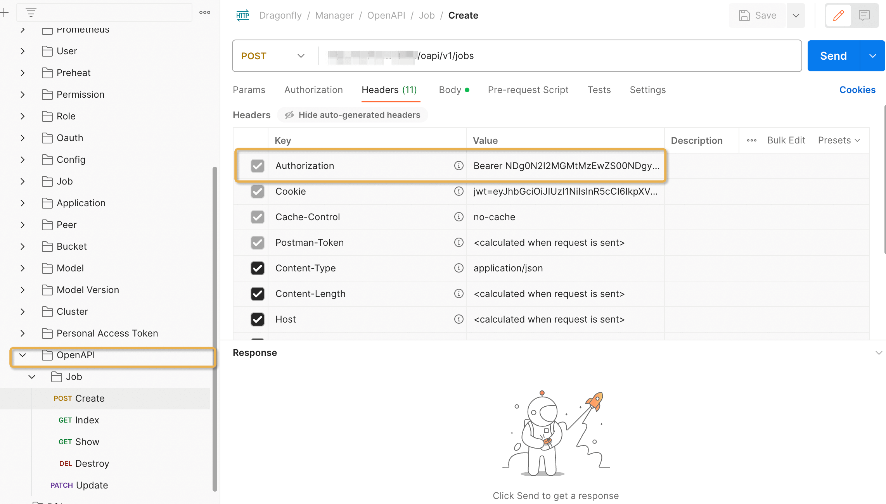
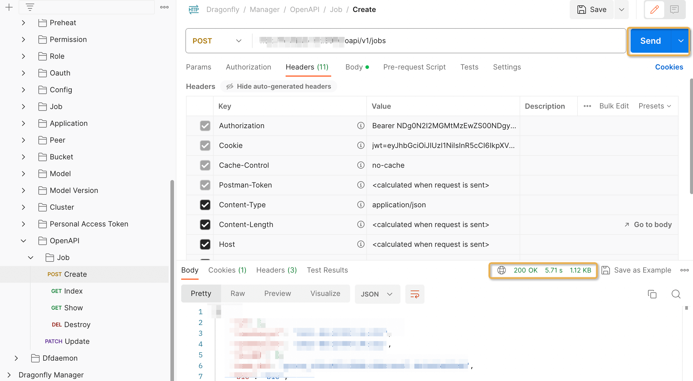

You can use a personal access token to call open API.

In this article, we will show you how to create, use, modify and delete personal access token.

## About personal access tokens

Only users with `root` role can list all personal access tokens.

## Create personal access token

Click the `ADD PERSONAL ACCESS TOKENS` button to create personal access token.

**Name**: Set your token a descriptive name.

**Description**: Set a description.

**Expiration**: Set your token an expiration.

**Scopes**: Select the access permissions for the token.

Click `SAVE` and copy the token and store it. For your security, it doesn't display again.

## Update personal access token

Click `personal access token name` and update your personal access token.

## Delete personal access token

Click `DELETE` and delete your personal access token.

## Use personal access token

**Step 1:** Open Postman, and import [postman_collection.json](https://github.com/gaius-qi/dragonfly-docs/blob/main/manager/postman/Dragonfly.postman_collection.json).

**Step 2:** Click **Open API** in the sidebar.

**Step 3:** Click **Authorization** and select **Bearer Token**, paste `personal access token` in `Token`.

**Step 4:** Click **Headers**, check whether `Authorization` is added to Headers.

**Step 5:** Click **Send** button to initiate a request.

**Step 6:** If successful, it means that the call to the open API is completed through the personal access token.

