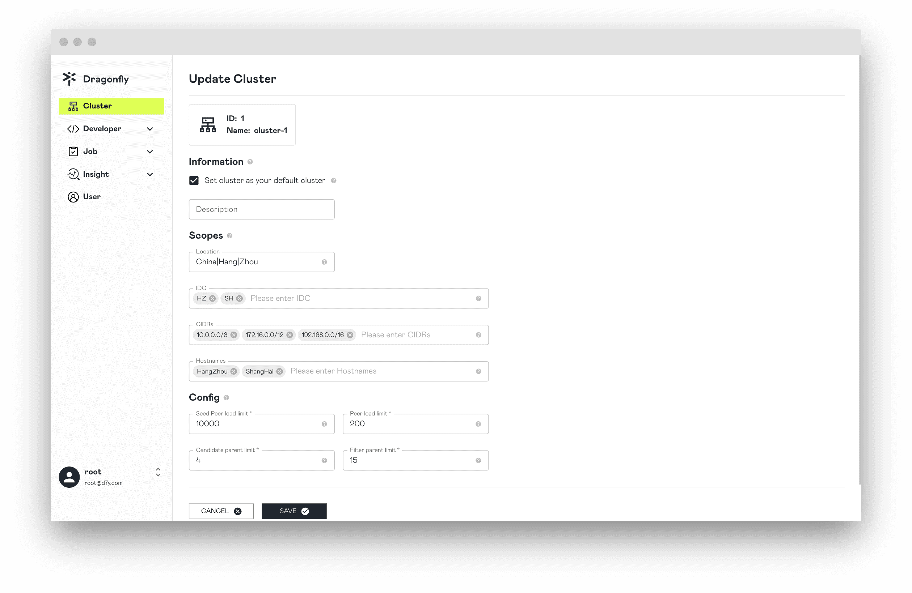

Documentation for setting capacity planning and performance tuning for Dragonfly.

## Capacity Planning

A big factor in planning capacity is: highest expected storage capacity.
And know the memory size, CPU core count, and disk capacity of each machine.

For predicting your capacity, you can use the estimates from below if you don’t have your capacity plan.

### Manager

The resources required to deploy the Manager depends on the total number of peers.

> Run a minimum of 3 replicas.

<!-- markdownlint-disable -->

| Total Number of Peers | CPU | Memory | Disk  |
| --------------------- | --- | ------ | ----- |
| 1K                    | 8C  | 16G    | 200Gi |
| 5K                    | 16C | 32G    | 200Gi |
| 10K                   | 16C | 64G    | 200Gi |

<!-- markdownlint-restore -->

### Scheduler

The resources required to deploy the Scheduler depends on the request per second.

> Run a minimum of 3 replicas.

<!-- markdownlint-disable -->

| Request Per Second | CPU | Memory | Disk  |
| ------------------ | --- | ------ | ----- |
| 1K                 | 8C  | 16G    | 200Gi |
| 3K                 | 16C | 32G    | 200Gi |
| 5K                 | 32C | 64G    | 200Gi |

<!-- markdownlint-restore -->

### Client

<!-- markdownlint-disable -->

The resources required to deploy the Client depends on the request per second.

> If it is a Seed Peer, run a minimum of 3 replicas. Disk are calculated based on file storage capacity.

| Request Per Second | CPU | Memory | Disk  |
| ------------------ | --- | ------ | ----- |
| 500                | 8C  | 16G    | 500Gi |
| 1K                 | 8C  | 16G    | 3Ti   |
| 3K                 | 16C | 32G    | 5Ti   |
| 5K                 | 32C | 64G    | 10Ti  |

<!-- markdownlint-restore -->

### Cluster

The resources required to deploy each service in a P2P cluster depends on the total number of Peers.

<!-- markdownlint-disable -->

| Total Number of Peers | Manager            | Scheduler          | Seed Peer         | Peer        |
| --------------------- | ------------------ | ------------------ | ----------------- | ----------- |
| 500                   | 4C/8G/200Gi \* 3   | 8C/16G/200Gi \* 3  | 8C/16G/1Ti \* 3   | 4C/8G/500Gi |
| 1K                    | 8C/16G/200Gi \* 3  | 8C/16G/200Gi \* 3  | 8C/16G/3Ti \* 3   | 4C/8G/500Gi |
| 3K                    | 16C/32G/200Gi \* 3 | 16C/32G/200Gi \* 3 | 16C/32G/5Ti \* 3  | 4C/8G/500Gi |
| 5K                    | 16C/64G/200Gi \* 3 | 32C/64G/200Gi \* 3 | 32C/64G/10Ti \* 3 | 4C/8G/500Gi |

<!-- markdownlint-restore -->

## Performance tuning

The following documentation may help you to achieve better performance especially for large scale runs.

### Rate limits

#### Outbound Bandwidth

Used for node P2P to share piece bandwidth.
If the peak bandwidth is greater than the default outbound bandwidth,
you can set `rateLimit` higher to increase the upload speed.
It is recommended that the configuration be the same as the inbound bandwidth of the machine.
Please refer to [dfdaemon config](../../reference/configuration/client/dfdaemon.md).

```yaml
upload:
  # -- rateLimit is the default rate limit of the upload speed in KiB/MiB/GiB per second, default is 10GiB/s.
  rateLimit: 10GiB
```

#### Inbound Bandwidth

Used for node back-to-source bandwidth and download bandwidth from remote peer.
If the peak bandwidth is greater than the default inbound bandwidth,
`rateLimit` can be set higher to increase download speed.
It is recommended that the configuration be the same as the outbound bandwidth of the machine.
Please refer to [dfdaemon config](../../reference/configuration/client/dfdaemon.md).

```yaml
download:
  # -- rateLimit is the default rate limit of the download speed in KiB/MiB/GiB per second, default is 10GiB/s.
  rateLimit: 10GiB
```

### Concurrency control

When used to download a single task of a node
the number of concurrent downloads of piece back-to-source and the number of concurrent downloads of piece from remote peer.
The larger the number of piece concurrency, the faster the task download, and the more CPU and memory will be consumed.
The user adjusts the number of piece concurrency according to the actual situation.
and adjust the client's CPU and memory configuration.
Please refer to [dfdaemon config](../../reference/configuration/client/dfdaemon.md).

```yaml
download:
  # -- concurrentPieceCount is the number of concurrent pieces to download.
  concurrentPieceCount: 10
```

### GC

Used for task cache GC in node disk, taskTTL is calculated based on cache time.
To avoid cases where GC would be problematic or potentially catastrophi,
it is recommended to use the default value.
Please refer to [dfdaemon config](../../reference/configuration/client/dfdaemon.md).

```yaml
gc:
  # interval is the interval to do gc.
  interval: 900s
  policy:
    # taskTTL is the ttl of the task.
    taskTTL: 21600s
    # distHighThresholdPercent is the high threshold percent of the disk usage.
    # If the disk usage is greater than the threshold, dfdaemon will do gc.
    distHighThresholdPercent: 80
    # distLowThresholdPercent is the low threshold percent of the disk usage.
    # If the disk usage is less than the threshold, dfdaemon will stop gc.
    distLowThresholdPercent: 60
```

### Nydus

When Nydus downloads a file, it splits the file into 1MB chunks and loads them on demand.
Use Seed Peer HTTP proxy as Nydus cache service,
use P2P transmission method to reduce back-to-source requests and back-to-source traffic,
and improve download speed.
When Dragonfly is used as a cache service for Nydus, the configuration needs to be optimized.

**1.** `proxy.rules.regex` matches the Nydus repository URL,
intercepts download traffic and forwards it to the P2P network.
Please refer to [dfdaemon config](../../reference/configuration/client/dfdaemon.md).

```yaml
proxy:
  # rules is the list of rules for the proxy server.
  # regex is the regex of the request url.
  # useTLS indicates whether use tls for the proxy backend.
  # redirect is the redirect url.
  # filteredQueryParams is the filtered query params to generate the task id.
  # When filter is ["Signature", "Expires", "ns"], for example:
  # http://example.com/xyz?Expires=e1&Signature=s1&ns=docker.io and http://example.com/xyz?Expires=e2&Signature=s2&ns=docker.io
  # will generate the same task id.
  # Default value includes the filtered query params of s3, gcs, oss, obs, cos.
  rules:
    - regex: 'blobs/sha256.*'
      # useTLS: false
      # redirect: ""
      # filteredQueryParams: []
```

**2.** Change `Seed Peer Load Limit` to 10000 or higher to improve the P2P cache hit rate between Seed Peers.

Click the `UPDATE CLUSTER` button to change the `Seed Peer Load Limit` to 10000.
Please refer to [update-cluster](../../advanced-guides/web-console/cluster.md#update-cluster).



Changed `Seed Peer Load Limit` successfully.


**3.** Nydus will initiate an HTTP range request of about 1MB to achieve on-demand loading.
When prefetch enabled, the Seed Peer can prefetch the complete resource after receiving the HTTP range request,
improving the cache hit rate.
Please refer to [dfdaemon config](../../reference/configuration/client/dfdaemon.md).

```yaml
proxy:
  # prefetch pre-downloads full of the task when download with range request.
  prefetch: true
```

**4.** When the download speed is slow,
you can adjust the `readBufferSize` value of proxy to 64KB in order to reduce the proxy request time.
Please refer to [dfdaemon config](../../reference/configuration/client/dfdaemon.md).

```yaml
proxy:
  # -- readBufferSize is the buffer size for reading piece from disk, default is 32KB.
  readBufferSize: 32768
```
