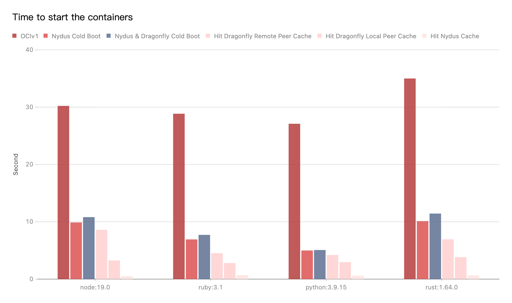

This document will help you experience how to use Dragonfly & Nydus.

## Prerequisites {#prerequisites}

<!-- markdownlint-disable -->

| Name               | Version | Document                                                    |
| ------------------ | ------- | ----------------------------------------------------------- |
| Kubernetes cluster | 1.20+   | [kubernetes.io](https://kubernetes.io/)                     |
| Helm               | 3.8.0+  | [helm.sh](https://helm.sh/)                                 |
| containerd         | v1.4.3+ | [containerd.io](https://containerd.io/)                     |
| Nerdctl            | 0.22+   | [containerd/nerdctl](https://github.com/containerd/nerdctl) |

<!-- markdownlint-restore -->

## Install Nydus with Helm

We **recommend** using helm to install Nydus, please refer to [Install Dragonfly & Nydus with Helm](https://github.com/dragonflyoss/helm-charts/blob/main/INSTALL.md).

## Install Nydus with Binaries

### Dragonfly Kubernetes Cluster Setup {#dragonfly-kubernetes-cluster-setup}

For detailed installation documentation based on kubernetes cluster, please refer to [quick-start-kubernetes](../../../getting-started/quick-start/kubernetes.md).

#### Setup kubernetes cluster {#setup-kubernetes-cluster}

[Kind](https://kind.sigs.k8s.io/) is recommended if no Kubernetes cluster is available for testing.

Create kind multi-node cluster configuration file `kind-config.yaml`, configuration content is as follows:

```yaml
kind: Cluster
apiVersion: kind.x-k8s.io/v1alpha4
nodes:
  - role: control-plane
  - role: worker
    extraPortMappings:
      - containerPort: 30950
        hostPort: 4001
      - containerPort: 30951
        hostPort: 4003
  - role: worker
```

Create a kind multi-node cluster using the configuration file:

```shell
kind create cluster --config kind-config.yaml
```

Switch the context of kubectl to kind cluster:

```shell
kubectl config use-context kind-kind
```

#### Kind loads Dragonfly image {#kind-loads-dragonfly-image}

Pull Dragonfly latest images:

```shell
docker pull dragonflyoss/scheduler:latest
docker pull dragonflyoss/manager:latest
docker pull dragonflyoss/client:latest
```

Kind cluster loads Dragonfly latest images:

```shell
kind load docker-image dragonflyoss/scheduler:latest
kind load docker-image dragonflyoss/manager:latest
kind load docker-image dragonflyoss/client:latest
```

#### Create Dragonfly cluster based on helm charts {#create-dragonfly-cluster-based-on-helm-charts}

Create helm charts configuration file `charts-config.yaml` and enable prefetching, configuration content is as follows:

```yaml
manager:
  image:
    repository: dragonflyoss/manager
    tag: latest
  metrics:
    enable: true
  config:
    verbose: true
    pprofPort: 18066

scheduler:
  image:
    repository: dragonflyoss/scheduler
    tag: latest
  metrics:
    enable: true
  config:
    verbose: true
    pprofPort: 18066

seedClient:
  image:
    repository: dragonflyoss/client
    tag: latest
  metrics:
    enable: true
  config:
    verbose: true
    proxy:
      prefetch: true

client:
  image:
    repository: dragonflyoss/client
    tag: latest
  hostNetwork: true
  metrics:
    enable: true
  config:
    verbose: true
    proxy:
      prefetch: true
      server:
        port: 4001
      registryMirror:
        addr: https://index.docker.io
      rules:
        - regex: 'blobs/sha256.*'
```

Create a Dragonfly cluster using the configuration file:

<!-- markdownlint-disable -->

```shell
$ helm repo add dragonfly https://dragonflyoss.github.io/helm-charts/
$ helm install --wait --create-namespace --namespace dragonfly-system dragonfly dragonfly/dragonfly -f charts-config.yaml
NAME: dragonfly
LAST DEPLOYED: Mon May 27 19:56:34 2024
NAMESPACE: dragonfly-system
STATUS: deployed
REVISION: 1
TEST SUITE: None
NOTES:
1. Get the scheduler address by running these commands:
  export SCHEDULER_POD_NAME=$(kubectl get pods --namespace dragonfly-system -l "app=dragonfly,release=dragonfly,component=scheduler" -o jsonpath={.items[0].metadata.name})
  export SCHEDULER_CONTAINER_PORT=$(kubectl get pod --namespace dragonfly-system $SCHEDULER_POD_NAME -o jsonpath="{.spec.containers[0].ports[0].containerPort}")
  kubectl --namespace dragonfly-system port-forward $SCHEDULER_POD_NAME 8002:$SCHEDULER_CONTAINER_PORT
  echo "Visit http://127.0.0.1:8002 to use your scheduler"

2. Get the dfdaemon port by running these commands:
  export DFDAEMON_POD_NAME=$(kubectl get pods --namespace dragonfly-system -l "app=dragonfly,release=dragonfly,component=dfdaemon" -o jsonpath={.items[0].metadata.name})
  export DFDAEMON_CONTAINER_PORT=$(kubectl get pod --namespace dragonfly-system $DFDAEMON_POD_NAME -o jsonpath="{.spec.containers[0].ports[0].containerPort}")
  You can use $DFDAEMON_CONTAINER_PORT as a proxy port in Node.

3. Configure runtime to use dragonfly:
  https://d7y.io/docs/getting-started/quick-start/kubernetes/
```

<!-- markdownlint-restore -->

Check that dragonfly is deployed successfully:

```shell
$ kubectl get po -n dragonfly-system
NAME                                 READY   STATUS    RESTARTS        AGE
dragonfly-client-9rkgp               1/1     Running   1 (6h29m ago)   9h
dragonfly-client-l2czc               1/1     Running   2 (6h29m ago)   9h
dragonfly-manager-789f57fc65-t44tf   1/1     Running   2 (6h28m ago)   9h
dragonfly-mysql-0                    1/1     Running   3 (6h28m ago)   9h
dragonfly-redis-master-0             1/1     Running   3 (6h28m ago)   9h
dragonfly-redis-replicas-0           1/1     Running   7 (6h28m ago)   9h
dragonfly-redis-replicas-1           1/1     Running   2 (6h28m ago)   8h
dragonfly-redis-replicas-2           1/1     Running   2 (6h28m ago)   8h
dragonfly-scheduler-0                1/1     Running   2 (6h28m ago)   9h
dragonfly-scheduler-1                1/1     Running   2 (6h28m ago)   8h
dragonfly-scheduler-2                1/1     Running   2 (6h28m ago)   8h
dragonfly-seed-client-0              1/1     Running   8 (6h27m ago)   9h
dragonfly-seed-client-1              1/1     Running   4 (6h27m ago)   8h
dragonfly-seed-client-2              1/1     Running   4 (6h27m ago)   8h
```

Create peer service configuration file `peer-service-config.yaml`, configuration content is as follows:

```yaml
apiVersion: v1
kind: Service
metadata:
  name: peer
  namespace: dragonfly-system
spec:
  type: NodePort
  ports:
    - name: http-4001
      nodePort: 30950
      port: 4001
    - name: http-4003
      nodePort: 30951
      port: 4003
  selector:
    app: dragonfly
    component: client
    release: dragonfly
```

Create a peer service using the configuration file:

```shell
kubectl apply -f peer-service-config.yaml
```

### Nydus Setup for containerd Environment {#nydus-for-containerd-environment}

For detailed Nydus installation documentation based on containerd environment, please refer to
[nydus-setup-for-containerd-environment](https://github.com/dragonflyoss/image-service/blob/master/docs/containerd-env-setup.md#nydus-setup-for-containerd-environment).
The example uses Systemd to manage the `nydus-snapshotter` service.

#### From the Binary Releases {#install-nydus-tools}

Download the `Nydus Snapshotter` binaries, please refer to [nydus-snapshotter/releases](https://github.com/containerd/nydus-snapshotter/releases/latest):

> Notice: `your_nydus_snapshotter_version` is recommended to use the latest version.

```shell
NYDUS_SNAPSHOTTER_VERSION=<your_nydus_snapshotter_version>
wget  -O nydus-snapshotter_linux_arm64.tar.gz https://github.com/containerd/nydus-snapshotter/releases/download/v$NYDUS_SNAPSHOTTER_VERSION/nydus-snapshotter-v$NYDUS_SNAPSHOTTER_VERSION-linux-arm64.tar.gz
```

Untar the package:

```shell
tar zxvf nydus-snapshotter_linux_arm64.tar.gz

# Install executable file to  /usr/local/bin/{containerd-nydus-grpc}.
sudo cp bin/containerd-nydus-grpc /usr/local/bin/
```

Download the `Nydus Image Service` binaries, please refer to [dragonflyoss/image-service](https://github.com/dragonflyoss/image-service/releases/latest):

> Notice: `your_nydus_version` is recommended to use the latest version.

```shell
NYDUS_VERSION=<your_nydus_version>
wget -O nydus-image-service-linux-arm64.tgz https://github.com/dragonflyoss/image-service/releases/download/v$NYDUS_VERSION/nydus-static-v$NYDUS_VERSION-linux-arm64.tgz
```

Untar the package:

```shell
tar zxvf nydus-image-service-linux-arm64.tgz

# Install executable file to  /usr/local/bin/{nydus-image,nydusd,nydusify}.
sudo cp nydus-static/nydus-image nydus-static/nydusd nydus-static/nydusify /usr/local/bin/
```

#### Install Nydus Snapshotter plugin for containerd {#install-nydus-snapshotter-plugin-for-containerd}

Modify your `config.toml` (default location: `/etc/containerd/config.toml`), please refer to
[configure-and-start-containerd](https://github.com/dragonflyoss/image-service/blob/master/docs/containerd-env-setup.md#configure-and-start-containerd).

```toml
[proxy_plugins]
  [proxy_plugins.nydus]
    type = "snapshot"
    address = "/run/containerd-nydus/containerd-nydus-grpc.sock"

[plugins.cri]
  [plugins.cri.containerd]
    snapshotter = "nydus"
    disable_snapshot_annotations = false
```

Restart containerd:

```shell
sudo systemctl restart containerd
```

Check that containerd uses the `nydus-snapshotter` plugin:

```shell
$ ctr -a /run/containerd/containerd.sock plugin ls | grep nydus
io.containerd.snapshotter.v1          nydus                    -              ok
```

#### Systemd starts Nydus Snapshotter {#systemd-starts-snapshotter-service}

Create the Nydusd configuration file `nydusd-config.json`.
Please refer to the [Nydus Mirror](https://github.com/dragonflyoss/image-service/blob/master/docs/nydusd.md#enable-mirrors-for-storage-backend)
documentation for details.

Set the `backend.config.mirrors.host` and `backend.config.mirrors.ping_url`
address in the configuration file to your actual address. Configuration content is as follows:

```json
{
  "device": {
    "backend": {
      "type": "registry",
      "config": {
        "mirrors": [
          {
            "host": "http://127.0.0.1:4001",
            "auth_through": false,
            "headers": {
              "X-Dragonfly-Registry": "https://index.docker.io"
            },
            "ping_url": "http://127.0.0.1:4003/healthy"
          }
        ],
        "scheme": "https",
        "skip_verify": true,
        "timeout": 10,
        "connect_timeout": 10,
        "retry_limit": 2
      }
    },
    "cache": {
      "type": "blobcache",
      "config": {
        "work_dir": "/var/lib/nydus/cache/"
      }
    }
  },
  "mode": "direct",
  "digest_validate": false,
  "iostats_files": false,
  "enable_xattr": true,
  "fs_prefetch": {
    "enable": true,
    "threads_count": 10,
    "merging_size": 131072,
    "bandwidth_rate": 1048576
  }
}
```

Copy configuration file to `/etc/nydus/config.json`:

```shell
sudo mkdir /etc/nydus && cp nydusd-config.json /etc/nydus/config.json
```

Create systemd configuration file `nydus-snapshotter.service` of Nydus snapshotter, configuration content is as follows:

```text
[Unit]
Description=nydus snapshotter
After=network.target
Before=containerd.service

[Service]
Type=simple
Environment=HOME=/root
ExecStart=/usr/local/bin/containerd-nydus-grpc --nydusd-config /etc/nydus/config.json
Restart=always
RestartSec=1
KillMode=process
OOMScoreAdjust=-999
StandardOutput=journal
StandardError=journal

[Install]
WantedBy=multi-user.target
```

Copy configuration file to `/etc/systemd/system/`:

```shell
sudo cp nydus-snapshotter.service /etc/systemd/system/
```

Systemd starts nydus snapshotter service:

<!-- markdownlint-disable -->

```shell
$ sudo systemctl enable nydus-snapshotter
$ sudo systemctl start nydus-snapshotter
$ sudo systemctl status nydus-snapshotter
● nydus-snapshotter.service - nydus snapshotter
     Loaded: loaded (/etc/systemd/system/nydus-snapshotter.service; enabled; vendor preset: enabled)
     Active: active (running) since Wed 2022-10-19 08:01:00 UTC; 2s ago
   Main PID: 2853636 (containerd-nydu)
      Tasks: 9 (limit: 37574)
     Memory: 4.6M
        CPU: 20ms
     CGroup: /system.slice/nydus-snapshotter.service
             └─2853636 /usr/local/bin/containerd-nydus-grpc --config-path /etc/nydus/config.json

Oct 19 08:01:00 kvm-gaius-0 systemd[1]: Started nydus snapshotter.
Oct 19 08:01:00 kvm-gaius-0 containerd-nydus-grpc[2853636]: time="2022-10-19T08:01:00.493700269Z" level=info msg="gc goroutine start..."
Oct 19 08:01:00 kvm-gaius-0 containerd-nydus-grpc[2853636]: time="2022-10-19T08:01:00.493947264Z" level=info msg="found 0 daemons running"
```

<!-- markdownlint-restore -->

#### Convert an image to Nydus image {#convert-an-image-to-nydus-image}

Convert `alpine:3.19` image to Nydus image,
Conversion tool can use [nydusify](https://github.com/dragonflyoss/image-service/blob/master/docs/nydusify.md) and [acceld](https://github.com/goharbor/acceleration-service).

Login to Dockerhub:

```shell
docker login
```

Convert `alpine:3.19` image to Nydus image, and `DOCKERHUB_REPO_NAME` environment variable
needs to be set to the user's image repository:

```shell
DOCKERHUB_REPO_NAME=<your_dockerhub_repo_name>
sudo nydusify convert --nydus-image /usr/local/bin/nydus-image --source alpine:3.19 --target $DOCKERHUB_REPO_NAME/alpine:3.19-nydus
```

#### Nydus downloads images through Dragonfly {#nydus-downloads-images-through-dragonfly}

Running `alpine:3.19-nydus` with nerdctl:

```shell
sudo nerdctl --snapshotter nydus run --rm -it $DOCKERHUB_REPO_NAME/alpine:3.19-nydus
```

<!-- markdownlint-disable -->

#### Verify

Check that Nydus is downloaded via Dragonfly based on mirror mode:

```shell
# Check Nydus logs.
grep mirrors /var/lib/containerd-nydus/logs/**/*log
```

The expected output is as follows:

```shell
[2024-05-28 12:36:24.834434 +00:00] INFO backend config: ConnectionConfig { proxy: ProxyConfig { url: "", ping_url: "", fallback: false, check_interval: 5, use_http: false }, mirrors: [MirrorConfig { host: "http://127.0.0.1:4001", ping_url: "http://127.0.0.1:4003/healthy", headers: {"X-Dragonfly-Registry": "https://index.docker.io"}, health_check_interval: 5, failure_limit: 5 }], skip_verify: true, timeout: 10, connect_timeout: 10, retry_limit: 2 }
```

You can execute the following command to check if the `alpine:3.19` image is distributed via Dragonfly.

```shell
# Find pod name.
export POD_NAME=$(kubectl get pods --namespace dragonfly-system -l "app=dragonfly,release=dragonfly,component=client" -o=jsonpath='{.items[?(@.spec.nodeName=="kind-worker")].metadata.name}' | head -n 1 )

# Find task id.
export TASK_ID=$(kubectl -n dragonfly-system exec ${POD_NAME} -- sh -c "grep -hoP 'alpine.*task_id=\"\K[^\"]+' /var/log/dragonfly/dfdaemon/* | head -n 1")

# Check logs.
kubectl -n dragonfly-system exec -it ${POD_NAME} -- sh -c "grep ${TASK_ID} /var/log/dragonfly/dfdaemon/* | grep 'download task succeeded'"
```

The expected output is as follows:

```shell
{
  2024-04-19T02:44:09.259458Z  "INFO"
  "download_task":"dragonfly-client/src/grpc/dfdaemon_download.rs:276":: "download task succeeded"
  "host_id": "172.18.0.3-kind-worker",
  "task_id": "a46de92fcb9430049cf9e61e267e1c3c9db1f1aa4a8680a048949b06adb625a5",
  "peer_id": "172.18.0.3-kind-worker-86e48d67-1653-4571-bf01-7e0c9a0a119d"
}
```

<!-- markdownlint-restore -->

## Performance testing {#performance-testing}

Test the performance of single-machine image download after the integration of
`Nydus Mirror` mode and `Dragonfly P2P`.
Test running version commands using images in different languages.
For example, the startup command used to run a `python` image is `python -V`.
The tests were performed on the same machine.
Due to the influence of the network environment of the machine itself,
the actual download time is not important, but the ratio of the increase in
the download time in different scenarios is very important.



- OCIv1: Use containerd to pull image directly.
- Nydus Cold Boot: Use containerd to pull image via nydus-snapshotter and doesn't hit any cache.
- Nydus & Dragonfly Cold Boot: Use containerd to pull image via nydus-snapshotter.
  Transfer the traffic to Dragonfly P2P based on Nydus Mirror mode and no cache hits.
- Hit Dragonfly Remote Peer Cache: Use containerd to pull image via nydus-snapshotter.
  Transfer the traffic to Dragonfly P2P based on Nydus Mirror mode and hit the remote peer cache.
- Hit Dragonfly Local Peer Cache: Use containerd to pull image via nydus-snapshotter.
  Transfer the traffic to Dragonfly P2P based on Nydus Mirror mode and hit the local peer cache.
- Hit Nydus Cache: Use containerd to pull image via nydus-snapshotter.
  Transfer the traffic to Dragonfly P2P based on Nydus Mirror mode and hit the nydus local cache.

Test results show `Nydus Mirror` mode and `Dragonfly P2P` integration.
Use the `Nydus` download image to compare the `OCIv1` mode,
It can effectively reduce the image download time.
The cold boot of `Nydus` and `Nydus & Dragonfly` are basically close.
All hits to `Dragonfly` cache are better than `Nydus` only.
The most important thing is that if a very large `kubernetes` cluster uses `Nydus` to pull images.
The download of each image layer will be generate as many range requests as needed.
The `QPS` of the source of the registry is too high.
Causes the `QPS` of the registry to be relatively high.
Dragonfly can effectively reduce the number of requests and
download traffic for back-to-source registry.
In the best case, `Dragonfly` can make the same task back-to-source download only once.
