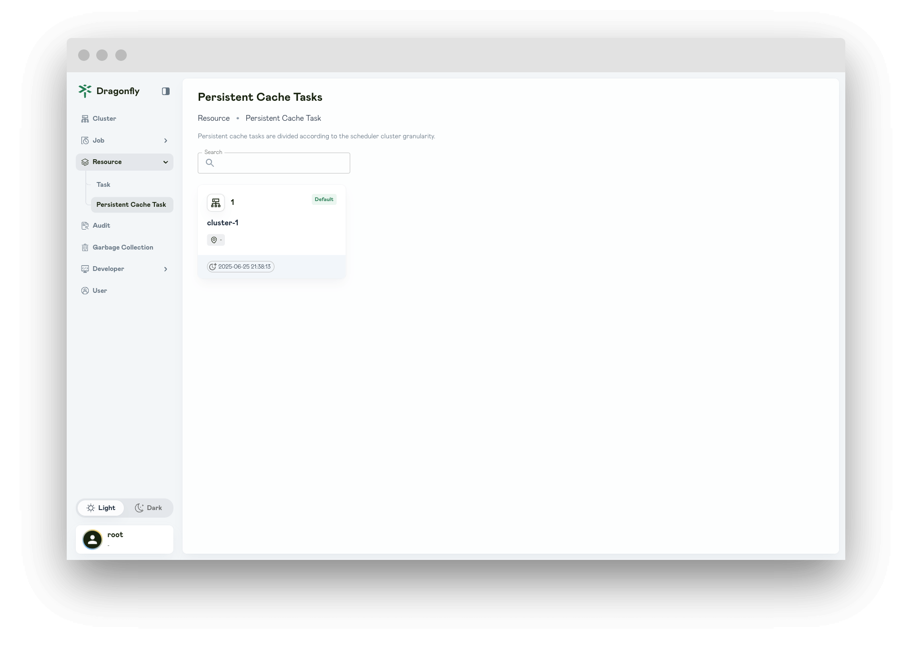
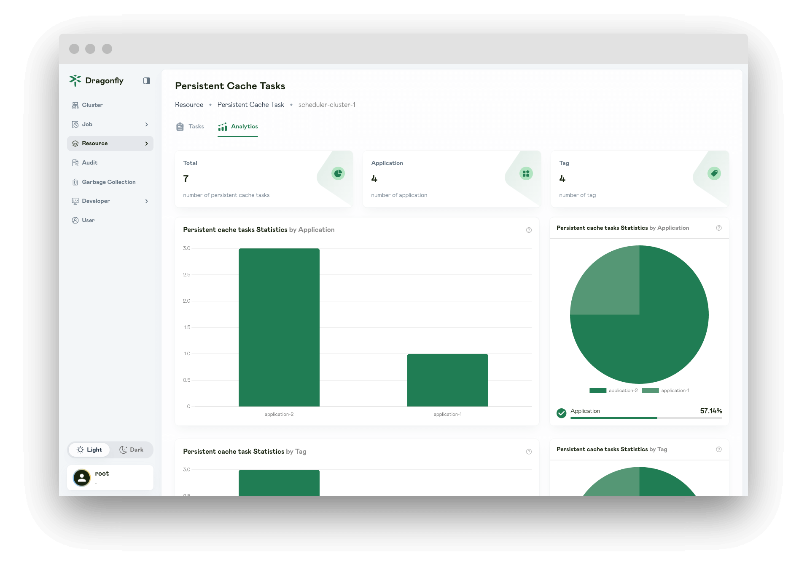
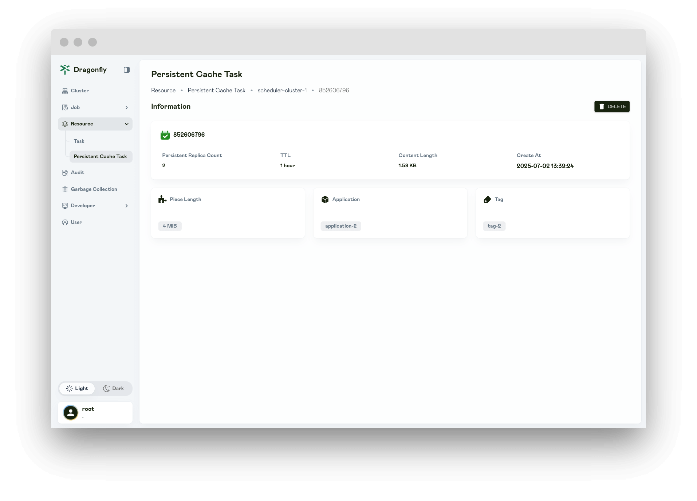
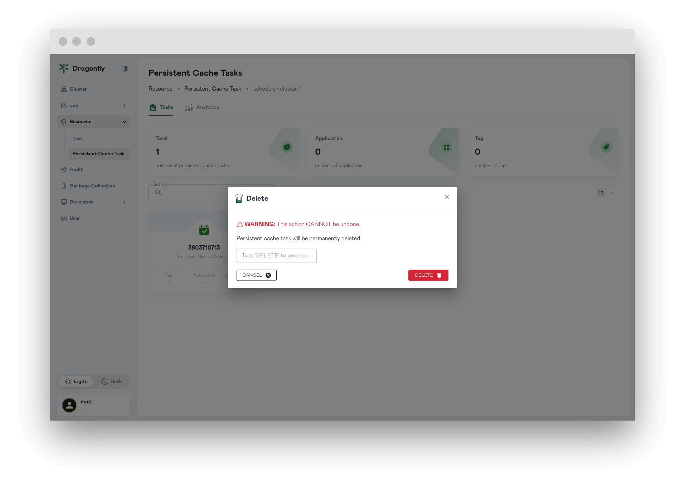

In this article, you will be shown Persistent Cache Task page information.

## Cluster

Persistent cache tasks are divided according to the scheduler cluster granularity.

## Persistent Cache Tasks

### Tasks

Display all of the persistent cache tasks.

### Analytics

Number of persistent cache tasks by application and tag.

## Persistent Cache Task

Display the persistent cache task details.

## Delete Persistent Cache Task

Click DELETE and delete persistent cache task details.

